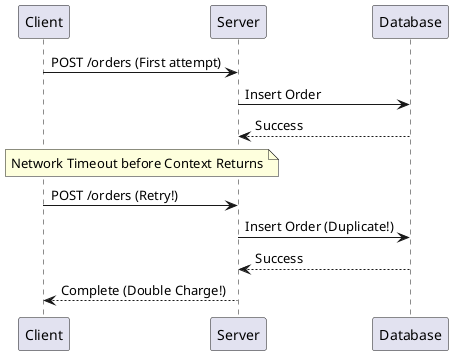
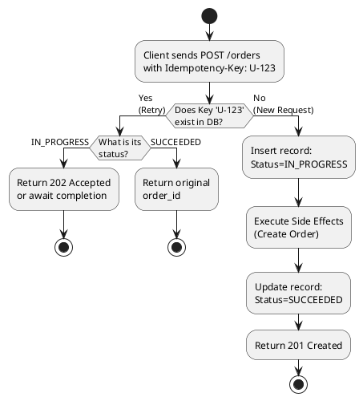
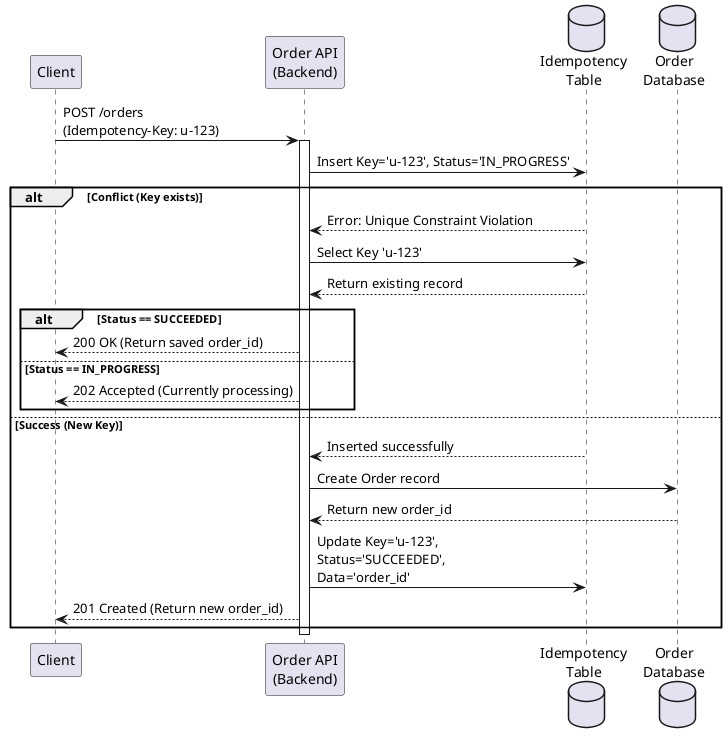
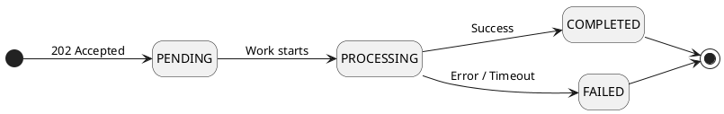
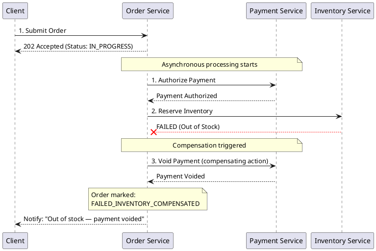
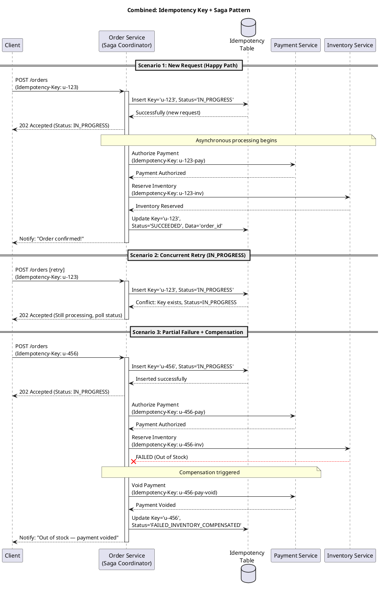

# Microservices 101: Idempotency & Eventual Consistency
**Safe Retries and Async Systems**

## 1. Introduction

“Everything fails, all the time.”
— Werner Vogels, CTO of Amazon.

In distributed systems, failures and delays are inevitable. This module covers the fundamental disciplines for ensuring correctness: **Idempotency** and **Eventual Consistency**.

- **Idempotency**: Doing something many times has the same effect as doing it just once.
- **Eventual Consistency**: State may temporarily diverge, but if no new updates happen, all replicas and reads eventually converge.

### Why do failures matter more here than in Monoliths?
In traditional monoliths, we tackled failures too, but in microservices, failures cause different states than in monoliths.
1. **Partial Failures**: A monolith usually either works successfully or collapses entirely. In microservices, one service can fail while others succeed, leaving workflows in an uncertain state.
2. **Network Uncertainty**: Why such "an uncertain state" happens? Monoliths use memory calls, so if something fails, you get an explicit error (exception). In contrast, microservices use networks. A "timeout" leaves you uncertain whether the request was processed or not.
3. **No Global Rollbacks**: Monoliths traditionally rely on single-transaction mechanisms to automatically undo errors. Microservices use separate databases, meaning we can't rely on this mechanism. We must write code to explicitly undo actions if a later step fails.

---

## 2. The Distributed Reality
To understand why idempotency is crucial, consider a classic incident. Imagine an e-commerce web site: A user clicks "Pay," the request times out, and the client, of course, retries. What happens if the backend processes both the original and the retry requests? A double charge and double order creation occur.

The root cause of this incident is the traditional mental model of *exactly-once* processing. In the real world, systems operate on an *at-least-once* delivery model. Timeout does not equal failure; timeout equals uncertainty.
Because of client timeouts, load balancer retries, queue redeliveries, and service restarts, we should always assume components will retry. **"I sent it once" does not mean "it was processed once."**

**From ACID Mental Model to Distributed Reality**
Traditional single-database architectures rely heavily on ACID (Atomicity, Consistency, Isolation, Durability) transactions where operations are wrapped in one transaction. In a distributed environment, cross-service global transactions are impractical. Correctness instead arises from local commits, explicit states, and idempotent workflows.

---

## 3. Idempotency: Making Retries Safe
To protect systems against accidental duplicates from retries, operations must be **idempotent**—meaning they can be safely executed multiple times without changing the result beyond the first try. 

**How the Flow Works:**
1. **New Request (upper):** The client sends an operation with a unique identifier (e.g., `Key = 123`). The server checks the database. Seeing that no such key exists, it executes the operation (e.g., creates a record) and saves the key.
2. **Retry Request (lower):** If a network timeout occurs and the client retries the same operation with `Key = 123`, the server checks the database. This time, finding the existing key, it bypasses the execution step and simply refers to the initially created record.

This mechanism ensure that the server always returns the same result for the same key.
This is the core pattern for achieving idempotency, called **Idempotency Key**.

### The Idempotency Key Pattern
A client generates a unique `Idempotency-Key` (e.g., a UUID) for a logical action and reuses it upon any retry.

On the server side:
- **Check the Key**. If it exists (retry), return the previously recorded outcome.
- **If it is new**, execute the required operation, and save the outcome.

This looks simple? No, it is not. Why?
This often requires the server to maintain a deduplication storage (or request journal) scoped by a unique constraint (typically `user_id` + `endpoint` + `key`) alongside a defined Time-To-Live (TTL) cleanup policy.

### Aren't DB UPSERTs or Unique Constraints Enough?
Developers with a background in monolithic development often wonder, "Can't we just use a database `UPSERT` or a unique constraint to prevent duplicates?"

However, an Idempotency Key in a distributed system requires dedicated **state management and storage** for the following reasons:

1. **Protecting External Side-Effects**: `UPSERT` only guards against duplicates within your local database. Enterprise APIs frequently perform external side-effects, such as charging a credit card via Stripe or sending an email. To prevent these from executing twice, you must intercept the duplicate request at the API boundary, long before the database insertion.
2. **Preventing `IN_PROGRESS` Collisions**: If a client experiences a timeout and immediately retries while the initial request is still executing (a concurrent retry), a simple database unique constraint won't know how to handle this race condition. A dedicated storage that records the `IN_PROGRESS` state enables you to explicitly block or wait for the trailing retry.
3. **Caching the Original Response**: When a valid retry occurs, the API shouldn't return an error; it should ideally return the exact same success response (e.g., the generated `order_id`) as the initial attempt. You need a temporary place to cache this outcome. As I mentioned in No.1, the response data is not only the data written to the DB.
4. **The Necessity of a TTL (Time-To-Live)**: Idempotency keys are not permanent business data. Storing them forever would cause infinite database bloat. Network-related retries almost always happen within seconds or hours. A TTL (e.g., 7 days) ensures that once the retry window has safely passed, the keys are automatically purged to clean up storage space.

### API Semantics: What Do We Return on Replay?
Replays should be predictable and deterministic. If a request is replayed with the same key, it should ideally return:
1. **The original success response** (e.g., `201 Created` with the same `order_id`).
2. **An in-progress status** (`202 Accepted` with a `status_url`) if work is still processing.
3. **A consistent failure response** if the request previously reached a terminal failure state.

**What to avoid:** blindly creating new resources on replay, returning different outcomes, or returning success when a payload with different parameters was submitted under the same key. Such responses are anti-patterns. (If the payload changes for an existing key, you can return a `409 Conflict` or `422`).

### Practical Application: Retry-Safe "Create Order" API
When designing a `POST /orders` endpoint, the flow should follow this path:
1. Client sends a request with an `Idempotency-Key`.
2. Backend attempts a transactional insert into an `idempotency_records` table with an `IN_PROGRESS` state.
   - If a conflict occurs and the existing state is `SUCCEEDED`, safely return the saved `order_id`.
   - If a conflict occurs and the state is `IN_PROGRESS`, return `202 Accepted` (or briefly block).
3. On a successful insert, the backend creates the order and updates the idempotency record to `SUCCEEDED` with a durable `order_id`.

---

## 4. Eventual Consistency: Managing Asynchrony

Idempotency gave us a superpower: the ability to safely retry network calls when things fail. However, retrying synchronous calls across 5 different microservices in real-time is a recipe for cascading failures. To truly scale and survive, microservices must decouple these steps. This is where **Asynchrony** comes in, and its unavoidable consequence is **Eventual Consistency**.

### Why do we need Asynchrony? (Monolith vs. Microservice)
In a traditional **Monolith**, we rely on Strong Consistency. When a user creates an order, we open a single Database Transaction, deduct inventory, and process payment all in one synchronous block. Either everything succeeds instantly, or the transaction rolls back. 

In a **Microservice** architecture, doing this synchronously (Service A calls Service B, which calls Service C) means:
1. **Latency multiplies**: The user waits for all 3 services to finish.
2. **Reliability plummets**: If just one service is slow or down, the entire user request fails.

To fix this, we make the process **Asynchronous**. The Order Service records the request, immediately responds to the user ("Order Accepted"), and then sends an event to a Message Queue so Payment and Inventory can process it in the background independently. 

The trade-off? **Eventual Consistency**. Different parts of the system will temporarily disagree (e.g., The Order is created, but Inventory hasn't decremented yet). The system guarantees it will eventually converge, but we must design our UIs and APIs to handle this temporary lag.

**Key principles to remember:**
- **It is about timing, not correctness:** The system isn't "wrong"—it's simply not finished *yet*. The final state is guaranteed to be correct once all events are processed.
- **It does not mean "data is random":** Eventual consistency does not mean you have corrupt or unpredictable data. It means data flows through deterministic, highly predictable stages over time.

### FAQ: Is "All or Nothing" better than "Eventual Consistency"?
Developers often prefer "All or Nothing" (Atomicity) because it is easier to code. However, in distributed systems, Eventual Consistency is necessary for three reasons:
1. **The Math of Availability**: If you require 5 services to be up simultaneously, your uptime breaks down (e.g., `99.9% ^ 5 = 99.5%`). Asynchrony keeps your main system highly available even if backends are lagging.
2. **Business Over Perfection**: "Capture beats Completion." If the email service is down, you shouldn't block a customer from placing an order. Capture the money now; send the email later.
3. **Preventing Traffic Jams**: Forcing "All or Nothing" across multiple databases requires global locks. A 5-second network lag in one minor service holds locks everywhere, risking a total system crash.

### The "Big Three" Symptoms
When designing for eventual consistency, assume the following will occur by default:
1. **Stale Reads**: A read doesn't reflect the newly written data yet.
2. **Reordered Events**: Event B arrives before Event A.
3. **Duplicate Events**: The same event is delivered twice.

If your design survives these three symptoms, it is safe for production.
Here I introduce some API design petterns to handle Eventual Consistency well.

### Introduce "in-progress" state

Making "**in-progress**" a first-class state is essential.

- **`202 Accepted`**: Emitted when the async work has initiated, rather than when it is completed.
- **Status Endpoints (`GET /orders/{id}/status`)**: Provides a stable API contract for clients to poll progress.
- **Explicit State Machines**: `PENDING` → `PROCESSING` → `COMPLETED` / `FAILED`.

### Embracing Partial Failure: The Saga Pattern
Once you click "Submit order" button, the system processes the order in multiple steps, like Payment → Inventory → Shipping. These steps are executed asynchronously and independently. This multi-step asynchronous workflow spans multiple services, and there is no global transaction to guarantee that every step will succeed. So, the **Saga Pattern** is used to converge the system to a clean business state upon a partial failure.

**Compensation Model**
If a downstream step fails (e.g., Payment succeeds but Inventory fails to reserve), you trigger **compensating actions** for all previously completed steps (e.g., Void the Payment).
*The forward actions and the compensating actions must all be idempotent since they can be retried.*

**Case Study: E-commerce Order Flow**

**What this flow demonstrates:**
1. **IN_PROGRESS as a first-class state**: The client immediately receives a `202 Accepted` with `Status: IN_PROGRESS`. The client is never left waiting; it can poll `GET /orders/{id}/status` at any time.
2. **Explicit Order States**: Each step transitions the order through well-defined states — `CREATED` → `PAYMENT_AUTHORIZED` → `INVENTORY_FAILED` → `FAILED_INVENTORY_COMPENSATED`. No state is ambiguous.
3. **Compensation Model in action**: When Inventory fails *after* Payment has already succeeded, it explicitly triggers a compensating action — `Void Payment` — to undo the completed step and restore a consistent business state.
4. **Client Notification on failure**: Once compensation completes, the Order Service notifies the client with a clear, actionable message: *"Out of stock — payment voided."* Clients are never left with a silent failure.

## 6. The Combined Recipe & Pitfalls
In the real world, we usually use Idempotency Key + Saga Pattern, and others together.

**Starter Kit for Distributed APIs:**
- Request ID / Idempotency Key logic on every non-idempotent endpoint.
- Deduplication storage mapped to unique database constraints.
- Explicit state machines + visible status endpoints.
- **Idempotency + Saga**: Both forward actions (e.g., Authorize Payment) and compensating actions (e.g., Void Payment) in a Saga can be retried by the coordinator. They must all be idempotent — use an Idempotency Key for each individual step.

The following diagram shows a sample of all three key scenarios working together:

### Idempotency in Compensation Actions
Although it is omitted in the above diagram to avoid excessive complexity, **compensation actions must be idempotent too**.

The Saga coordinator may retry a compensation action for the same reason it retries a forward action — network timeouts, crashes, or restarts. Without idempotency on the compensation side, a `Void Payment` call could be sent twice to the Payment Service, causing an incorrect double-refund.

Two things to consider before triggering a compensation action:

1. **Verify the forward action actually completed.** Before voiding a payment, confirm from the idempotency record or the Payment Service that the payment was truly authorized. There is no need — and it may be harmful — to compensate an action that never succeeded in the first place.
2. **Decide on the compensation strategy based on the downstream service's guarantee:**

| Downstream Service Guarantee | Your Compensation Strategy |
|---|---|
| Service is **already idempotent** for the compensation (e.g., `Void` is safe to call repeatedly) | Assign it a stable scoped key (e.g., `u-456-pay-void`) and retry safely. |
| Service is **NOT idempotent** for the compensation | Check your idempotency record first. Only call `Void` or `Refund-in-progress` if your idempotency record shows the payment has not already been voided. If your idempotency record shows the payment has already been `Voided`, do nothing. |

> **What is a "scoped idempotency key"?**
> A scoped key uniquely identifies one specific step within a larger workflow, so each step can be retried independently. There are several strategies to achieve this and the following 2 are typical ones:
> - **Preferred: Use the downstream transaction ID.** When a payment succeeds, the Payment Service returns a unique transaction ID (e.g., Stripe's `ch_abc123`). Using this as the idempotency key for the void call (e.g., `void(txn_id: ch_abc123)`) is ideal — it's externally verifiable, guaranteed unique by the provider, and both sides share the exact same reference.
> - **Fallback: Construct a scoped key.** If no natural transaction ID exists, construct one from the parent request key + a step suffix, e.g., `u-456` (the order) + `-pay-void` (the void step) = `u-456-pay-void`.

The safest default is to always assign a scoped idempotency key to every compensation call — it costs nothing and makes recovery deterministic regardless of the downstream service's behaviour.

**Antipatterns / Common Pitfalls:**
- Idempotency keys that are **not scoped to a specific user and endpoint**, causing unintended cross-tenant collisions.
- **TTLs that are too short**, allowing late mobile/background retries to bypass deduplication and create duplicates.
- Deduplicating strictly **in-memory**, breaking retry safety during service restarts.
- Blindly **assuming strict event ordering** in messaging queues. Some messaging frameworks / services guarantee ordering only within a partition, not across the entire topic, so events with the same key may arrive out of order, causing idempotency checks to fail.

## 7. Key Takeaways & Bridge to the Next Module

### What We Learned
This module introduced two foundational disciplines for building reliable microservices (distributed systems):

| Concept | Core Idea | The Risk if Ignored |
|---|---|---|
| **Idempotency** | Any operation can be safely retried without duplicate side-effects. | Retries cause double charges, double inserts, or corrupt state. |
| **Eventual Consistency** | Systems temporarily disagree but are guaranteed to converge. | Developers block on synchronous calls, causing cascading failures. |
| **Saga Pattern** | Multi-step workflows handle partial failure via explicit compensation. | Partial failures leave business data in an inconsistent, unrecoverable state. |
| **Scoped Idempotency in Sagas** | Each step in a Saga has its own idempotency identity. | Compensation retries cause double-refunds or drop compensations silently. |

### Bridge: What's Missing?
We now know how to make retries *safe* (Idempotency) and how to tolerate *partial failure* (Saga + Eventual Consistency).
But we don't yet control *how* retries happen:
- How many times should a client retry before giving up?
- How long should it wait between attempts?
- What happens if every client retries at exactly the same moment?

These questions belong to **Resiliency** (Circuit Breakers, Retry policies with Exponential Backoff + Jitter, Timeouts) and **Observability** (Distributed Tracing, structured logging of idempotency key state, alerting on dead-letter queues).

**Without Idempotency**, any retry is a risk for duplicate business impact.
**Without Resiliency controls**, unrestricted safe retries can still amplify server load and trigger a system-wide collapse.
**Without Observability**, you cannot tell whether a `FAILED_INVENTORY_COMPENSATED` state is a rare edge case or a sign of a broken upstream dependency.

The next module will connect these three disciplines into a complete operational picture.

---

### Appendix: 1-Pager Architecture Checklist

**API (Request/Response)**
- Require an `Idempotency-Key` for non-idempotent (e.g. POST) mutations.
- Scope duplication constraints correctly: `(tenant/user, endpoint, idempotency_key)`.
- Use a transactional state flow: `IN_PROGRESS` → Executed Side Effects → `SUCCEEDED`.
- Ensure deterministic replay semantics: `same key ⇒ same outcome`.
- Reject requests that use a known key but a different request body (`409 Conflict`).
- Rely on a practical TTL (e.g., 24 hours – 7 Days) mapping to client retry limits.

**Consumer (Event Handler)**
- Over-engineer for **at-least-once** delivery. Duplicates will happen.
- Deduplicate processing using a stable `event_id` paired with a relational unique constraint.
- Implement state guards on all transitions to natively handle out-of-order execution without assuming event sequences. 
- Ensure eventual consistency is legible to the frontend using explicit `progress` properties.
