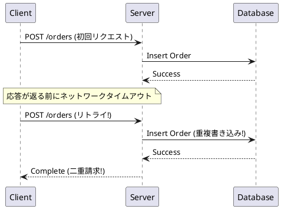
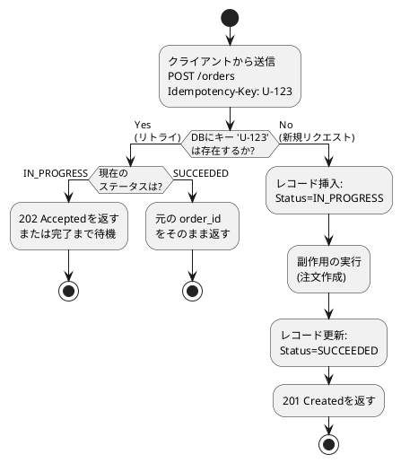
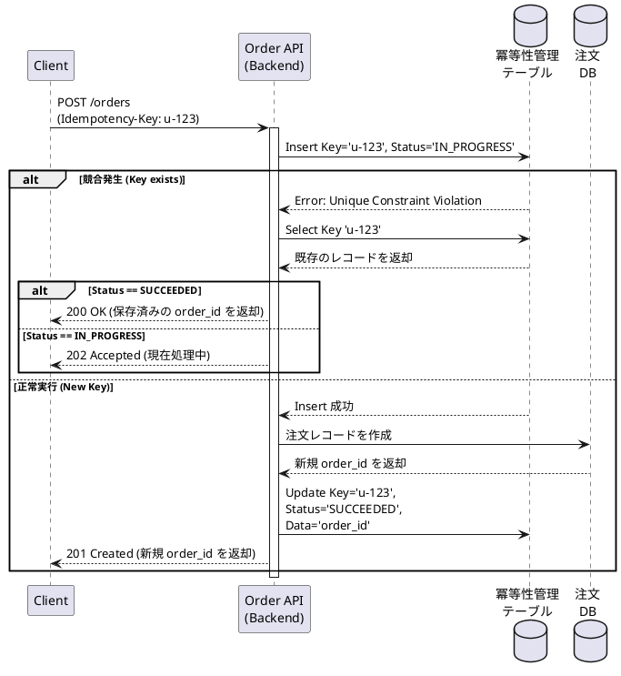
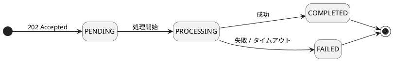
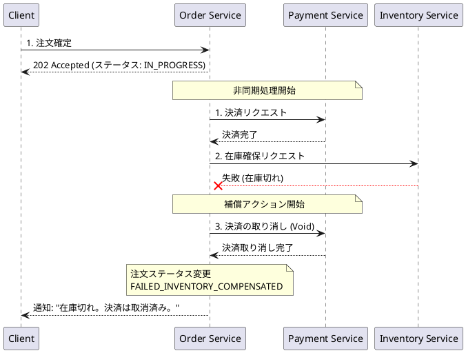
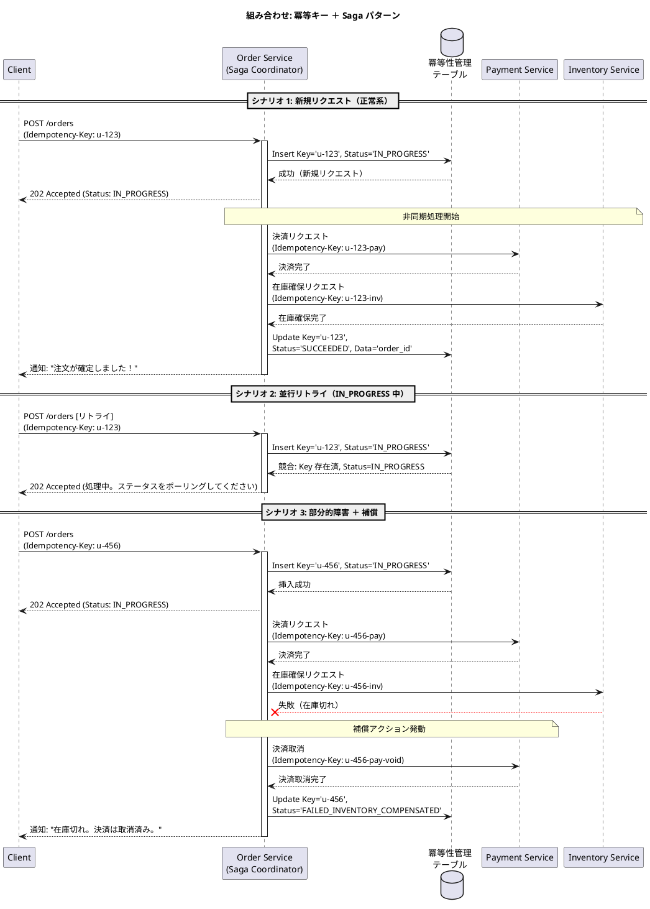

# マイクロサービス 101: 冪等性と結果整合性
**安全なリトライと非同期システム**

## 1. Introduction

“Everything fails, all the time.”
— Werner Vogels, CTO of Amazon.

マイクロサービスは分散システムです。分散システムでは、障害や遅延は避けられないものです。本モジュールでは、Consistency（一貫性）を保証するための基本的な運用原則である「**冪等性（Idempotency）**」と「**結果整合性（Eventual Consistency）**」について解説します。

- **冪等性**: 同じ操作を何度繰り返しても、1回だけ実行した時と同じ結果になる性質。
- **結果整合性**: 各所の状態が一時的に食い違うことがあっても、新たな更新が止まれば最終的には全てが同期し、システム全体の一貫性が保たれる性質。

### モノリスシステムだって障害は起こる。分散システムだと何が違うの？
従来のモノリスでもエラーハンドリングは重要でした。違うのは、マイクロサービスでは、障害によってモノリスではなかった状態が発生するからです。
1. **部分的な障害（Partial Failures）**: モノリスでは処理は「完全に成功する」か「完全に失敗する」かのどちらかになることが一般的です。一方、マイクロサービスでは、一部のコンポーネントだけが失敗して他は成功し、結果的に処理全体の状態は不明、という不完全な状態が発生しえます。
2. **ネットワークの不確実性（Network Uncertainty）**: なぜこのような「不完全な状態」が発生するのでしょうか？モノリスはメモリ内通信を行うので、失敗した場合には明確なエラー（例外）が返ります。一方で、マイクロサービスはネットワーク経由で通信するため、「タイムアウト」のような、リクエストが処理されたのか、それとも応答が消えただけなのかが分からない、という不確実な状態が発生するのです。
3. **グローバルロールバックの不在（No Global Rollbacks）**: モノリスでは多くの場合、エラー時にも自動で安全にロールバックしてくれる単一トランザクション機構に依存しています。マイクロサービスではデータベースも分散されているのでこのメカニズムに頼ることができません。一部のステップで失敗した場合、自動ロールバックはできず、以前のアクションを取り消す（補償する）コードを明示的に書く必要があります。

---

## 2. 分散システムの現実
冪等性がなぜ重要なのかを理解するために、典型的なインシデント事例を考えてみましょう。ユーザーが「支払う」ボタンをクリックしたところ、リクエストがタイムアウトしました。クライアントはもちろんリトライします。このとき、もし最初のリクエストもバックエンドにちゃんと届いていて、バックエンドが最初とリトライの両方のリクエストを処理してしまうとどうなるでしょうか。二重請求や注文の二重登録という深刻な事態が発生してしまいます。

このようなインシデントの根本原因は、「確実に　1　回だけ処理される（Exactly-once）」というメンタルモデルにあります。実際には、現実のシステムは「少なくとも 1 回は処理される（At-least-once）」モードで動作しています。「タイムアウト＝失敗」ではなく、「タイムアウト＝結果が不明（Uncertainty）」なのです。
クライアントのタイムアウト、ロードバランサーのリトライ、キューの再配信、サービス再起動など様々な理由で、コンポーネントは常にリトライされると想定しておかなくてはいけないのです。**「送信が1回」だからといって「1回だけ処理される」とは限りません。**

**ACIDメンタルモデルから分散システムの現実へ**
単一のデータベースを扱うアーキテクチャでは、操作を一つのトランザクションにまとめる ACID（原子性、一貫性、独立性、永続性）トランザクションに強く依存していました。ですが、分散環境で複数サービスにまたがるグローバルトランザクションの実装は現実的ではありません。代わりに、ローカルコミット、明示的な状態管理、そして冪等なワークフローを組み合わせることで、システムの一貫性を担保します。

---

## 3. 冪等性: リトライを安全にする機能
リトライによる意図しない重複処理（二重書き込みなど）からシステムを守るためには、システムへの変更操作を「何度実行しても、1回だけ実行したのと同じ状態になる」ように設計します。この性質を**冪等性（Idempotency）**と呼びます。

**フローの仕組み:**
1. **新規リクエスト（上段）:** クライアントは一意の識別子（例: `Key = 123`）を付与してリクエストを送信します。サーバーはデータベースを確認します。キーが存在しないため、操作を実行（例: レコード作成）してキーを保存します。
2. **リトライ（下段）:** ネットワークのタイムアウトが発生し、クライアントが同じ `Key = 123` で操作をリトライしたとします。サーバーがデータベースを確認すると、今度はキーが存在します。そのため、処理の再実行をスキップし、最初に作成されたレコード（処理結果）のみを参照します。

この仕組みで、同じキーに対して同じ処理リクエストが何度来ても、同じ処理結果になることを保証することができます。
これが冪等性を実現する中核パターンである「**Idempotency Key（冪等キー）**」です。

### 冪等キーの実装パターン
クライアントは、論理的なアクションごとに一意の `Idempotency-Key`（UUIDなど）を生成し、リトライ時には常にそのキーを再利用します。

サーバー側の挙動:
- **キーを確認する**: 同じキーが既に存在する場合はリトライと判断し、前回記録された結果をそのまま返します。
- **新規キーの場合**: リクエストの処理を実行し、その結果を保存します。

一見シンプルに見えますが、実はもう少し裏側は複雑になります。
これを実現するには、サーバー側に固有の制約（通常は `user_id` + `endpoint` + `key`）に基づいた重複排除用のストレージ（またはジャーナル）を準備して、一定期間でデータを消去する TTL（Time-To-Live）ポリシーを設定する必要があることが多いからです。

### DBのUPSERT（更新・挿入）やユニーク制約で十分じゃない？
モノリス開発の経験がある方は特に、「DBの `UPSERT` 構文やユニーク制約を使えば重複排除できるのでは？」と思うかもしれません。しかし、分散システムにおける冪等キーには以下の理由から専用の**状態管理とストレージ**が必要になります。

1. **DB以外の外部呼び出し（副作用）を防ぐため**:
   `UPSERT` は「自サービスのデータベース」の重複しか防げません。現実世界では「決済 API（Stripeなど）を呼ぶ」「メールを送信する」といった外部へのリクエスト（副作用と呼びます）を伴うことが多々あります。これらが重複実行されるのを防ぐには、処理より前の段階（API 層の入り口）でリクエストを弾かなくてはならないわけです。
2. **処理中（IN_PROGRESS）の競合を防ぐため**:
   初回リクエストが処理されている最中に、クライアントがタイムアウトとしてリトライを投げてくることがあります（並行リトライ）。単なる DB のユニーク制約ではこの競合状態をうまくコントールできません。専用ストレージで「現在処理中（IN_PROGRESS）」であることを記録し、後続のリトライをブロックしたり待機させたりする仕組みが必要です。
3. **元のレスポンスを返す（状態のキャッシング）ため**:
   リトライが来た際、API はエラーではなく、初回と全く同じ成功レスポンス（処理結果など）を返さなくてはならず、そのためには、結果を記録しておく一時的な保存場所が必要です。前述のように処理結果は、DB に書き込まれている情報だけではありません。
4. **なぜ TTL（Time-To-Live）を設定するのか**:
   冪等キーは永続的に保存するビジネスデータではありません（保存することはできますが、ストレージが無駄に肥大化します）。ネットワーク起因のリトライは通常、数秒〜数時間のうちに行われます。クライアント側のリトライ設定期間をカバーできる十分な長さ（例：7日間）が経過した後は、「もう確実にリトライは来ない」と判断できるので、冪等キーは削除してストレージ容量を節約したいところです。そのためには TTL が不可欠です。

### API セマンティクス: リプレイ（リトライの応答）時に何を返すべきか？
リプレイの挙動は予測可能かつ決定的でなければなりません。同じキーのリクエストがリプレイされた場合、理想的には以下を返す必要があります。
1. **同じ成功レスポンス** （例: 同じ `order_id` を含んだ `201 Created`）。
2. **処理中のステータス** （例: 処理が進行中の場合は `status_url` を含んだ `202 Accepted`）。
3. **一貫した失敗レスポンス** （以前のリクエストがすでに回復不能なエラー状態に終わっていた場合）。

**避けるべきこと**: リプレイ時に新たなリソースを盲目的に作成すること、キーが同じなのに異なる結果を返すこと、同じキーでパラメータだけ変更されたリクエストに対して成功を返すこと - こういった応答はアンチパターンです。（既存キーでペイロードが変わった場合は、`409 Conflict` または `422` を返しましょう）。

### ケーススタディ: 安全にリトライできる「注文」API
`POST /orders` エンドポイントを設計する場合、次のようなフローになるでしょう。
1. クライアントが `Idempotency-Key` 付きでリクエストを送信。
2. バックエンドが `idempotency_records` テーブルに `IN_PROGRESS`（進行中）状態でレコードを追加する。
   - 競合が発生し、既存レコードの状態が `SUCCEEDED`（成功）の場合、保存済みの `order_id` を安全に返す。
   - 競合が発生し、状態が `IN_PROGRESS` の場合、 `202 Accepted` を返す（または短時間ブロックして待つ）。
3. 競合がなくレコードを追加できた場合、バックエンドは新規リクエストとして注文を作成する。その後、冪等性レコードを `SUCCEEDED` に更新して、永続化された `order_id` を紐付ける。

---

## 4. 結果整合性: 非同期処理の管理

「冪等性」によって、ネットワーク通信が失敗したときに安全に「リトライ」できるようになりました。ですが、ユーザーからのリクエスト処理のたびに、例えば 5 つのマイクロサービスを同期的（都度、応答を待つ）に呼び出し、エラーのたびにリトライをしていては、システム全体が遅延し、連鎖的な障害（Cascading Failures）を引き起こしてしまいます。そこでマイクロサービスでは、各サービスの処理を切り離す「**非同期（Asynchrony）**」通信を積極的に取り入れます。

### なぜ非同期処理が必要なのか？（モノリスとの違い）
従来の**モノリス**は「強い一貫性（Strong Consistency）」に依存していました。ユーザーからのリクエストに対してデータベースのトランザクションを開始し、注文の作成、在庫の引き当て、決済処理などをすべて単一の同期ブロック内で実行します。エラー時にはすぐすべてがロールバックされます。

一方、**マイクロサービス**でこれを同期的（サービス A が B を呼び、B が C を待ってから…）に行うと、次のような問題が発生します。
1. **レイテンシの増大**: 全てのサービスの処理が終わるまで、ユーザーがローディング画面で待たされることになります。
2. **信頼性の低下**: いずれか1つのサービスが遅延したりダウンしたりするだけで、全体のリクエストが失敗してしまいます。

そうならないようにするためには、処理を**非同期**にします。注文サービスはリクエストを受け取ったことだけを記録し、ユーザーには即座にレスポンス（例:「注文を受け付けました」）を返します。そしてメッセージキューなどにイベントを送信し、決済や在庫サービスにはバックグラウンドで独立して処理を進めるように通知することができます。

非同期処理によって分散処理ならではの高いスループットと信頼性を手に入れるためのトレードオフが、**結果整合性**です。システム内では一時的に各サービスの状態の不一致が発生します（例：注文は「受付完了」になっているけれども、在庫はまだ引き当てられていない、など）。最終的にはすべてのデータの整合性がとれることが保証されますが、私たちはこの「一時的な遅延や食い違い」を前提としたAPIやUIを設計しなければなりません。

**結果整合性とは…**
- **「不整合」になるのではなく「タイミング」の問題。**システムのデータが論理的に間違っているわけではない、という点がポイントです。単に処理が「まだ終わっていない」だけです。処理が追いつけば、最終的に正しい状態になることは設計上保証されます。
- **「状態やデータがランダム（適当）になる」わけではありません。**結果整合性とは、データが予測不能で信頼できない状態になることとは違います。設計された、安全で予測可能なステップに沿って、データは段階的に処理されます。

### 「All or Nothing (同期処理)」の方がシンプルだし、優れているのでは？
開発者はコードがシンプルになる「All or Nothing（原子性）」を好みがちです。しかし分散システムにおいては、以下の理由から**結果整合性の方がビジネスに貢献**します。
1. **可用性は掛け算**: 例えば 5 つのサービス全てが同時に稼働していることが前提だとすると、システム全体の可用性は各サービスの可用性の掛け算になるため、低下します（例: `99.9% ^ 5 = 99.5%`）。非同期にすることで、一部のバックグラウンド処理の障害に影響されずに必要最小限の処理だけでも継続できます。
2. **ビジネスは「完璧」より「確保」を優先する**: もし「メール通知サービス」がダウンしているだけで、顧客の「購入処理」を止めてしまうとビジネス機会損失になります。大事な注文だけは今すぐ確保し、メールは復旧後に送ってもよいのです。
3. **渋滞による全体機能停止を防ぐ**: 複数 DB で「All or Nothing」を強要すると、グローバルロックが必要になります。1 つのサービスで数秒の遅延が発生するだけで全体のロックが待たされ、大渋滞が起きてシステム全体が停止するリスクがあります。

### 設計上の考慮点
結果整合性を前提とする設計では、以下の事象が起こり得ます。
1. **古いデータの読み取り（Stale Reads）**: 最新の書き込みデータが反映される前に、読み取り結果が返却されることがあります。
2. **順序の入れ替わり（Reordered Events）**: イベント B がイベント A より先に到着する（あるいは処理が完了する）ことがあります。
3. **イベントの重複（Duplicate Events）**: 同じイベントが 2 回以上処理されることがあります。

これら 3 つの事象に対応できるように設計すれば、本番環境でも安全に稼働します。
結果整合性を前提とする非同期アプリケーションを設計する際に重要な API パターンをいくつか紹介します。

### 処理ステータスの導入
非同期処理では、「**処理中（in-progress）**」が非常に重要なステータスになります。

- **`202 Accepted`**: 非同期処理が「完了した」時ではなく、「開始した」タイミングで返します。
- **ステータスエンドポイント（`GET /orders/{id}/status`）**: クライアントが処理の進捗をポーリングできる、安定したAPIの契約を提供します。
- **明示的なステートマシン**: `PENDING`（保留中） → `PROCESSING`（処理中） → `COMPLETED`（完了） / `FAILED`（失敗）。

### 部分的な障害の許容: Saga パターン
例えば、注文確定ボタンをクリックすると、決済が行われ、在庫が確保され、出荷準備が整う、という複数ステップにわたる非同期ワークフローがそれぞれ非同期に実行されます。これらのステップが複数のサービスに跨がると、すべてのステップが成功することを保証することはできません（前述したように、All or Nothing を実現するグローバルトランザクションの実装は現実的ではありません）。
ここで活躍するのが、部分的な障害発生時にシステムを整合性の取れた状態、ビジネス的に正しい状態へと収束させる **Saga パターン** です。

**補償モデル（Compensation Model）**
途中のステップで障害が発生した場合（例: 決済は完了したのに、在庫確保に失敗した場合）、すでに完了しているステップに対して**補償アクション**をトリガーします（例: 決済の取り消し、返金）。
⚠️ *ここでももちろん、リトライが行われる可能性を考慮しなくてはなりません。通常のアクション、補償アクションのどちらも冪等性の確保を忘れずに！*

**ケーススタディ: Eコマースの注文フロー**

1. **IN_PROGRESS ステータス**: クライアントはすぐに `Status: IN_PROGRESS` を含む `202 Accepted` 応答を受け取ります。これにより、クライアントは処理完了を待つ必要がありません。処理状況を知りたければいつでも `GET /orders/{id}/status` をポーリングできます。
2. **注文ステータス**: 処理ステータスは例えば次のように遷移します — `CREATED` → `PAYMENT_PENDING` → `PAYMENT_AUTHORIZED` → `INVENTORY_PENDING` → `INVENTORY_RESERVED` → `SHIPPING_PENDING` → `SHIPPING_SCHEDULED`。
3. **補償モデル**: 決済が完了した後に在庫確保が失敗した場合には、完了したステップ（この場合は決済）を元に戻すための補償アクション（`Void Payment`）を明示的にトリガーし、整合性の取れたビジネス状態を復元します。
4. **クライアントに失敗を通知**: 補償アクションが完了すると、注文サービスはクライアントに「*"在庫切れ。決済は取消済み。"*」であることを知らせる明確なメッセージを送ります。クライアントのリクエストが失敗したまま放置されることはありません。

---

## 5. 組み合せのレシピと落とし穴
現実の設計では、冪等キーと Saga パターン、その他のパターンを組み合わせて使うことが多いです。

**分散 API 設計の基本セット:**
- リクエスト ID / 冪等キー（Idempotency Key）のロジック（非冪等なエンドポイント全て）
- 連携するデータベースのユニーク制約による重複排除
- 明示的なステートマシン ＋ 状態確認のためのステータスエンドポイント
- **冪等性 ＋ Saga の組み合わせ**: Saga における正常アクション（例: 決済）も補償アクション（例: 決済取消）もリトライが発生する可能性があります。それぞれのステップに対して冪等キーを使用し、すべての操作を冪等に設計しなくてはいけません。

次の図は、3 つの主要なシナリオにおける両パターンの組み合わせの一例です。

### 補償アクションにおける冪等性
上記の図では（図がますます複雑になってしまうので）省略していますが、**補償アクションも冪等でなければなりません**。

Saga パターンでは、正常アクションと同じ理由（ネットワークタイムアウト、クラッシュ、再起動など）によって、補償アクションもリトライされる可能性があります。補償アクション側に冪等性がないと、`Void Payment（決済取消）` が決済サービスに 2 回送信され、場合によっては誤って二重返金が発生するリスクがあります。

補償アクションをトリガーする場合に考慮すべき 2 つのポイントを紹介します。

1. **正常アクションが本当に完了したことを確認する。** 決済を取り消す前に、冪等性レコードまたは決済サービスへの問い合わせによって、決済が実際に完了していることを確認します。一度も成功していない処理を補償することは、不要であるだけでなく、別のトラブルになる場合もあります。
2. **後続サービスの補償操作の冪等性に基づいて補償戦略を決定する。**

> **「スコープ付き冪等キー（Scoped Idempotency Key）」とは？**
> スコープ付きキーとは、ワークフロー内の特定の 1 ステップを一意に識別するためのキーと言えます。各ステップを独立して安全にリトライできるようにします。実現方法はいくつかありますが、次の 2 つが代表的です。
> - **推奨: 後続サービスのトランザクション ID を使う。** 例えば決済が成功すると、決済サービスが一意なトランザクション ID を返します（例: Stripe の `ch_abc123`）。これをそのまま取消呼び出しの冪等キーとして使う（例: `void(txn_id: ch_abc123)`）のが理想です。外部から検証可能で、プロバイダーが一意性を保証しており、双方が同一のレコードを扱っていることを確実にできます。
> - **代替: スコープ付きキーを自前で構築する。** 上記のようなトランザクション ID が存在しない場合は、親リクエストのキーにステップ識別用サフィックスを付加するなどでキーを構築します。例: `u-456`（注文）+ `-pay-void`（取消ステップ）= `u-456-pay-void`。

| 後続サービスの補償操作のパターン | 補償戦略 |
|---|---|
| サービスが補償操作に対して**冪等**（例: `Void` を繰り返し呼んでも二重返金などが発生しないように設計されている）| スコープ付きキーを割り当て（例: `u-456-pay-void`）、安全にリトライする。 |
| サービスが補償操作に対して**冪等でない** | まず冪等性レコードを確認する。レコードが「決済成功」（あるいは「取消中」）のままであれば `Void` を呼び出す。レコードが「取消済み」であれば、何もしない。 |

最も安全な方針は、**すべての補償呼び出しにスコープ付き冪等キーを必ず割り当てること**です。コストはかからず、後続サービスの挙動に依存せずリカバリを決定論的にすることができます。

**アンチパターン / よくある落とし穴:**
- **対象を限定していない冪等キー**: ユーザーやエンドポイントごとにスコープ化されていないと意図しない競合を引き起こしかねません。
- **短すぎる TTL 設定**: モバイルやバックグラウンドでの遅延リトライが重複排除をすり抜け、操作が二重に実行されてしまう可能性があります。
- **インメモリのみでの重複排除**: サービス再起動が発生するとデータが消えてしまいます。サービス復旧直後にありがちなリトライラッシュで重複が発生するリスクを引き起こします。 
- **メッセージの順序性に依存**: フレームワークやメッセージングサービスによっては順序保証がないものもあります。キューにおけるイベントの順序が順序が保証されない環境では、同じキーを持つイベントが異なる順序で到着する可能性があり、冪等性チェックが失敗する可能性があります。

---

## 6. まとめ

### 学んだこと
このモジュールでは、信頼性の高いマイクロサービス（分散システム）を構築するための 2 つの基礎となる考え方を学びました。

| 概念 | コアとなる考え方 | 無視した場合のリスク |
|---|---|---|
| **冪等性（Idempotency）** | どんな操作も、副作用を重複させずに安全にリトライできる。 | リトライが二重課金、二重挿入、または状態の破損を引き起こす。 |
| **結果整合性（Eventual Consistency）** | システムは一時的に不一致になるが、最終的に収束することが保証されている。 | 開発者が同期呼び出しでブロックし、連鎖的な障害が発生する。 |
| **Saga パターン** | 複数ステップのワークフローが、明示的な補償によって部分的な障害を処理する。 | 部分的な障害が、回復不能な不整合なビジネスデータを残す。 |
| **Saga 内でのスコープ付き冪等性** | Saga の各ステップが独自の冪等性を持つ。 | 補償アクションのリトライが二重返金を起こしたり、補償が無言でスキップされる。 |

### 次のモジュールでは
このモジュールではリトライを「安全」にする方法（冪等性）と、部分的な障害に耐える方法（Saga ＋ 結果整合性）を学びました。
ですがこれだけでは足りません。リトライを「どのように」実行するか、を制御できていないからです。
- クライアントは諦めるまでに何回リトライすればよいか？
- リトライ間に何秒待てばよいか？
- すべてのクライアントが全く同じタイミングでリトライしたらどうなるか？

次のモジュールでは、これらの問いに答える **レジリエンス（Resiliency）**（サーキットブレーカー、指数バックオフ＋ジッターを用いたリトライポリシー、タイムアウト）と **可観測性（Observability）**（分散トレース、冪等キー状態の構造化ログ、デッドレターキューへのアラート）を紹介します。

**冪等性がなければ**、リトライはビジネス上の重複リスクを生み出してしまいます。
**レジリエンスコントロールがなければ**、リトライが安全でもサーバー負荷を増幅させ、システム全体の崩壊を引き起こす可能性があります。
**可観測性がなければ**、例えば `FAILED_INVENTORY_COMPENSATED` という状態が、稀なケースなのか、上流サービスの障害のシグナルなのかすら判断することができません。

次のモジュールでは、この 3 つの考え方を統合して、完全な「運用のできる」アーキテクチャの全体像へと進みましょう。

---

### 付録: アーキテクチャ設計チェックリスト（1ページ）

**API (リクエスト/レスポンス)**
- 副作用を伴う非冪等な更新処理（POSTなど）には `Idempotency-Key` を必須にする。
- 重複排除の制約スコープを正しく設定する: `(tenant/user, endpoint, idempotency_key)`。
- トランザクションを利用した状態フローを導入する: `IN_PROGRESS` → 処理実行 → `SUCCEEDED`。
- リプレイ処理の決定論的セマンティクスを確保する: `キーが同じなら ⇒ 同じ結果を返す`。
- 同じキーでも異なるリクエストボディを持つものは拒否する（`409 Conflict`）。
- クライアントのリトライ期限を考慮した現実的なTTL（例：24時間～7日間）を設定する。

**コンシューマー (イベントハンドラー)**
- **At-least-once（少なくとも1回）** 配信を前提とした安全過ぎるくらいの設計を行う。重複は必ず起きる。
- 安定した `event_id` と RDB のユニーク制約を組み合わせた重複排除を実装する。
- 順序通りにイベントが来ることを前提とせず、全ての状態遷移にステートガードを実装して順序の前後に対応する。
- 明示的な `progress` 状態を利用し、結果整合性の途中経過がフロントエンド側からも分かりやすいようにする。
