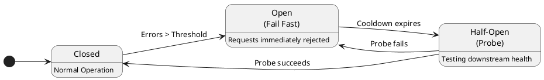

# Microservices 101-02: Resilience & Observability

Design for Failure and Debug Fast

## 1. Introduction

In Module 1, we learned how to make operations safe under failure using Idempotency, Asynchronous Communication, and Eventual Consistency. However, safety alone is not enough to keep a system alive under heavy stress. In Module 2, we will learn how to design for failure and how to quickly observe and debug issues, enabling us to build a truly resilient system.

- **Resiliency**: the set of boundaries and guardrails we build to prevent local failures from bringing down the entire system.
- **Observability**: gives us the x-ray vision required to find, understand, and fix those failures quickly.

These 2 concepts are complementary. Together, they form our survival toolkit for production.

### "Slow is the new down"
In distributed systems, most major outages do not begin with a sudden spike in errors (like HTTP 500s). Instead, they usually begin with a slowdown. This is a key mental model shift from monolith world.

In microservice architecture, a single request often requires calling multiple services. Even if only one service becomes slow, the requests stay in-flight longer. This causes **resource retention**: your service holds onto threads, database connections, and memory while it waits. Eventually, you hit **saturation**, meaning your service is fully occupied waiting for something else, and even healthy parts of your system can no longer process work. This is how a single slow dependency can take down an entire architecture—a phenomenon known as a **Cascading Failure**.

---

## 2. Resilience Starter Kit: Preventing Cascades
First, let's clarify what resilience actually is compared to similar concepts:

* **Availability: “Can I use it right now?”**
  * **Typical Signals/metrics:** Uptime percentage, successful request rate, availability SLI/SLO.
* **Reliability: “Does it behave correctly over time?”**
  * **Typical Signals/metrics:** Error rate, failed transactions, MTBF/MTTF (and incident rate).
  * *(Note: Often measured against a defined SLO, not just ‘no failures’.)*
* **Durability: “Will the data survive crashes?”**
  * **Typical Signals/metrics:** Probability of data loss (e.g., “11 nines”), RPO (how much data you can lose).
* **Resilience: “When something breaks, does the system degrade safely and recover quickly?”**
  * **Typical Signals/metrics:** MTTR (actual time to restore) vs RTO (target time to restore), blast radius, p95/p99 under stress, retry amplification avoided.

In monolith world, we focused on availability and reliability, because failures were exceptional status.
But in microservice world, we need to focus on resilience because "Everything fails, all the time".
We cannot prevent failures, but we can prevent them from spreading. Our goal is containment. That is the key concept of Resilience.

Let's take a quick tour of the starter toolkit for resilience:

### Timeouts: The Boundary (Fail Fast)
In Module 1, we saw timeouts as a frustrating cause of uncertainty ("Did the downstream system actually process my request before the connection dropped?"). However, from a resilience perspective, an intentional timeout is actually a **strategic defense mechanism**. 
Timeouts forcefully prevent infinite waits and stop resource retention. Without timeouts, a slow dependency will drag your service down with it (failures spread). With timeouts, you actively cut the cord (failures are contained).
* **Rule:** Never use "infinite" or default timeouts. Every remote call must have a strict, intentional timeout budget.

### Controlled Retry
As I mentioned in Module 1, retry is essential. However, it must be intelligently controlled. Blind retries can act as a failure multiplier—a phenomenon known as the **Retry Amplification Cascade**. 

Imagine your service is already overloaded by some reason and latency is rising, causing callers to experience timeouts. If clients retry immediately, queued messages increase which causes additional timeouts... and finally the traffic multiplies, which makes the latency even worse.


Retries must be treated as a controlled tool, not a blind reliability hack. You should observe the following rules:
* **When to retry:** Only retry on **transient** conditions (timeouts, specific 5xx errors, rate-limiting). Never retry **persistent** failures (4xx errors, validation failures, or if the dependency is known to be down).
* **How to retry:** Use bounded attempts, **exponential backoff**, and **jitter** (randomness).
  * **Backoff:** It means wait longer each time before retrying. Gives the dependency time to recover.
  * **Jitter:** It adds randomness. It prevents a "thundering herd" where multiple clients retry at the exact same millisecond.

**Visualizing Backoff vs. Jitter:**
```text
1. Exponential Backoff
Client A: [Fail] 
            -> 1s -> [Retry] [Timeout]
            ---> 2s ---> [Retry] [Timeout]
            ------> 4s ------> [Retry] [Recovered]

2. Jitter
No Jitter: Multiple Clients = Thundering Herd!
Client A: [Fail] 
           -> 1s -> [Retry]
Client B: [Fail] 
           -> 1s -> [Retry]
Client C: [Fail] 
           -> 1s -> [Retry]

With Jitter: Load is spread out safely.
Client A: [Fail] 
           --> 1.2s --> [Retry]
Client B: [Fail]
           ----> 2.5s ----> [Retry]
Client B: [Fail]
           -> 0.8s -> [Retry]
```

**Important Reminder:** Never forget Session 1. Retries are only safe if the target operation is **Idempotent**.

### Circuit Breakers: Stop Digging
A circuit breaker prevents your service from repeatedly calling a dependency that is already failing or timing out. It mimics an electrical circuit breaker: closed (electricity flows), open (electricity is cut off), and half-open (testing the circuit).



* **Closed:** Normal flow. The health of calls is monitored.
* **Open:** After crossing a failure threshold, the circuit trips. Calls are immediately rejected (fail fast) for a cooldown period. This protects the downstream system from overload and stops your service from wasting threads waiting on doomed calls.
* **Half-Open:** After the cooldown, a few "probe" calls are sent. If they succeed, the circuit closes. If they fail, it opens again.

### Bulkheads: Limit the Blast Radius
Like compartments in a ship, bulkheads separate capacity pools so one failure doesn't sink everything.
* Use separate connection pools or thread pools for different dependencies or tenants. If one dependency stalls, only its pool is exhausted, allowing the rest of the application to keep running.

### Concurrency Limits & Backpressure: Stop Latency from Becoming Load
When a downstream dependency slows down, the number of in-flight requests in your service grows, saturating your thread and connection pools. We need to prevent latency from becoming load.
* **Concurrency Limits:** Set a hard cap on how many active requests can be sent to a specific dependency simultaneously. If the limit is reached, any new requests are rejected immediately or queued briefly rather than consuming more resources.
* **Backpressure:** A mechanism where an overloaded system signals its upstream callers to slow down, preventing them from blindly pushing more traffic.

### Overload Protection & Fallbacks
In a state of severe overload, doing less is how you survive. The goal is to provide users with a *partial* experience rather than letting the entire system crash or time out entirely.
* **Rate Limiting (Throttling):** Limits traffic from a specific client or tenant to prevent one "noisy neighbor" from exhausting the system's capacity.
* **Load Shedding:** When the system reaches a critical threshold (e.g., CPU > 90%), it intentionally rejects traffic to prevent a total crash. Smart load shedding does this by evaluating priority—dropping low-priority requests (like background syncs) first to preserve capacity for mission-critical requests (like checkout transactions). It follows the principle that "it's better to successfully serve *some* users than to time out for *everyone*."
* **Graceful Degradation:** When a dependency fails, degrade the experience safely instead of breaking the page. For example, if the recommendation service is down, load the core product page but omit the recommendations (instead of returning a 500 error). Using **cached data** is also a great fallback: if the pricing engine is down, serve the last known good price from a local cache.

---

## 3. Observability 101: Answering Questions Quickly
Resilience controls contain the failure. Observability helps you fix it. 

### Why “Ping/Health Checks” Aren’t Enough in Microservices

In the monolith world, we just checked if the server was up (ping) or whether `/health` was green. This is because "the process is alive" is usually a reliable proxy for "the system is usable." 

In microservices, however, failures happen in "partial and path-dependent" ways. An individual service can report a perfectly green `/health` status while real user requests flowing through it are actively failing. Why? Because a downstream dependency might be unexpectedly **slow**. While health checks are essential for telling load balancers where to route traffic, they cannot debug a slow, multi-hop request path.

**Mental model shift: From Node Health to Path Health**
* **Node health (What health checks see):** "Is this specific instance running? Can it respond to a basic request? Is it connected to its immediate database?" 
* **Path health (What users experience):** "Can the system complete this end-to-end request (A → B → C → DB) within an acceptable time frame?"

**Observability** gives you the contextual data required to figure out exactly *why* and *where* a client request failed across multiple network boundaries. Here I show you some desing patterns to build this path-level visibility.

### The Golden Signals
Always monitor these four golden signals—and slice them by endpoint, region, or dependency. Averages hide pain!
1. **Latency:** How long it takes to process requests (focus on p95/p99, not just the median).
2. **Traffic:** The demand on your system (RPS, concurrency).
3. **Errors:** The rate of failed requests.
4. **Saturation:** How "full" your service is (CPU, memory, connection pools, queue depth).

> p50 (50th percentile) means that 50% of requests are faster than this value, for example 100ms. p95 (95th percentile) means that 95% of requests are faster than this value, and the slowest 5% are above it.

### Logs: Structured and Correlated
You cannot grep your way out of a distributed incident. Logs must be structured (JSON) and queryable.
* **Must-have fields:** `trace_id` (correlation ID), safe tenant/user identifiers, endpoint, status code, latency, dependency name, and error codes.

### Distributed Traces
Traces show where time went across services, which is essential for debugging high p95 latency. They reveal the **critical path**, letting you quickly identify exactly which downstream dependency added the delay.

**Example Trace (Waterfall View):**
```text
[API Gateway] /checkout ............................ 1500ms (100%)
  ├── [Auth Service] /verify_token ................... 50ms (3%)
  └── [Order Service] /process_order ............... 1445ms (96%)
        ├── [Inventory Service] /reserve ............. 75ms (5%)
        └── [Payment Service] /charge_card ......... 1350ms (90%) 💥 BOTTLENECK
```
By passing a shared `trace_id` through HTTP headers between services, observability platforms can stitch these calls together, proving instantly that the slow API Gateway response was caused entirely by the Payment Service.

### Case Study: Debugging Workflow
You receive an alert that says "p95 latency doubled!". What you should do is to decide and apply any mitigation strategy to stop customer impact. Follow this playbook to narrow down the problem quickly:
1. **Confirm symptom:** Check SLOs and golden signals. Which endpoint is affected?
2. **Slice dimensions:** Break down the metrics by region, dependency, or tenant to find anomalies.
3. **Check traces:** Find a slow trace and look at the critical path span to isolate the slow dependency.
4. **Inspect logs:** Filter logs by the `trace_id` to get the exact error context (timeout vs. throttle, retry attempts).
5. **Mitigate:** Choose an action to stop customer impact (shed load, degrade gracefully, open a breaker, rollback).

---

## Closing: You Build It, You Run It

Resilience controls prevent cascading failures, and observability proves whether those controls are actually working. In the world of microservices, post-incident improvements almost always fall into one of two buckets: 
- **Adding guardrails:** (timeouts, circuit breakers, bulkheads) to protect the system.
- **Adding signals:** (dashboards, trace headers, log fields) to make the next failure easier to diagnose.

Remember, building a system is only half your job. In modern architectures, **"you build it, you run it"**. True ownership means designing for failure *before* it happens, and instrumenting your code so that when you are the one responding to an alert at 2 AM, your system can tell you exactly what went wrong.


---

## Appendix: MTTF vs MTTR (And Why We Care)

In distributed systems, **Reliability** is a combination of having *fewer* failures and *faster* recovery when they inevitably occur. 


* **MTTF (Mean Time To Failure):** The average time a system operates normally between failures. A higher MTTF means the system is more stable.
* **MTTR (Mean Time To Restore/Recover):** The average time it takes to restore service after a failure occurs. A lower MTTR means the system recovers quickly.

**Availability** improves when you increase MTTF (preventing failures) and decrease MTTR (recovering quickly). 
While *Resilience* patterns (like Circuit Breakers) help improve MTTF by preventing cascading crashes, **Observability primarily targets MTTR**. By providing contextual data, distributed traces, and structured logs, observability enables significantly faster detection, diagnosis, and mitigation.

For more details, refer to https://docs.aws.amazon.com/whitepapers/latest/availability-and-beyond-improving-resilience/understanding-availability.html.


## Appendix: Production-Ready Defaults Checklist
- [ ] Every remote call has a non-infinite timeout.
- [ ] Retries are limited to transient errors (no 4xx retries).
- [ ] Retries use explicit bounded limits, exponential backoff, and jitter.
- [ ] Remote calls are protected by Circuit Breakers.
- [ ] Critical dependencies are isolated with Bulkhead patterns.
- [ ] Logs are structured (JSON) and include a `trace_id`.
- [ ] Dashboards show Latency (p50/p95/p99), Traffic, Errors, and Saturation.
