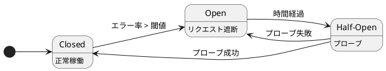

# Microservices 101-02: レジリエンスと可観測性 (Resilience & Observability)

障害を前提に設計し、迅速に障害に対処する

## 1. はじめに

モジュール 1 では、冪等性、非同期処理や結果整合性によって、障害が発生してもリクエストを「安全」に処理する方法を紹介しました。ですが、大きな負荷や障害の連鎖の中でもシステム全体を生き永らえさせるためには、安全性だけでは不十分です。モジュール 2 では、真にレジリエントなシステムを構築するために、障害を前提とした設計手法と、問題を素早く発見してデバッグする手段について学びます。

- **レジリエンス（Resilience）**: 局所的な障害がシステム全体をダウンさせるのを防ぐための「境界線とガードレール」を構築します。
- **可観測性（Observability）**: 発生した障害を素早く発見、理解、そして修正するための「透視能力（X-ray vision）」を与えてくれます。

これら 2 つが組み合わさることで、本番環境で起こる障害にも安全に向き合うことができるようになります。

### 「遅延（スローダウン）」はシステムの「ダウン（停止）」の予兆
分散システムにおける大規模な障害の多くは、エラー（HTTP 500など）の急増から始まるわけではありません。ほとんどの場合、「遅延」から始まります。これもモノリス世界でのメンタルモデルからの転換が必要なところです。
マイクロサービス型のサービスでは、一つのリクエストの処理のために複数のサービスを呼び出します。一部のサービスが遅くなるだけで、リクエストはシステム内に長く留まることになります。これにより、スレッドやデータベースコネクション、メモリなどのリソースが解放されないまま待機状態となるため、**リソースの枯渇（Resource Retention）** が発生します。最終的にシステムは**飽和状態（Saturation）** に陥り、システム内の健康な部分も処理できなくなります。このように、1つの下流サービスの遅延がシステム全体をダウンさせてしまう現象を **連鎖的障害（Cascading Failure）** と呼びます。

---
## 2. レジリエンス（回復力）の基本セット: 連鎖的障害を防ぐ
はじめに、似た概念である「可用性」や「耐久性」との違いを明確にしておきましょう。
* **可用性 (Availability): 「今、このシステムは使えるか？」**
  * **代表的な指標/メトリクス:** 稼働率（Uptime %）、成功リクエスト率、可用性 SLI/SLO
* **信頼性 (Reliability): 「時間が経っても正しく動作し続けているか？」**
  * **代表的な指標/メトリクス:** エラー率、処理に失敗したトランザクション数、MTBF（平均故障間隔）/MTTF（平均故障時間）、インシデント発生頻度
  * *(注: 単なる「エラーなし」ではなく、定義された SLO に対して測定されることが多いです)*
* **耐久性 (Durability): 「クラッシュが発生しても、データは守られているか？」**
  * **代表的な指標/メトリクス:** データ損失確率（例: "99.99999999%"）、RPO（目標復旧時点: どれだけのデータなら失っても許容できるか）
* **レジリエンス (Resilience): 「どこか壊れても、安全に縮退し、素早く回復できるか？」**
  * **代表的な指標/メトリクス:** MTTR（実際の平均復旧時間） vs RTO（目標復旧時間）、影響範囲（Blast Radius）、強い負荷や障害下での p95/p99 レイテンシ、リトライの暴走をどれだけ防げたか

モノリスの世界では障害は例外ケースであり、例外ケースへの対処として可用性や信頼性が重視されていました。
マイクロサービスの世界では「Everything fails, all the time.（障害は常に発生するものだ）」という前提のもと、被害の封じ込めと回復により焦点を当てます。
障害を完全にことはできませんが、広がるのを防ぐことは可能です。目指すものは「影響を封じ込めること（Containment）」です。これがレジリエンスの基本コンセプトです。

ではレジリエンスのための基本キットを見ていきましょう。

### タイムアウト: 被害の境界線（Fail Fast）
モジュール 1 では、タイムアウトは状態が分からなくなる厄介な状態（「呼び出し先の処理が成功したのか失敗したのか、通信が途中で切れてしまったため分からない状態」）を招くものとして登場しました。ここで取り上げる意図的に設計されたタイムアウトは **戦略的な防衛メカニズム** の一つです。
タイムアウトは、無限に待ち続けることによって引き起こされるリソースの枯渇を防ぎます。タイムアウトを設定しないと、下流の遅延に巻き込まれてシステム全体の障害につながってしまいます。タイムアウトを設定することで、自ら通信を断ち切り、障害を一部に留めることができます。
* **ルール:** タイムアウトを「無限（設定なし）」や「フレームワークのデフォルト」のままにしないようにしてください。外部への呼び出しには必ず意図的かつ厳密に設計したタイムアウト値を設定してください。

### コントロールされたリトライ（Controlled Retry）
モジュール 1 で紹介したように、リトライは不可欠です。しかし、賢くコントロールされていなければなりません。戦略的に設計されていない盲目的なリトライは状況をさらに悪化させる「障害の増幅器」になり得ます。これは **リトライによるトラフィックの増幅: Retry Amplification Cascade** と呼ばれます。

何らかの理由で遅延が発生している状況を考えてみてください。通常のトランザクション量をこなせなくなり、クライアント側ではタイムアウトが発生し始めます。この状況でクライアントが即座に盲目的なリトライを行うと、滞留するメッセージがさらに増え、それがまた新たなタイムアウトを引き起こします。処理できない状況にも関わらずトラフィックが何倍にも膨れ上がり、遅延はさらに悪化します。


こうならないよう、リトライは盲目的に実装するのではなく、「制御可能なツール」として扱う必要があります。以下のルールを守りましょう。
* **いつリトライするか:** **一時的（Transient）** エラー（タイムアウト、一部の5xxエラー、レートリミットなど）の場合にのみリトライします。**永続的（Persistent）** エラー（4xxエラー、バリデーションエラー、依存先がダウンしていると分かっている場合）には決してリトライしてはいけません。
* **どのようにリトライするか:** 試行回数に上限を設け、エクスポネンシャルバックオフ（指数バックオフ）と **ジッター（Jitter: ゆらぎ）** を組み合わせます。
  * **バックオフ:** リトライを繰り返す場合にリトライ間隔を長くしていくことで、依存先のサービスが回復する時間を与えます。
  * **ジッター:** 乱数によるゆらぎを使ってリトライ間隔をランダムにします。これにより、複数のクライアントが同時にリトライして状況を悪化させることを防ぎます。

**バックオフとジッターの視覚化:**
```text
1. エクスポネンシャルバックオフ
Client A: [失敗]
           -> 1秒 -> [再試行] [タイムアウト]
           ---> 2秒 ---> [再試行] [タイムアウト]
           ------> 4秒 ------> [再試行] [復旧]
(試行間隔を長くしていくことで、リクエスト先の回復を待つ)

2. ジッター
ジッターなしの場合、リトライタイミングが重なってしまう:
Client A: [失敗] 
           -> 1秒 -> [再試行]
Client B: [失敗] 
           -> 1秒 -> [再試行]
Client C: [失敗] 
           -> 1秒 -> [再試行]

ジッターによりリトライ負荷が分散され安全になる
Client A: [失敗] 
           --> 1.2秒 --> [再試行]
Client B: [失敗]
           ----> 2.5秒 ----> [再試行]
Client B: [失敗]
           -> 0.8秒 -> [再試行]
```

> **メモ:** モジュール 1 で述べたように、リトライが安全なのは **冪等（Idempotent）** な操作の場合のみです。

### サーキットブレーカー（Circuit Breaker）: 無駄な呼び出しを止める
サーキットブレーカーは、すでに障害が起きている、あるいは遅延している依存先に対して、無駄に呼び出しを続けるのを防ぎます。電気回路のスイッチが閉じている状態（電流が通る）と開いている状態（電流が遮断される）を模倣したものです。



* **Closed（閉）:** 正常な状態です。
* **Open（開）:** エラー率や遅延が閾値を超えると、ブレーカーが作動します。一定時間、下流へのリクエストは即座に拒否され（Fail Fast）、呼び出しを行いません。これにより下流システムを保護し、無駄な待ち時間によるリソース枯渇を防ぎます。
* **Half-Open（半開）:** 一定時間後、「プローブ（探り）」のために一部のリクエストのみを通します。成功すれば Closed に戻り、失敗すれば再び Open になります。

### バルクヘッド（Bulkheads）: 影響範囲（Blast Radius）の制限
船の隔壁（バルクヘッドは浸水を防ぐための隔壁のこと）のように、リソースのキャパシティプールを分割することで、1 つの障害が全体に及ぶのを防ぎます。
* 具体的には、依存サービスごとやテナントごとに、異なるコネクションプールやスレッドプールを使用します。仮に 1 つの依存先が遅延しても、そのプールが枯渇するだけで、アプリケーションの他の部分は動作し続けることができます。

### 並行処理数制限とバックプレッシャー: 遅延を負荷に変えない
下流の依存サービスが遅延すると、自サービス内で処理中（インフライト）のリクエストが増加し、スレッドやコネクションプールが飽和してしまいます。遅延を負荷にしないような対策が必要です。
* **並行処理数制限（Concurrency Limits）:** 特定の依存先に対して同時に送信できるアクティブリクエスト数に上限（ハードキャップ）を設けます。上限に達した場合、新しいリクエストは一時的にキューで待機させるか、これ以上リソースを消費しないために即座に拒否します。
* **バックプレッシャー（Backpressure）:** システムが過負荷になった際に、上流の呼び出し元に対して「今は処理しきれないので送信を抑えて」というシグナルを送り、トラフィックの送信ペースを落とさせる防衛機能です（文字通り「押し返し」ます）。

### 過負荷制御とフォールバック
システムが深刻な過負荷に陥った場合、「やらないこと」を決めるのが生き残るための鍵です。システム全体がダウンするのを防ぎ、ユーザー体験全体を壊さずに最低限でも「何らかの機能（部分的な機能）」を提供し続けることを目指します。
* **スロットリング（レートリミット）:** 特定のクライアントやテナントからのトラフィックに上限を設けます。一部のクライアントからの大量リクエスト（ノイジーネイバー）がシステム全体のリソースを食いつぶすのを防ぎます。
* **ロードシェディング:** システムが過負荷な閾値（例: CPU 使用率が 90 %超など）に達したときに、トラフィックを意図的に破棄しそれ以上の負荷を防ぎます。高度なロードシェディングでは、優先順位を考慮し、「バックグラウンド処理」のような優先度の低いリクエストを先に切り捨てることで、「決済処理」のような最重要リクエストのためにリソースを温存することもあります。「全滅するくらいなら、一部の重要なリクエストだけでも正常に処理する」という原則に基づきます。
* **グレースフルデグラデーション（段階的縮退）:** 依存サービスがダウンした際に安全に縮退させます。例えばレコメンドサービスがダウンしているからと 500 エラーを返すのではなく、レコメンドなしの商品ページだけを表示させます。他にも、**キャッシュ** を利用する（例: 価格計算エンジンがダウンしている場合、キャッシュにある最後に成功した時点の価格を使う）ことも有効な代替手段です。

---

## 3. 可観測性（Observability） 101: 答えを素早く見つける
レジリエンスが障害の「広がり」を抑えるなら、可観測性は障害を「直す」ためのものです。

***測定できないものは制御できない**

### これまでも「Ping やヘルスチェック」はしていたけど何が違うの？

モノリスの時代でも、Ping や `/health` エンドポイントを叩いて「サーバーが立ち上がっているか」を確認していました。これは「プロセスが生きている＝システムが使える」という前提がほぼ成り立っていたからです。

一方、マイクロサービスにおいて、障害は「部分的、かつリクエストの経路（パス）に依存して」発生します。個別のサービスが `/health` で「正常（グリーン）」を返していても、実際にはそこを通過するユーザーからのリクエストが失敗し続けている状況がよく起こります。なぜでしょうか？ 下流の依存サービスが（エラーを出していなくても）**遅延**している可能性があるからです。ヘルスチェックはロードバランサーがトラフィックを振り分けるために不可欠ですが、マルチホップなリクエストパスの遅延をデバッグすることはできません。

**メンタルモデルの転換: 「ノードの健康度」から「パスの健康度」へ**
* **ノードの健康度（ヘルスチェックが確認していること）:** 「個々のインスタンスはダウンしていないか？ 基本的なリクエストに応答できるか？ 隣接する DB に接続できているか？」
* **パスの健康度（ユーザーが実際に体験していること）:** 「このエンドツーエンドのリクエスト（例. A → B → C → DB）を、許容できる時間内に完了できるか？」

**可観測性（Observability）** とは、分散されたネットワーク上で「どこで、なぜクライアントリクエストが失敗したのか」を解明するための文脈を持ったデータを提供する機構です。この「パスの健康度」を可視化するために、私たちは特有のオブザーバビリティ設計パターン（ゴールデンシグナル、分散トレース、構造化ログ）を利用します。

### ゴールデンシグナル（Golden Signals）
必ず監視すべき4つの指標です。ただし、全体平均だけで見てはいけません（平均値は障害を隠します！）。必ずエンドポイントごと、リージョンごと、依存サービスごとに分けて確認してください。
1. **レイテンシ（Latency）:** リクエストの処理時間（中央値だけでなく、p95 や p99 などのパーセンタイルに注目します）。
2. **トラフィック（Traffic）:** システムへの要求量（RPS、並列数など）。
3. **エラー（Errors）:** 失敗したリクエストの割合。
4. **飽和度（Saturation）:** システムのリソースがどの程度「一杯」か（CPU、メモリ、コネクションプール、キューの深さなど）。

> p50（50パーセンタイル）とは、50% のリクエストがそれより速い処理時間であることを意味します。例えば 100ms であれば、半分のリクエストは 100ms 未満で完了している、という意味です。同様に p95（95パーセンタイル）は、95% のリクエストがそれより速い処理時間であることを意味し、残りの 5% がそれ以上の遅延となります。

### ログ（Logs）: 構造化と相関づけ
分散システムにおいて、文字列検索（grep）だけで障害対応はできません。ログは検索可能な構造化データ（JSONなど）である必要があります。
* **必須フィールド:** `trace_id`（相関ID）、安全なテナント・ユーザー識別子、エンドポイント、ステータスコード、レイテンシ、依存サービス名、エラーコード。

### 分散トレーシング（Distributed Traces）
トレースは複数のサービスを跨いで「どこで時間がかかったのか」を示します。これは p95 のようなロングテールのレイテンシのデバッグに極めて有効です。**クリティカルパス**を明らかにすることで、「正確にどの下流システムが遅延の原因だったか」をすぐに見つけることができます。

**トレースのイメージ（ウォーターフォールビュー）:**
```text
[API Gateway] /checkout ............................ 1500ms (100%)
  ├── [認証サービス] /verify_token ................... 50ms (3%)
  └── [注文サービス] /process_order ............... 1445ms (96%)
        ├── [在庫サービス] /reserve ............. 75ms (5%)
        └── [決済サービス] /charge_card ......... 1350ms (90%) 💥 ボトルネック
```
どのサービスの呼び出しにおいても、HTTP ヘッダーに共通の `trace_id` を付与することで、各サービスの処理時間が 1 つのストーリーとして繋がります。これによって「チェックアウト処理全体のボトルネックが決済サービスにある」ことをすぐに突き止めることができます。

### ケーススタディ
"p95 レイテンシが 2 倍に跳ね上がった!" というアラートを受け取ったとします。あなたは素早く原因を特定し、ユーザー影響を止めるためのアクションをすぐに決定しなくてはなりません。そのために、以下の手順に沿って調査を進めます。

1. **症状の理解:** SLO やゴールデンシグナルを確認します。どのエンドポイントが影響を受けているでしょうか？
2. **ディメンションの切り分け:** リージョン、依存関係、特定のユーザー層ごとにメトリクスを分解し、異常値を見つけます。
3. **トレースの確認:** 時間のかかっているリクエストの分散トレースを追いかけて、クリティカルパスを見つけ、「ボトルネックの下流システム」を特定します。
4. **ログの調査:** トレース ID (`trace_id`) でログをフィルターし、エラーの詳細（タイムアウト、スロットル制限、リトライ回数など）を確認します。
5. **緩和策の実行:** ユーザー影響を止めるためのアクションを決定します（ロードシェディング、機能の無効化、ブレーカーを手動で開く、ロールバックなど）。

---

## クロージング: You build it, You run it.

レジリエンスの制御は障害の連鎖を防ぎ、可観測性は実際にその制御が機能していることを証明してくれます。マイクロサービスの世界では、インシデント後の改善タスクはほぼ、次の 2つのパターンのいずれかに当てはまります。
- **ガードレールの追加:** （タイムアウト、サーキットブレーカー、バルクヘッドなど）システムを保護するための機構を追加する。
- **シグナルの追加:** （ダッシュボード、トレースヘッダー、ログの構造化など）次回の障害発生時により素早く診断・デバッグできるようにする。

システムを作ることは、開発という仕事の半分に過ぎません。モダンなアーキテクチャでは、**「自分たちで作ったシステムは、自分たちで運用する（You build it, you run it）」** ことが求められます。真のオーナーシップとは、障害が起きる *前* に障害を前提とした設計（Design for Failure）を行う、（夜中の 2 時にアラートで叩き起こされることがなくなるわけではないにしても）システムが自動的に「何が起きたのか」を明確に教えてくれるように武装（インストルメンテーション）しておくことなのです。

---

## 付録: MTTF と MTTR の違い（と、なぜ我々が気にするのか）

分散システムにおいて、**信頼性（Reliability）** とは、障害の発生を *減らす* ことと、避けられない障害からいかに *早く* 回復するか、の組み合わせです。


* **MTTF（平均故障間隔: Mean Time To Failure）:** 障害と障害の間にシステムが正常稼働している平均時間。この値が高いほど、システムは安定しています。
* **MTTR（平均復旧時間: Mean Time To Restore/Recover）:** 障害が発生してからサービスが復旧するまでの平均時間。この値が低いほど、システムは素早く回復します。

**可用性（Availability）** を高めるには、MTTF を上げ（障害を防ぐ）、MTTR を下げる（素早く回復する）必要があります。
サーキットブレーカーのような *レジリエンス（回復力）* パターンは、障害の連鎖を防ぐことで MTTF の向上に大きく貢献します。一方、**可観測性（Observability）が最も効力を発揮するのは MTTR の短縮** です。文脈を持ったデータ、分散トレース、構造化ログを提供することで、障害の検知（Detection）、原因究明（Diagnosis）、そして復旧（Mitigation）の時間を劇的に短縮します。

より詳細は https://docs.aws.amazon.com/whitepapers/latest/availability-and-beyond-improving-resilience/understanding-availability.html を参照してください。

---

## 付録: 本番環境チェックリスト
- [ ] すべての外部呼び出しに、「無限」ではない意図的なタイムアウトが設定されている。
- [ ] リトライは一時的なエラーのみに制限されている（4xx エラーなどにはリトライしない）。
- [ ] リトライには最大試行回数が設定され、指数バックオフとジッターが適用されている。
- [ ] リモート呼び出しがサーキットブレーカーで保護されている。
- [ ] 重要な依存先がバルクヘッドパターンで分離（アイソレーション）されている。
- [ ] ログは構造化（JSONなど）され、リクエストを跨ぐ `trace_id` が含まれている。
- [ ] ダッシュボードで「レイテンシ（p50/p95/p99）」「トラフィック」「エラー」「飽和度」が可視化されている。
