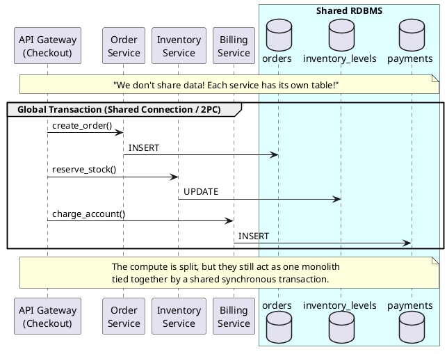
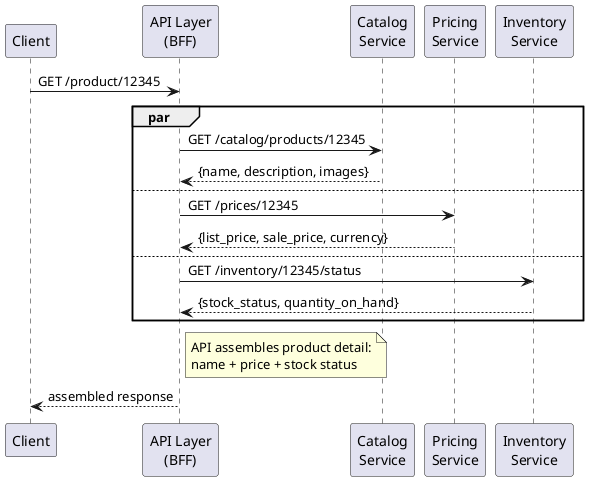
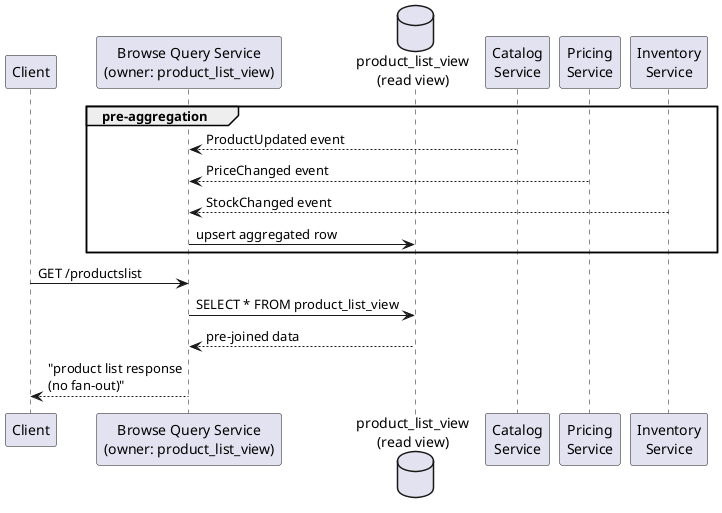
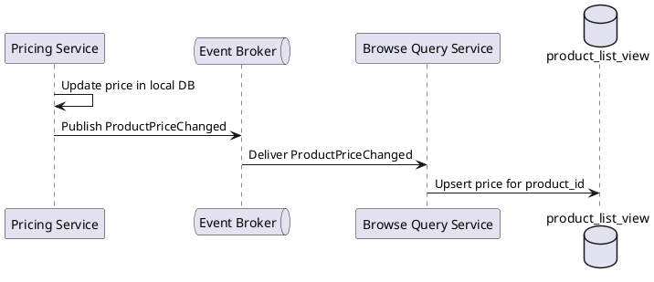
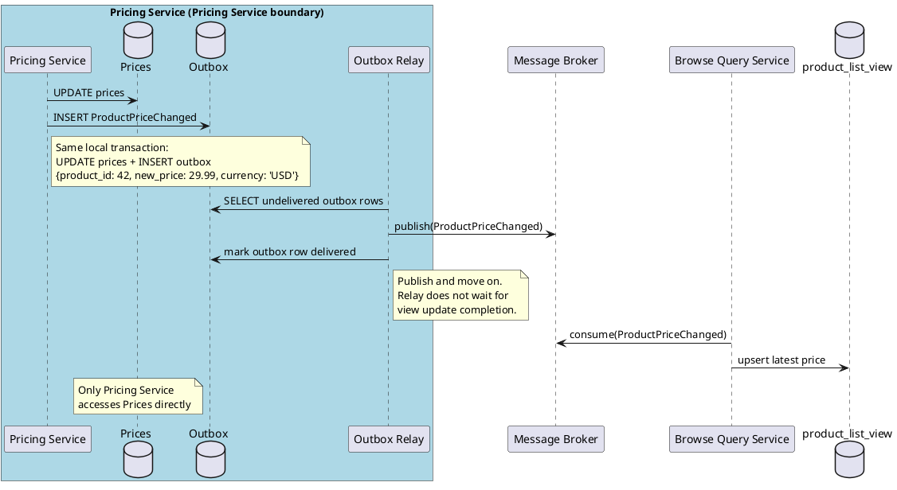
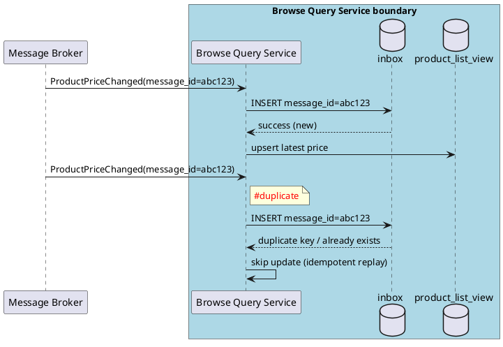
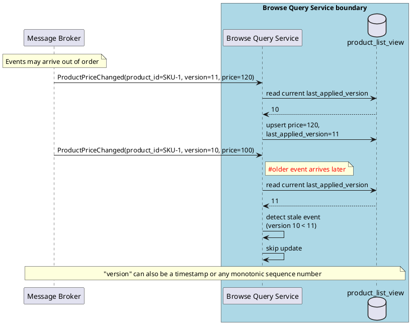

# Microservices 101-03: Data Boundaries & Ownership

Own the Domain and Move Data Safely

## 1. Introduction

In Module 1, we learned how to make operations safe under failure using Idempotency and Eventual Consistency. In Module 2, we learned how to contain failures with Resilience patterns and find them quickly with Observability. Module 3 addresses the next challenge: **data**. Specifically, where it lives, who owns it, and how to move it reliably across service boundaries.

- **Data Ownership**: each service owns its own data exclusively. No other service reads or writes it directly.
- **Change Propagation**: when owned data changes, the owning service publishes events so consumers can update their own copies reliably.

These two principles form the foundation of data independence in microservices. Without them, splitting services is cosmetic — the shared database remains the last invisible coupling point.

> This module is more challenging than most 101-level content, but it covers topics that are unavoidable in microservice design. Event-driven design patterns also appear here as a preview — they are covered in depth in Module 5, so if something feels unclear, feel free to revisit this module after completing Module 5.

### The 'Relational Database' mentalmodel

This pattern persists because the relational database has been the default architecture for over 40 years. ACID transactions, foreign key constraints, and cross-table JOINs made strong consistency practical and comfortable. Teams trust the database to enforce business rules across domains — and that trust is deeply cultural, not just technical.

If you carry this mental model into microservice development as-is, you end up splitting only the service layer while the data layer remains a monolith.

Many teams successfully split their services into separate deployments, separate CI/CD pipelines, and separate teams. But they keep one shared database. To justify it, they say: "We don't share data — each service has its own table!"

But isolation is not just about avoiding INSERT or UPDATE on tables you do not own. Even SELECT is a violation. If you need data stored in another service's table, you must retrieve it via an API provided by the owning service — not by querying the table directly. This is the data isolation principle in microservices.



"How do we ensure data consistency without TRANSACTION COMMIT/ROLLBACK?", "Won't latency increase if we have to retrieve data via APIs instead of using JOINs or VIEWs?"

This module introduces the core principles of data isolation and the microservice design patterns that answer these questions.

---

## 2. Data Ownership: One Service, One Schema

### Why Accept the Complexity?
Giving up the shared database sounds like a step backward in the new era. We lose instant cross-service JOINs, global transactions, and the comfort of strong consistency. Teams have to implement them by themselves. Why would any team choose this?

| Dimension | Shared Transaction | Independent Boundaries |
|---|---|---|
| Implementation effort (short-term) | Simpler to implement initially (RDB-centric) | More upfront design and integration complexity |
| Ownership model | Ownership boundaries are unclear | Ownership boundaries are clear |
| Change impact | One team's migration can break everyone | Each team deploys independently |
| Authority model | DB is the authority | API is the contract |
| Scalability model | Scale the whole DB together | Scale each service separately |
| Failure impact | One failure cascades | Blast radius is contained |

At small scale, the shared database often wins on simplicity. But as teams and traffic grow, tight coupling in the data layer becomes the real bottleneck. The value of microservices comes from keeping each service independent enough that one team's change does not impact the others. The same is true for the data layer: once it is shared, the services themselves can no longer evolve independently. Even if the design becomes more complex, the gain in autonomy is worth that cost.

### Domain Boundary = Data Boundary
To find the right ownership boundary, stop looking at database schemas and start looking at the business itself.

- **Traditional (RDBMS)**: Group data by normalization, keys, and structural convenience.
- **Microservices (Domain)**: Group data by behavior, lifecycle, and business ownership.

A **Domain Boundary** is a "Sphere of Knowledge" where one team has the authority to change rules. The database is a persistent side effect of this knowledge — not the starting point.

Transactions protect **Business Invariants** (rules that must always be true). If two pieces of data must be consistent in real-time, they belong in the *same* domain.

Domain-Driven Design (DDD) is outside this module's scope, so we won't go deep here. If you want to explore domain boundary discovery further, Event Storming is a good starting point.

### The Master Data Trap
Almost every team that still carries the relational database mental model hits the same question during microservice design: "Which service should own the `products` master data table?"

The diagnostic question to ask back: **"Does your company have a single business team whose job is to maintain every attribute of a product?"**

The answer is almost always **No**. The monolith `products` table grew because every team added the columns they needed. Nobody truly owns the integrity of the whole row, but everybody depends on it.

### Bounded Context: Thinking in Domains
The fix is **Domain Model**, or **Bounded Context** thinking. A "Product" is not a single entity — it is a concept that spans multiple domains, and each domain is the absolute authority over its own attributes:

| Domain | What it owns |
|---|---|
| **Catalog** | name, description, images, categories |
| **Pricing** | list price, discount rules, currency |
| **Inventory** | SKU, stock level, warehouse location |
| **Logistics** | weight, dimensions, hazmat flags |
| **Finance** | tax class, cost price, accounting code |

No single service "owns the product" — they each own their **Domain Attributes**. The practical test for a healthy boundary: can a team change their columns without coordinating with anyone else? If not, you have not split the domain; you have just split the table.

### Reference by ID via API, Not by Join
Once each service owns its own data, SQL JOINs across service boundaries are no longer available. The replacement is simple: store the ID, and resolve it when needed.

**Before (shared schema, join):**
```sql
SELECT o.id, i.sku, i.quantity
FROM orders o
JOIN inventory i ON o.product_id = i.id   -- cross-schema join
```

**After (separate schemas, reference by ID):**
```
Order: { order_id: "ORD-1", product_id: "PROD-42", quantity: 2 }
-- To get product inventory level: call Inventory Service GET /products/PROD-42
```

The ID is the API contract. The owning service controls what it returns when you resolve that ID. 
Network calls are introduced to query information that could be obtained by a local JOIN. You might think, "Why bother?", but this is precisely the intention of microservices. The coupling between services that was hidden within the JOIN becomes explicit through API calls.

---

## 3. After the Split: Reading Across Services

Splitting the data solves the ownership problem but, as mentioned above, creates a read-composition problem. A product detail page needs name (Catalog), price (Pricing), and stock level (Inventory). Previously, one SQL query could retrieve all necessary attributes. Now we have to call three services. Three services may be acceptable, but what if 10 or 20 are required?

The split immediately raises two read-composition questions:

1. How do we assemble one response from multiple services at query time?
2. How do we handle high-frequency list reads without exploding cross-service calls?

There are established design patterns that answer both questions. Choosing between them comes down to two axes: **how fresh the data must be**, and **how much read throughput the screen demands**.

Read patterns fall into two families:

### Family 1: Gather Data on Demand
Fetch fresh data from each service at request time.

**API Composition** 

The default starting point: one backend endpoint gathers data from multiple services in parallel and returns one assembled response.



**When to use:** Data must be fresh, fan-out is small, and request volume is moderate (e.g., product detail pages, admin dashboards).
**Watch out:** Tail latency grows with fan-out. If any downstream is down, composition may fail or degrade. Mitigate with parallel calls, timeouts, and partial fallback.

**Frontend Composition**

The client (browser or mobile app) calls each service directly and assembles the UI itself — no backend assembly layer required. This is the natural model for micro-frontend architectures where each team ships an independent UI component.

**When to use:** Teams own separate UI components per domain and can expose service APIs publicly with appropriate auth. Reduces backend coordination overhead.
**Watch out:** Moves assembly complexity into the client. More round trips are visible to the user, service URLs are browser-visible, and auth tokens must be managed across multiple origins. Avoid for sensitive data that should not leave the backend.

### Family 2: Prepare Data Ahead of Time
Pre-compute or pre-position data so reads are fast and simple. A dedicated **aggregated read view** (sometimes called a CQRS read model) pre-joins the fields needed for a specific screen.

This may sound like a database-level materialized view — but the key difference is **ownership**: the read view is owned and written exclusively by the consuming service, not by the database engine or by source services directly. We'll revisit this distinction in the next section when we look at the shared read datastore anti-pattern.



**When to use:** High-traffic list or search pages where API composition fan-out is too large. Eventual consistency is acceptable.
**Key rule:** The read view is **owned by the consuming service** (Browse Query Service in this example). Source services never write the view directly — they publish change events.

### Anti-Pattern: Shared Read Datastore
A pattern that looks similar but is dangerous: multiple source services directly write one shared read datastore.

This quietly re-introduces coupling: any schema change requires coordination across all services that read from it. Services become aware of each other's table structures. Ownership boundaries become blurry. This significantly impairs the value of microservices. 

**Simple test:** Can Service A change a column without notifying Service B or C? If not, coupling is back.

**Preferred alternatives:**
- API composition (fresh data, moderate QPS)
- Consumer-owned cache (simple optimization for repeated reads)
- Consumer-owned aggregated read view (high QPS, tolerate slight lag)

---

## 4. Change Propagation: How Do Copies Stay in Sync?

Family 2 of Section 3 covered how to pre-assemble reads. This means a consumer holds a copy of the source data. That raises a new question: when a source service updates its own data, how do downstream services that hold a denormalized copy learn about the change?

There are four update strategies, and the right choice depends on **how fresh the data must be** and **how much operational complexity the team can absorb**:

| Strategy | How it works | Freshness | Complexity |
|---|---|---|---|
| **Local same-service update** | The same service that writes the data also updates the read view in the same transaction | Immediate | Low |
| **Scheduled refresh** | A job re-reads source data on a fixed interval (e.g., every 5 minutes) | Eventually consistent (lag = refresh interval) | Low |
| **Batch refresh** | A bulk job re-reads and rewrites the full view in a batch window | Eventually consistent (lag = batch window) | Medium |
| **Event-driven update** | The source publishes a change event; consumers subscribe and update their own copy asynchronously | Eventually consistent (near-real-time) | Medium–High |

In a microservices context, the first strategy (local update) only applies when the source and the read view live in the same service. For cross-service copies, the other three apply — and event-driven is the most common default because it is decoupled and avoids staleness.

### Event-Driven Updates
The default approach: the source service publishes a change event, and each consumer updates its own local view asynchronously.



This improves decoupling and scale, but introduces propagation lag — data becomes eventually consistent (Module 1). Delivery is usually at-least-once: events can be delayed or retried, so consumers must handle duplicates safely (Module 1's idempotency principle).

### The Dual-Write Problem
Let's go deeper. This is where it gets complex, but it's a combination of patterns we've already covered. In event-driven updates above, the source service writes to its own database and publishes an event. What if one succeeds and the other fails? The event may be lost entirely, with no record of what went wrong.

But what if the DB write and event publish are two independent steps? If one succeeds and the other fails, the event may be lost entirely — with no record of what went wrong.

- `UPDATE prices` succeeds, but `publish(ProductPriceChanged)` fails → consumers never see the new price
- Or: publish succeeds, but DB update fails → consumers apply a price that was never committed

This is the **Dual-Write Problem**: not data duplication, but the risk of data loss when two independent writes — one to the DB and one to the event broker — are not atomic.

The fix is not one silver bullet but **two complementary layers**:

| Layer | What it solves | Mechanism |
|---|---|---|
| **Outbox (producer side)** | Never lose an event record | Atomic local write: business data + outbox in one transaction |
| **Inbox / Idempotent consumer (consumer side)** | Safely handle duplicate delivery | Inbox table or natural idempotency|
| **Together** | Exactly-once business outcomes | At-least-once publishing + at-least-once consumption with deduplication |

The next two sections cover each layer in turn.

### The Outbox Pattern: Making Publishing Atomic
The fix is the **Outbox Pattern**: write both the business data and the event record in one local database transaction. A separate **relay** component polls the outbox table and publishes events to the broker asynchronously.



**Key point:** The business write and the outbox record happen in **one local transaction** — atomicity is what makes the event record impossible to lose. The relay then publishes asynchronously and is entirely decoupled from business logic.

**Why not 2PC (DB + broker)?** It couples DB and broker at commit time, reducing availability and adding latency. It ties your architecture to specific middleware — platform lock-in. In event-driven systems, eventual consistency is the accepted model, not global commits.

---

### Consumer Safety: Inbox Pattern & Version Check

The outbox guarantees "no event lost" on the producer side. But what about the consumer side? Two failure modes must be handled:

### Failure Mode 1: Duplicate Delivery
The relay publishes at-least-once, which means the consumer may receive the same event more than once. The **Inbox Pattern** handles this: record processed message IDs in a local `inbox` table before processing.

The Inbox is the consumer-side complement of the Outbox — Outbox makes publishing reliable; Inbox makes consuming safe.



The inbox datastore holds a record of successfully processed messages — typically just the message ID (as primary key for deduplication) and a timestamp. This lightweight table enables the consumer to idempotently replay incoming messages.

```sql
CREATE TABLE inbox (
  message_id  UUID PRIMARY KEY,
  processed_at TIMESTAMPTZ NOT NULL DEFAULT now()
);
```

This directly applies Module 1's idempotency principle to the event consumer layer. Alternatively, use natural idempotency (e.g., `INSERT ... ON CONFLICT DO NOTHING`) when the operation itself is inherently safe to replay.

> **Tip:** Scope `message_id` to topic + consumer to avoid cross-topic collisions.

### Failure Mode 2: Out-of-Order Delivery
In distributed systems, message ordering is not guaranteed. Retries, consumer restarts, and multi-partition scenarios can shuffle arrival order. This is not a bug — it is a fundamental property of asynchronous communication. A stale overwrite silently corrupts the read model — no error, no exception, just wrong data served to users.

The **Version Check Pattern** handles this: every event carries a monotonic version number. Before applying an update, the consumer compares the event's version against `last_applied_version` stored in its local view. If the incoming version is older — skip it.



Brokers like Kafka offer per-partition ordering when you route by entity key. You can use it if possible. But in case your platform doen't offer the ordering mechanism, the version check is your safety net.

To summarize the consumer side: **Inbox** handles duplicates; **Version Check** handles stale or out-of-order events. Together they cover the two most common consumer-side failure modes.

---

## 5. Closing: Own It First, Then Move It Safely

Microservices push teams to separate data ownership first, then intentionally choose read and write patterns around that boundary.

1. **Ownership first** — one service, one schema. Only the service that owns a data attribute can create, update, or delete it. All other services must access it through the API of the owner service.
2. **Read patterns come in two families** — gather on demand (API composition) when freshness matters, or prepare ahead of time (aggregated read view) when throughput matters. Neither is universally better — choose by the use case.
3. **Write-side reliability** — the outbox guarantees no event is lost. The inbox and version check guarantee the consumer handles duplicates and ordering safely.
4. **Every copy needs an owner** — who refreshes it, how stale is acceptable, whose read problem does it solve? Without this clarity, copied data becomes unmanaged coupling.

Remember: eventual consistency is not "anything goes." It means the team explicitly decides where temporary lag is acceptable and designs the user experience around it.

### Bridge: What's Next?
This module introduced event publishing as the mechanism for propagating data changes across service boundaries. Module 4 takes that idea further.

In **Module 4 (Workflows & Messaging)**, we look at what happens when a single event triggers a chain of actions across multiple services — and what to do when one step in that chain fails. We contrast two coordination styles (Orchestration vs. Choreography) and introduce the **Saga Pattern**: the distributed equivalent of a rollback when you no longer have a global transaction to rely on.

When you are ready to design **owned APIs that can evolve safely** — backward compatibility, versioning strategies, and the expand/contract pattern — that is covered in Module 5 (API Evolution).

---

## Appendix: Production-Ready Checklist
- [ ] Every piece of business data has exactly one owning service (system of record).
- [ ] No cross-service SQL JOINs. Services reference each other by ID and resolve via API.
- [ ] Schema changes use the expand/contract pattern — never break consumers.
- [ ] Write-side uses the outbox pattern: business write + event record in one local transaction.
- [ ] Consumer-side implements inbox (dedup) and version check (stale rejection).
- [ ] Every derived copy (cache, projection, read view) has a defined owner, refresh strategy, and acceptable staleness window.
- [ ] Read patterns match the use case: API composition for fresh data, aggregated read view for high-traffic screens.
- [ ] No shared read datastore — each consumer owns its own read model.
