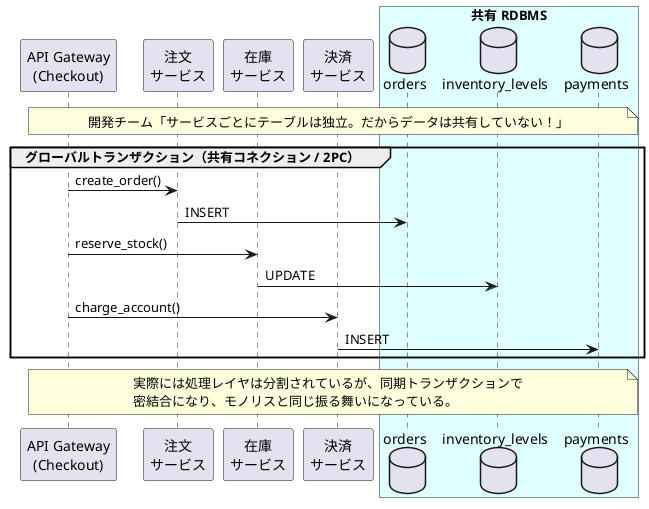
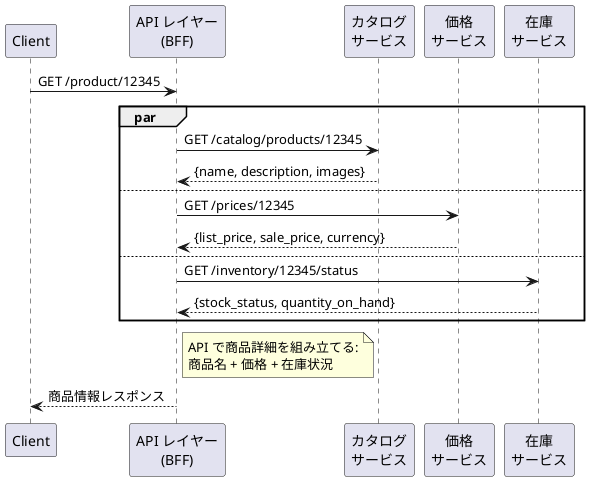
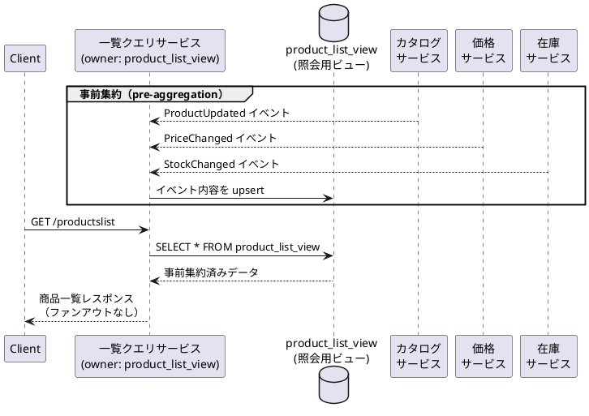
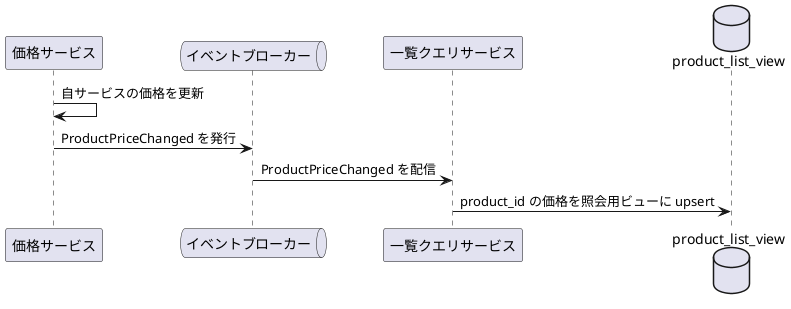
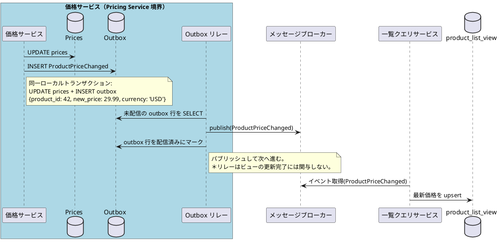
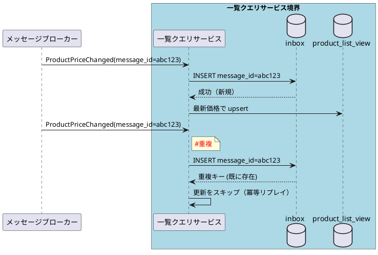
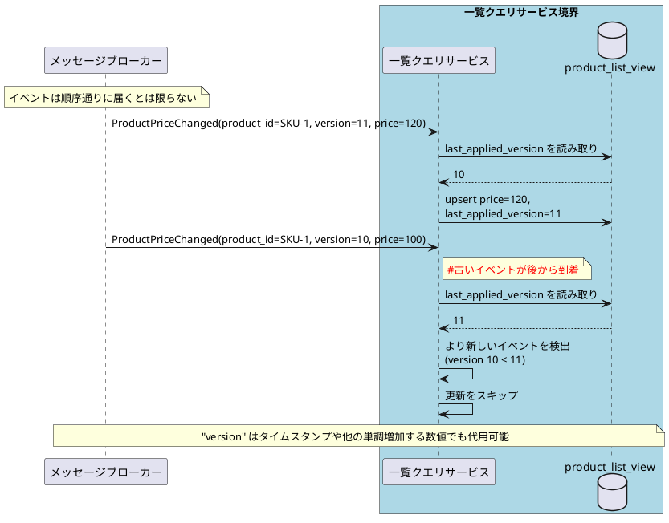

# Microservices 101-03: データ境界とオーナーシップ (Data Boundaries & Ownership)

ドメインの所有するデータを安全に伝播させる

## 1. はじめに

モジュール 1 では、冪等性と結果整合性によって、障害が発生してもリクエストを安全に処理する方法を紹介しました。モジュール 2 では、レジリエンスパターンで障害の連鎖を防ぎ、可観測性で素早く問題を特定する方法を紹介しました。このモジュール 3 では、大命題である**データ**に取り組みます。具体的には、データがどこに存在し、誰がそれを所有しているのか、そしてそのデータをサービス境界を越えてどのように安全に伝播させるのかを扱います。

- **データオーナーシップ（Data Ownership）**: 各サービスは自身のデータを排他的に所有します。他のサービスがそれを直接読み書きすることはありません。
- **データ変更の伝播（Change Propagation）**: 所有データが変更された場合、所有サービスがイベントを発行し、コンシューマ（データ利用者）が自身のコピーを確実に更新できるようにします。

この 2 つの原則が、マイクロサービスにおけるデータ独立性の基盤です。これらがなければ、サービスの分割は見かけだけのものになり、共有データベースが見えない密結合ポイントとして残り続けます。

> このモジュールは、101 レベルとしては難しいかもしれませんが、マイクロサービスでは避けて通ることができないのでしっかり説明します。また、イベント駆動のデザインパターンについては次のモジュールで解説するのですが、このモジュールでも先取りして出てきます。わからない部分は、モジュール 4 でイベント駆動について理解してからまた戻ってくれば OK です。

### リレーショナルデータベースというメンタルモデル

リレーショナルデータベースは 40 年以上にわたり、デフォルトのアーキテクチャであり続けてきました。このパターンが根強く残るのも仕方ありません。ACID トランザクション、外部キー制約、クロステーブル JOIN によって、データどうしの強い整合性を実用的かつ簡単に実現できたのです。ドメインを跨いだビジネスルールの実装をデータベースレイヤに任せるのは開発者にとって当たり前のことで、DBMS への高い信頼は、技術的なものだけでなく文化的にも根付いて来たのです。

そのメンタルモデルのままマイクロサービスのアプリケーション開発を始めても、サービスレイヤだけを分離しただけになってしまいます。

マイクロサービスに取り組むチームの多くは、サービスを個別の CI/CD パイプラインで個別にデプロイできるように、個別のチームに分割することには成功しています。それなのに、サービスの背後にあるデータベースが一つのままになっていることが多いのです。
チームに質問するとたいていは「データベースの箱は同じなんですが、各サービスが使うテーブルは独立しているので、データの共有はしていませんよ！」という答えが返ってきます。でも、よく見ると、あるサービスが別のサービスの所有する（独立しているはずの）テーブルに、1 つのトランザクションの中から直接アクセスしたり、JOIN でデータを取り出したりしています。

INSERT や UPDATE をしなければよいということではないのです。自分の所有データでなければ、SELECT も不可です。もし他のサービスの所有するテーブルにあるデータが必要なのであれば、そのサービスが提供する API を介してデータを取得しなくてはなりません。これはマイクロサービスにおけるデータ分離の基本原則です。



「TRANSACTION COMMIT/ROLLBACK を使わずにどうやってデータの整合性を確保するの？」「JOIN や VIEW を使わずに必要なデータを取得していたら、レイテンシが高くなってしまうのでは？」

このモジュールではデータ分離の基本原則と、それによって生じる上記のような疑問に答えるためのマイクロサービス・デザインパターンを紹介します。

---

## 2. データオーナーシップ: 1 サービス、1 スキーマ

### なぜあえて複雑なアプローチを選ぶ必要があるの？
RDBMS の便利な機能の数々を手放すことは、開発チームにとっては一見、進化でなく後退のように感じられます。クロスサービスの JOIN、グローバルトランザクション、確実な整合性の確保と言った安心感を手放し、それらの実現のためには自分たちが実装しなくてはいけなくなります。なぜマイクロサービスではあえてこの選択を推奨するのでしょうか？

| 観点 | 従来の RDBMS 型 | データ境界型 |
|---|---|---|
| 実装負荷（短期） | 初期実装は比較的シンプル（RDB 中心） | 境界設計や連携設計の初期負荷が高い |
| オーナーシップモデル | オーナーシップ境界が不明確 | オーナーシップ境界が明確 |
| 変更影響 | あるチームの変更が他チームに影響 | 各チームが独立して変更可能 |
| 権威モデル | DB 権威に依存 | API コントラクトに従う |
| スケーリングモデル | DB 全体でのスケール | 各サービスを個別にスケール |
| 障害影響 | 障害が連鎖しやすい | 影響範囲（Blast Radius）を限定しやすい |

チームやサービスが小規模なうちは、共有データベースがシンプルさで勝ります。しかし、チームやトラフィックが成長するにつれ、データ層の強い結合がボトルネックになります。マイクロサービスの価値は、あるチームの修正が他チームに影響を与えない独立性を維持するために、各サービスの影響範囲を十分に小さくすることで発揮されます。データ層も同じで、共有していることによりサービスそのものを独立して変更することができなくなります。設計が複雑になるとしても、自律性の獲得にはそれを超えるだけの価値があるのです。

### ドメイン境界 = データ境界
正しいオーナーシップの境界を見つけるには、データベーススキーマではなくビジネスそのものを見る必要があります。

- **従来型（RDBMS）**: 正規化、キー、構造的な利便性でデータをグループ化する。
- **マイクロサービス（ドメイン）**: 振る舞い、ライフサイクル、ビジネス上のオーナーシップでデータをグループ化する。

**ドメイン境界**とは、1 つのチームがルールを変更する権限を持つ「知識の領域（Sphere of Knowledge）」のことです。データベースはその知識の永続化された副産物であり、出発点ではありません。

トランザクションは**ビジネス不変条件（Business Invariants）**（常に真でなければならないルール）を保護します。2 つのデータがリアルタイムで整合している必要がある場合、それらは*同じ*ドメインに属しています。

ドメイン駆動設計（DDD）はこのモジュールの対象範囲外のため、ここでは深く掘り下げません。ドメイン境界の発見についてさらに探求したい場合は、イベントストーミング（Event Storming）もひとつの参考になります。

### マスターデータの壁
RDB のメンタルモデルを引きずったままマイクロサービス設計を始めたチームから必ずもらう相談（質問？）があります:「`商品マスタ` テーブルはどのドメインが持てばよいでしょうか？」

私はこう聞き返します: **「あなたの会社には、商品マスター管理部門という部門があって、そこで商品に関するすべての属性を維持管理していますか？」**

今までの経験では、答えは必ず**No**でした。

モノリスでは当たり前の `商品マスタ` テーブルですが、各ドメインに必要な属性を追加していった結果、巨大なテーブルになっています。属性全体と属性間の整合性を真に理解人は誰もいないのに、注文や在庫など多くのドメインがこのテーブルに依存しています。

### 境界づけられたコンテキスト: ドメインで考える
解決策は**ドメインモデル**あるいは、**境界づけられたコンテキスト（Bounded Context）**の考え方です。「商品（Product）」は単一のエンティティではなく、複数のドメインにまたがる概念であり、各ドメインが自身が所有する属性に対してすべての権限を持ちます:

| ドメイン | 所有する属性 |
|---|---|
| **カタログ（Catalog）** | 商品名、説明文、画像、カテゴリ |
| **価格（Pricing）** | 定価、割引ルール、通貨 |
| **在庫（Inventory）** | SKU、在庫数、倉庫の場所 |
| **物流（Logistics）** | 重量、寸法、危険物フラグ |
| **経理（Finance）** | 税区分、原価、勘定科目コード |

つまり「商品」を丸ごと所有するサービスは存在していません。各サービスは自身の**ドメインに必要な属性**を所有します。健全な境界が設計されていれば、そのチームは他のチームと調整することなく、自分の属性（テーブルの列）を変更できるます。もしできなないのであれば、ドメインが正しく分割できていないということになります。

### テーブル JOIN ではなく、API を介し ID で参照する
各サービスが独自のデータを所有する=スキーマが分割されたので、サービス境界を跨いだ SQL JOIN は使ってはいけません。代わりに、ID を保持し、必要な時に値を照会するというシンプルな方法を使います。

**Before（共有スキーマ、JOIN）:**
```sql
SELECT o.id, i.sku, i.quantity
FROM orders o
JOIN inventory i ON o.product_id = i.id   -- クロススキーマ JOIN
```

**After（個別スキーマ、ID による参照）:**
```
Order: { order_id: "ORD-1", product_id: "PROD-42", quantity: 2 }
-- 在庫サービスの GET /products/PROD-42 を呼び出して在庫数を照会
```

API 利用時に ID がコントラクトとなります。所有サービスが、その ID を解決した際に何を返すかを知っています。
ローカルに JOIN すれば得られる情報を照会するために、ネットワーク呼び出しが導入されます。わざわざ？と感じてしまうかもしれませんが、これこそがマイクロサービスの意図です。JOIN の中に隠れてしまっていたサービス間の結合は、API 呼び出しを介することで明示的になるのです。

---

## 3. テーブルを分割して、サービスを跨いだ読み取りはどうするの？

データの分割はオーナーシップの問題を解決しますが、上述したように読み取りの合成（read composition）という課題を生みます。例えば商品詳細ページには、商品名（カタログ）、価格（価格サービス）、在庫数（在庫サービス）が必要とします。以前は 1 つの SQL クエリで必要な属性をすべて取得できました。いまは 3 つのサービスを呼び出す必要があります。API 3 つくらいなら許容できるかもしれませんが、必要なサービスが 10 や 20 になったらどうでしょうか？

読み取りの合成（read composition）に関する課題がすぐに思い浮かびます。
1. クエリ時に、複数サービスから 1 つのレスポンスをどう組み立てるか？
2. 高頻度な一覧読み取りで、大量のサービス間呼び出しがベストなのか？

この質問に答えるためのデザインパターンがちゃんとあります。パターンを選ぶ際の判断軸は 2 つです: **データの鮮度（freshness）をどこまで求めるか**、そして**そのページの読み取りスループットがどの程度か**。
これに基づいて大きく 2 つの読み取りパターンがあります:

### パターン 1: オンデマンドでデータを集める
リクエスト時に各サービスから最新データを取得します。

**i) API コンポジション**

1 つのバックエンドエンドポイントが、複数のサービスからデータを並列に取得し、1 つのレスポンスとして返します。



**使える場面:** データの鮮度が重要で、ファンアウト（呼び出し先数）が少なく、リクエスト量も多くない場合（例: （1 つの）商品詳細ページ、管理画面）。
**注意点:** ファンアウトが増えるとテールレイテンシが増大します。下流サービスがダウンすると、コンポジション全体が失敗したり部分的にデグレードします。並列呼び出し、タイムアウト、部分的なフォールバック（モジュール 2 参照）で緩和しておく必要があります。

**フロントエンドコンポジション（Frontend Composition）**

クライアント（ブラウザやモバイルアプリ）が各サービスを直接呼び出し、UI を自身で組み立てます。バックエンドの集約レイヤーは不要になります。各チームが独立した UI コンポーネントを所有するマイクロフロントエンドアーキテクチャの場合に馴染みやすいパターンです。

**使える場面:** チームがドメインごとに独立した UI コンポーネントを所有しており、必要なサービス API を公開できる場合。バックエンド側の調整コストを削減できます。
**注意点:** 組み立ての煩雑さはクライアントに移ります。ユーザーから見えるラウンドトリップが増え、サービス URL がブラウザに露出し、複数オリジンにまたがる認証トークン管理が必要になります。バックエンドから外に出すべきでない機密データには使用しないよう留意が必要です。

### パターン 2: 事前にデータを準備する
データを事前に計算・配置して、読み取りを高速かつシンプルにします。専用の**集約読み取りビュー（Aggregated Read View）**が、特定の画面に必要なフィールドを事前に結合します。（CQRS リードモデルとも呼ばれることもあります。CQRS については別のモジュールで触れます。）

データベースレベルのマテリアライズドビューと似ているように聞こえるかもしれませんが、決定的な違いは**オーナーシップ**にあります。この読み取りビューは、データベースエンジンやソースサービスではなく、コンシューマ（利用）サービスが排他的に所有・書き込みを行います。この違いは、次のセクションで共有読み取りデータストアのアンチパターンを取り上げる際に改めて確認します。



**使える場面:** API コンポジションのファンアウトが大きすぎる、高トラフィックの一覧・検索ページ。結果整合性の許容が前提。
**重要なルール:** 読み取りビューは**コンシューマ側のサービス**（この例では一覧クエリサービス）が所有します。ソースサービス（カタログ、価格、在庫）はビューに直接書き込むことはなく、変更イベントを発行します。

### アンチパターン: 共有読み取りデータストア
似ているように見える危険なパターンが、共有読み取りデータストアです。マテリアライズドビューもその 1 つです。複数のソースサービスが 1 つの共有読み取りデータストアに直接読み書きします。

これは密結合を暗黙的に取り込んでしまうことになります。スキーマ変更時に、そのデータストアにアクセスするすべてのサービス間で影響範囲の調査と変更の調整が必要になります。サービスが互いのテーブル構造を意識するようになり、オーナーシップの境界が曖昧になります。これはマイクロサービスの価値を大きく損なうものです。
サービス A がテーブル定義を変更したい場合に、サービス B や C と調整したり通知する必要があるようなら、密結合がが復活している危険信号です。

**推奨される代替手段:**
- API コンポジション（最新データ、中程度の QPS）
- コンシューマ所有のキャッシュ（繰り返し読み取りのシンプルな最適化）
- コンシューマ所有の集約読み取りビュー（高 QPS、わずかな遅延を許容）

---

## 4. 変更の伝播: どのようにソースデータの変更と同期を保つか？

セクション 3 のパターン 2 では、読み取りビューを事前に組み立てる方法を取り上げました。これはコンシューマがソースデータのコピーを保持することを意味します。ここで新しい疑問が登場です: ソースサービスが自身のデータを更新したとき、非正規化コピー（denormalized copy）を持つ下流サービスはどうやってその変更に対応すればいいのでしょうか。

更新戦略は 4 つあります。選択の基準は **データをどこまで新鮮に保つ必要があるか** と **チームがどれだけの運用複雑性を受け入れられるか** です。

| 戦略 | 仕組み | 鮮度 | 複雑性 |
|---|---|---|---|
| **ローカル更新（同一サービス内）** | データを書いたサービスが同一トランザクション内で読み取りビューも更新する | 即時 | 低 |
| **スケジュール更新** | ジョブが一定間隔（例: 5 分ごと）にソースを再読し更新する | 結果整合（ラグ = 更新間隔） | 低 |
| **バッチ更新** | バルクジョブがバッチウィンドウ内にビュー全体を再書き込みする | 結果整合（ラグ = バッチウィンドウ） | 中 |
| **イベント駆動型更新** | ソースが変更イベントを発行し、コンシューマが非同期で自身のコピーを更新する | 結果整合（準リアルタイム） | 中〜高 |

マイクロサービスのコンテキストでは、ローカル更新はソースと読み取りビューが同じサービス内に存在する場合にのみ適用できます。サービスをまたぐ変更伝播には残り 3 つのパターンを提供することになりますが、イベント駆動型が最も一般的な選択肢です。疎結合でありデータの鮮度を維持しやすいためです。

### イベント駆動型更新
ソースサービスが変更イベントを発行し、そのイベントをトリガーにして各コンシューマが自身のローカルビューを非同期で更新します。



これにより疎結合とスケーラビリティが向上します。一方、伝播ラグが生じるので、データは結果整合的になります（モジュール 1）。配信は通常 at-least-once（少なくとも 1 回）です。イベントが遅延したりリトライされたりする可能性があるため、コンシューマは重複を安全に処理する必要もあります（モジュール 1 の冪等性の原則）。

### デュアルライト問題
もう一歩踏み込んでみましょう。一番複雑なところですが、これまでのモジュールの内容の組み合わせです。
上記のイベント駆動型更新で、ソースサービスは自分の所有する DB への書き込みとイベントの発行を行っています。もし一方が成功し他方が失敗したらどうなるでしょうか。イベントが失われてしまう可能性があります。ログを追いかけて調査しないと何が起きたかの記録も残りません。

- `UPDATE prices` は成功したが、`publish(ProductPriceChanged)` が失敗 → コンシューマ側にイベントが届かず、新しい価格が反映されない
あるいは
- イベント発行は成功したが、DB 更新が実は失敗していた → コンシューマはソース側に反映されていない価格を適用してしまう

これが**デュアルライト問題（Dual-Write Problem）**です。これはデータの重複を意味するデュアルではなく、DB とイベントの両方に書き込みを必要とするデュアルを意味していて、データ損失のリスクです。

このリスクを解決するためにはさらに**2 つの補完的なレイヤー**が必要になります。

| レイヤー | 何を解決するか | 仕組み |
|---|---|---|
| **Outbox（プロデューサ側）** | イベントレコードを確実に保持する | アトミックなローカル書き込み: ビジネスデータ + outbox を 1 つのトランザクションで実行 |
| **Inbox / 冪等コンシューマ（コンシューマ側）** | 重複配信を安全に処理する | inbox テーブルまたは自然な冪等処理 |
| **組み合わせ** | ビジネス上の exactly-once を実現 | at-least-once 発行 + at-least-once 消費 + 重複排除 |

次の 2 つのセクションでそれぞれのレイヤーを紹介します。

### Outbox パターン: イベントをアトミックにする
解決策の一つが **Outbox パターン**です。ビジネスデータとイベントレコードの両方を 1 つのローカルデータベーストランザクションで書き込みます。別の**リレー**コンポーネントが outbox テーブルをポーリングし、非同期でイベントをブローカーに発行します。



**ポイント:** ビジネスデータ書き込みと outbox レコードの記録は **1 つのローカルトランザクション**で行われます。イベントレコードを失わないようにする仕組みで、アトミック性を確保できます。リレーサービスははその後、ビジネスロジックとは独立して非同期にイベントを発行できます。

**なぜ 2PC（DB + ブローカー）ではダメなの？** DB とブローカーがコミットにより密結合してしまいます。これは可用性を低下させ、レイテンシを増加させる要因になります。アーキテクチャを特定のミドルウェアに縛り付けることにもなります（プラットフォームロックイン）。イベント駆動型システムの本質は、結果整合性を受け入れることで、これはグローバルコミットを目指すこととは違うものです。

---

### コンシューマの安全性: Inbox パターンとバージョンチェック

Outbox はプロデューサ側で「イベントを失わない」ことを保証します。ではイベントを受け取るコンシューマ側はどうでしょうか？ 2 つの障害モードに対処する必要があります:

### 障害モード 1: 重複配信
リレーは at-least-once で発行するため、コンシューマは同じイベントを複数回受信する可能性があります。**Inbox パターン**でこれに対処することができます。このパターンでは、処理済みのメッセージ ID をローカルの `inbox` テーブルに記録してから処理することで、二重処理を防止します。

Inbox パターンは Outbox パターンを保管するものです——Outbox がイベント発行を信頼できるものにし、Inbox がイベント消費を安全にしてくれます。



inbox データストアは、正常に処理されたメッセージのレコードを保持します。通常はメッセージ ID（重複排除用の主キー）と処理タイムスタンプのみです。この軽量なテーブルにより、コンシューマは受信メッセージを冪等性をもってリプレイできます。

```sql
CREATE TABLE inbox (
  message_id  UUID PRIMARY KEY,
  processed_at TIMESTAMPTZ NOT NULL DEFAULT now()
);
```

これはモジュール 1 の冪等性の原則をイベントコンシューマ層に直接適用したものです。操作自体が本質的にリプレイ安全な場合は、自然な冪等性（例: `INSERT ... ON CONFLICT DO NOTHING`）を使うこともできます。

> **ヒント:** `message_id` はトピック + コンシューマ単位でスコープすると、クロストピックの衝突を防げます。

### 障害モード 2: 順序外配信
分散システムではメッセージ配信の順序は保証されません。リトライ、コンシューマの再起動、マルチパーティションのシナリオにより、到着順序が入れ替わる可能性があります。これはバグではなく、非同期通信の基本的な性質です。順序が入れ替わって後から届いた古いデータを反映してしまった場合、読み取りモデルがソースと不整合になってしまいます。このケースはエラーも例外も発生しないので、不整合も検出しづらくなってしまいます。

**バージョンチェックパターン**でこの問題に対処します。各イベントに変更の都度加算されるバージョン番号を持たせます。イベントを受信したコンシューマーは、その更新を適用する前にローカルビューに保存された `last_applied_version` と比較します。受信バージョンの方が古い場合は、更新をスキップします。



Kafka のように、エンティティキーでルーティングすることでパーティション内の順序を保証してくれるブローカーもあります。これを利用することもできます。順序の到着順が保証されないプラットフォームの場合は、バージョンチェックはセーフティネットとして自分で実装するべきものです。

コンシューマ側のまとめです。**Inbox** パターンで重複に対処し、**バージョンチェック**パターンでイベントの順序に対処します。組み合わせることで、コンシューマ側の最も一般的な 2 つの障害モードをカバーできます。

---

## 5. クロージング: データオーナーシップ、そして安全な変更の伝播

マイクロサービスの第一歩は、データオーナーシップをドメイン責務に合わせて分離することにあります。その境界をまたぐデータの参照のために、紹介してきたデザインパターンを意図的に選択、組み合わせることが設計時に求められます。

1. **オーナーシップが最優先** — 1 サービス、1 スキーマ。あるデータ属性を作成、更新、削除できるのはその属性を所有するサービスだけです。他のすべてのサービスは、そのオーナーサービスの API を経由してアクセスしなくてはなりません。
2. **Cross-service 読み取りパターンは 2 つ** — 鮮度が重要な場合はオンデマンド収集（API コンポジション）、スループットが重要な場合は事前集約読み取りビューが有効です。どちらが普遍的に優れているわけではなく、ユースケースに応じて選択してください。
3. **ソースサービスでの変更反映の信頼性** — Outbox はイベントが失われないことを保証します。Inbox とバージョンチェックは、コンシューマが重複と順序を安全に処理することを保証します。
4. **コピー操作にもオーナーが必要** — 誰がリフレッシュするか、どの程度の古さが許容されるか、誰の読み取り問題を解決しているのか？ この明確さがなければ、コピーされたデータは管理されていない密結合の種になってしまいます。

> Note: 結果整合性は「そのうち整合されるなら何でもよい」を意味しているわけではありません。チームが一時的なデータの不整合がどこまで許容されるかを判断し、その前提でユーザー体験を設計することを意味することを覚えておいてください。

### 次のモジュールへの橋渡し
このモジュールでは、サービス境界を越えてデータ変更を伝播させるメカニズムとしてイベント発行を紹介しました。モジュール 4 では、この考え方をさらに発展させます。

**モジュール 4（Workflows & Messaging）** では、1 つのイベントが複数のサービスをまたぐ一連のアクションを引き起こす場合に何が起きるか、そしてそのチェーンの 1 ステップが失敗した場合にどう対処するかを学びます。2 つの調整スタイル（オーケストレーション vs. コレオグラフィー）を比較し、グローバルなトランザクションが使えない分散環境でのロールバック手段である **Saga パターン** を紹介します。

安全に進化できる**所有された API** の設計 — 後方互換性、バージョニング戦略、expand/contract パターン — はモジュール 5（API Evolution）で扱います。

---

## 付録: 本番環境チェックリスト
- [ ] すべてのビジネスデータに、ただ 1 つの所有サービス（システムオブレコード）がある。
- [ ] クロスサービスの SQL JOIN がない。サービスは ID で参照し、API 経由で解決する。
- [ ] スキーマ変更は expand/contract パターンを使用する — コンシューマを壊さない。
- [ ] 書き込み側は Outbox パターンを使用: ビジネス書き込み + イベントレコードを 1 つのローカルトランザクションで。
- [ ] コンシューマ側は Inbox（重複排除）とバージョンチェック（古いイベントの拒否）を実装している。
- [ ] すべての派生コピー（キャッシュ、プロジェクション、読み取りビュー）に、定義されたオーナー、リフレッシュ戦略、許容される古さの範囲がある。
- [ ] 読み取りパターンがユースケースに合っている: 最新データには API コンポジション、高トラフィック画面には集約読み取りビュー。
- [ ] 共有読み取りデータストアがない — 各コンシューマが独自の読み取りモデルを所有している。
