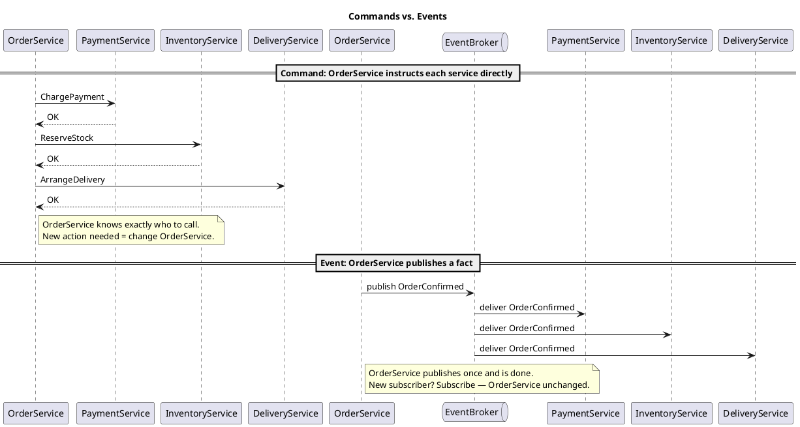
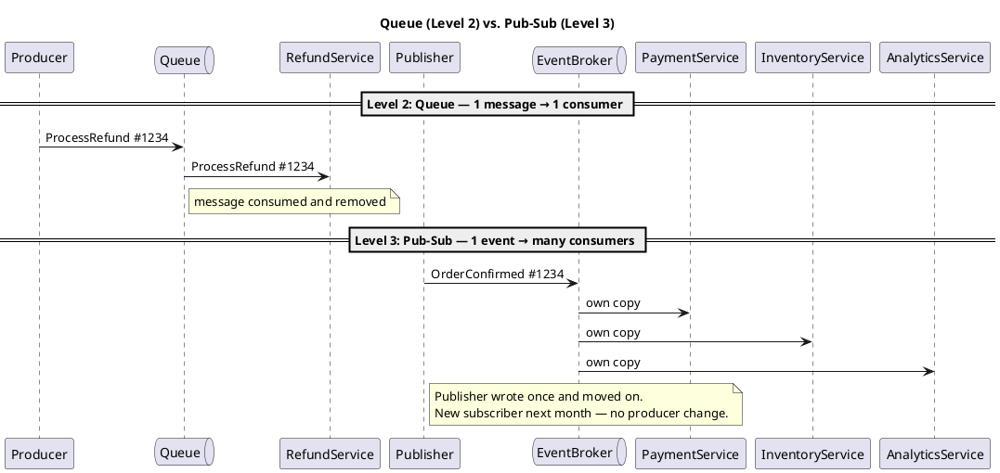
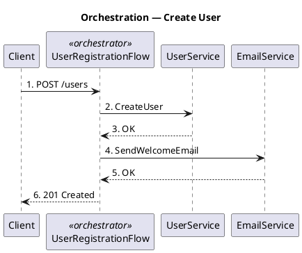
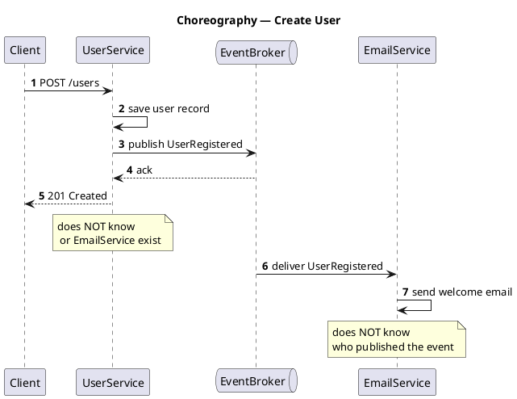

# Microservices 101-04: Workflows & Messaging

Coordination for Loose Coupling

## 1. Introduction

In Module 1, we learned how to make individual operations safe under failure using idempotency and eventual consistency. In Module 2, we learned how to contain failures with resilience patterns and find them quickly with observability. Module 3 addressed the data layer: where data lives, who owns it, and how to move it reliably across service boundaries. Module 4 moves one layer up — to the **application layer**.

- **Communication Models**: Services need to exchange information to work together. This module uses three service communication levels — synchronous chains, queues, and event-driven publication.
- **Workflow Patterns**: the two primary styles to coordinate multi-step business processes that span multiple services — orchestration and choreography.

Module 3 showed coupling hiding in the data layer — shared databases as invisible handcuffs. This module shows the same problem hiding one layer up: synchronous call chains that silently create **temporal** and **behavioral** coupling at the application layer.

> The fix isn't to avoid coordination — services must coordinate in microservice architecture. It's to choose the right level of coordination for each scenario, and to understand exactly what coupling cost you are accepting at each choice.

### The Synchronous Mental Model

Most teams learn to build services by writing REST APIs: one service calls another, waits for the response, and proceeds. This is natural, simple, and correct in many situations. The problem begins when this model is applied everywhere, without asking what happens when the other end is slow or unavailable.

In a monolith, this was manageable — one process, one runtime, one failure domain. If one module calls another, a failure is caught in the same thread. In microservices, you make a network call to a separate deployment. That separation is the entire value proposition — but it means the call can now time out, fail, or introduce latency that compounds across the entire call chain.

---

## 2. Loose Coupling 101 — What It Actually Means

### Measuring Coupling

"Loose coupling" is one of the most overused phrases in microservices discussions. It's cited as a benefit, a goal, and a justification — but rarely defined precisely enough to be actionable.

Think of it this way: **coupling is measured by how many services must change or be available for a given change to ship safely**.

If changing one service requires another team to update a dependency and redeploy, you have coupling — regardless of how cleanly your repositories are organized. If your service can't respond because a downstream dependency is slow, you have coupling. 

As I mentioned in Observability section in Module 03, "If you can't measure it, you can't manage it."

Three properties of a loosely coupled service:
- **Explicit boundaries**: it knows exactly what it owns and what it doesn't
- **Contracts**: it defines what it promises to callers and what it expects from dependencies — nothing more
- **"Don't assume"**: it never assumes the other end is fast, available, or the same version - all just convenient for you

### The Four Types of Coupling

There are four types of coupling that appear across a microservice architecture:

| Coupling type | Diagnostic question | Where it appears |
|---|---|---|
| **Data** | Do services share tables or schemas? | Module 03 |
| **Temporal** | Does A fail when B is slow or down? | This module |
| **Behavioral** | Does A assume B's error codes, latency, or response semantics? | Module 05 |
| **Deployment** | Do multiple services have to redeploy together? | Module 06 |

These coupling types are independent: each has a different root cause and requires a different fix. Adding a queue between A and B eliminates temporal coupling, but if A still depends on B's specific error format, behavioral coupling remains. Diagnose which types affect your system before choosing a remedy.

### The Mental Model Shift: Duplication Is Not the Enemy

In a monolith, the cardinal sin is code duplication: extract a shared library, reduce redundancy, lower change impact. This principle is correct inside a single deployment unit.

In microservices, applying the same instinct across service boundaries creates a **distributed monolith**. Extracting shared business logic into a shared library reduces code duplication but increases deployment coupling.

Here's a real migration story. In the monolith, Order and Delivery subsystem both needed tax calculation and a shared library was the natural choice. When the team migrated it to microservices, they found that Cart, Order, Delivery, and others all needed tax logic. They reasoned: 'Tax is mandated by law, no single domain owns it — let's keep distributing it as a shared library.' But the first time tax law changed, every team must update the dependency, test their service, and coordinate a release window together. That's the hidden coupling cost, collected every single time tax rules change. If a 'common rule' must be consistent, auditable, or updated quickly without coordinating many teams, it should be a service-owned capability (contract) - the correct design is a Tax Service, not a shared library.

> "When services are loosely coupled, a change to one service should not require a change to another."
> — Sam Newman, *Building Microservices*

In microservices, the priority is **service independence and autonomy** — even at the cost of some code or data duplication. The real test is deployment: can you ship this service on a Tuesday afternoon without notifying any other team?

---

## 3. Application-Layer Coupling — The Sync Call Chain Trap

Module 3 showed coupling hiding in the data layer. This section shows its counterpart: coupling hiding in the application layer, introduced by synchronous call chains.

### Two Types of Application-Layer Coupling

Direct synchronous calls between services introduce two types of coupling:

- **Temporal coupling**: the caller cannot complete unless the callee is alive *right now*. If Service B is slow or down, Service A fails — not because A has a bug, but because the coupling forces A's availability to depend on B's.
- **Behavioral coupling**: even if the callee is always available, the caller must correctly handle the callee's latency profile, error codes, and response semantics. Every change the callee makes to its error format propagates into the caller's code.

  **Example — the "empty means not found" assumption:**
  - Service A (Order UI / BFF) calls Service B (Catalog): `GET /products/{id}`
  - A was written assuming: if B returns `200 OK` with `{}` or `[]`, the product doesn't exist
  - B is later corrected to return `404 Not Found` for missing products — a more accurate REST response
  - Result: A now treats every `404` as a system error and fails checkout, instead of showing "product unavailable"
  - B made a semantically *correct* improvement. A broke. That's behavioral coupling: A's logic was secretly coupled to B's old response convention, and no interface boundary surfaced that dependency until runtime.

The key insight: you can fix one without fixing the other. Adding a queue breaks temporal coupling — but behavioral coupling remains until the contract is properly isolated.

### Fan-Out: Path Health ≠ Node Health

Fan-out makes temporal coupling compound multiplicatively. When Service A synchronously calls B, C, and D, A's availability is the **product** — not the average — of their individual availabilities.

```
Each node: 99.9% available          A's availability: 99.9³ ≈ 99.7%

        ┌───┐                              ┌───┐
        │ A │ ── calls ──┬──→ [ B 99.9% ]  │ A │  p99 latency
        └───┘            ├──→ [ C 99.9% ]  └───┘  = max(B, C, D)
                         └──→ [ D 99.9% ]           ↑
                                               one spike here
                                               = A spikes too

Individual nodes look healthy. Path health ≠ node health.
```

Tail latency compounds in the same direction: A's p99 latency is approximately the **maximum** of B's, C's, and D's p99 — not the average. One slow dependency dominates the entire path.

Add retry amplification: under load, B becomes slow, A's requests time out, and A retries. Multiple callers of A retry simultaneously. B now receives a surge of retry traffic on top of its already-overloaded queue — the overload spiral tightens. This is exactly why Module 2's controlled-retry rules exist.

**The key diagnostic question:** "If this dependency is slow or down, what happens to every service that calls it?" If the answer is "they all degrade," the temporal coupling is real and must be addressed.

---

## 4. Commands vs. Events

Before introducing the three communication levels, one vocabulary distinction is essential.

A common mistake is to treat the command/event distinction as a transport detail — "commands are synchronous, events are async, queues are for commands, pub-sub is for events." But you can send a command over a queue, and you can publish an event synchronously. The technology doesn't define it. What defines it is what the *sender assumes about the other side* — and that assumption is where the coupling lives.

When you send a **command**, you have already decided who must handle it. That assumption is coupling, regardless of how the message travels. When you publish an **event**, you make no such assumption — any service can react, or none.

- **Command** ("please do X"): the sender knows who executes it and expects a result. The sender is tightly coupled to the receiver's existence and contract.
- **Event** ("X happened"): the publisher announces a fact. It does not know who reacts, how many services react, or when. Loose coupling by design.



The command model requires the sender to know every receiver. Adding a new downstream action requires changing the sender. The event model requires the publisher to know only the event schema — new consumers join by subscribing, with no producer change needed.

> **Note:** The diagram uses synchronous calls for the command side to keep it readable. Commands can also travel over a queue — the transport does not change the semantics. It is still a command if the sender has decided who must handle it.

Mixing commands and events without awareness creates **invisible coupling**: a message that looks like an event (delivered asynchronously) but carries a command intent (one specific receiver expected) silently retains point-to-point coupling while appearing to be loosely coupled.

**The distinguishing question:** "Does the publisher care who acts on this?"
- No → publish an event
- Yes → send a command

---

## 5. Communication Models 101 — Three Levels of Service Communication

This section explains three service communication levels through the lens of coupling. Each level addresses real problems in the level before it, but introduces new trade-offs at the same time. There is no silver bullet.

| Level | Mechanism | Temporal coupling | Behavioral coupling | Key failure mode |
|---|---|---|---|---|
| 1 — Synchronous chains | Caller waits for callee | Maximum | Maximum | Cascading timeout |
| 2 — Queues (commands) | Producer writes command, consumer processes async | Broken | Moderate (command schema + semantics) | Queue depth growth, poison messages |
| 3 — Event-driven (facts) | Publisher emits facts to independent consumers | Broken | Lower (event schema + compatibility) | Implicit flow, duplicates, ordering gaps |

### Level 1 — Synchronous Call Chains

**Mechanism:** the caller issues a request, waits synchronously for each downstream service to complete, then responds.

**Typical uses:** real-time checkout flows, user-facing APIs where the user must know the outcome before proceeding.

**Failure modes:**
- Cascading timeout — one slow node degrades the entire path
- Retry amplification — unconstrained retries under saturation worsen overload
- All-or-nothing availability — the path is only as reliable as its weakest link

**Coupling profile:**
- Temporal coupling: **maximum** — every participant must be simultaneously available
- Behavioral coupling: **maximum** — the caller must handle each callee's exact error semantics

Synchronous calls are necessary for certain use cases. The design question is not "should we use synchronous calls?" but "which parts of the flow *require* a synchronous response?" Minimize the synchronous spine; push everything that doesn't require an immediate user-visible result to async.

### Level 2 — Queues (Commands / Work Distribution)

**Mechanism:** the producer writes a command message to a queue; a consumer processes it asynchronously.

**What changes from Level 1:** temporal decoupling is achieved. The producer and consumer do not need to be alive at the same time. The queue absorbs traffic spikes: the producer publishes at burst rate; the consumer drains at a steady rate.

**What stays the same:** the producer still knows there is a consumer. A message reading "ProcessRefund for order #1234" is a **command** — it carries a specific intent and implies a single responsible receiver. This is still point-to-point coupling. Adding a new downstream action still requires the producer to change.

**Common misconception:** "We added a queue, so we're event-driven." A queue that carries commands is Level 2, not Level 3. The technology does not determine the level — the message semantics do.

**Failure modes and required safeguards:**

| Safeguard | Problem it solves |
|---|---|
| Dead-letter queue (DLQ) | One bad message stalls all subsequent messages indefinitely |
| Backout / max-retry count | Cap the number of delivery attempts before routing to DLQ |
| Message TTL | A command queued during a 2-hour outage may execute a harmful stale action hours later |

**Delivery semantics:** most queues guarantee **at-least-once** delivery. Exactly-once is either a narrowly scoped product claim or achieved by combining at-least-once delivery with an **idempotent consumer**. Design every queue consumer as if it will receive duplicates — it costs less than the alternative.

### Level 3 — Event-Driven (Pub-Sub)

**Mechanism:** the publisher publishes "X happened" as an immutable fact using a Pub-Sub model. Any number of subscribers receive their own independent copy and react autonomously.

**What changes from Level 2:**
- After a queue message is read, it is removed; after a Pub-Sub event is read, the fact remains available for other subscribers until retention expires.
- The publisher no longer targets a specific consumer — it publishes a fact and moves on; who reacts, and how many services react, is not its concern.
- A new consumer joins by subscribing — no producer change required.




**Failure modes:**
- **Implicit end-to-end flow**: no single place shows the full workflow; distributed tracing (Module 2) is mandatory
- **Ordering not guaranteed** across partitions
- **Duplicate delivery**: the fact is not removed after reading, so each consumer keeps its own offset marker to track what it has already processed. Delivery is at-least-once — consumers must be idempotent (Module 1 rule applies directly)

**The distinguishing question:** "Does the publisher care who acts on this?" If no — publish an event. If yes — send a command.


## Summary of three levels of service communication

The three levels answer one question: **how does information travel between services?** The right choice depends on the failure modes you can tolerate and the coupling cost you can afford — not on which level sounds most advanced. Choosing Level 3 everywhere is as much a mistake as staying at Level 1.

But choosing the right communication level is only half the picture. Once services are loosely coupled, a new question surfaces: when a business process spans multiple services, who manages the overall flow? That is the subject of the next section.

---

## 6. Workflow Styles: Orchestration vs. Choreography

The three communication levels solve how messages travel between services. But loose coupling introduces a new problem as a tradeoff: **when a business process spans multiple services, who manages the overall flow?**

### The Problem: Loose Coupling Creates a Visibility Gap

```
Loosely-coupled services (Level 2 / 3):

┌──────────┐     ┌──────────┐     ┌──────────┐
│  User    │     │  Email   │     │  Audit   │
│ Service  │     │ Service  │     │ Service  │
└──────────┘     └──────────┘     └──────────┘
  each deploys, scales, and fails independently ✓

But "Register a new user" is a BUSINESS PROCESS
that needs ALL of these to succeed:

    1. Save user record       ✓
    2. Send welcome email     ✗ ← failed here
    3. Create audit entry     ?

Questions that become hard:
    "Where are we in the process right now?"
    "Step 2 failed — who notices?"
    "How do we retry step 2 without re-running step 1?"
    "Is registration complete?" — who can answer this?
```

Loose coupling gives independent deployment and failure isolation — that's the goal. But a multi-step business process still requires coordination: steps must happen, failures must be detected, and recovery must be possible. Workflow patterns exist to solve exactly this tension.

**Note:** Beginners hear "workflow" and often think: batch job. The key difference: a batch job is time-triggered and processes state implicitly — rerunning the whole job is how you recover. A workflow is event-triggered, each step has explicit state (PENDING → IN_PROGRESS → DONE / FAILED), and recovery means retrying or compensating a single step, not re-running everything.

> **Avoid the monolith batch mental model:** Batch jobs in a microservices context introduce two problems: **data coupling** — they read another service's database directly, bypassing domain ownership; and **temporal coupling** — one step fails, everything downstream stalls until the next scheduled run.

Batch still has its place: backfills, reconciliation, reports. But for user-facing business processes — use a workflow with explicit state.

### Two Decisions — Don't Confuse Them

A common question: **are event-driven communication and choreography the same pattern?** The answer is no.
Communication patterns and workflow patterns are **two independent decisions**:

| Decision | Question answered |
|---|---|
| **Communication pattern** | How do messages travel between services? (Sync / Queue / Pub-Sub) |
| **Workflow pattern** | Who manages a multi-step business process? (Orchestrator / Choreography) |

Choreography — the workflow pattern covered next — is frequently confused with event-driven communication because the two pair so naturally in practice. In real-world systems, they often appear together. But they answer different questions.

### Orchestration: The Conductor Model

A single **workflow coordinator** (orchestrator) explicitly calls each step in sequence. It owns the state machine (status of each step): it knows which step is next, handles timeouts and retries, and is the single source of truth for workflow state.



- **Visibility:** Full flow lives in one place
- **Failure handling:** Centralized — orchestrator retries or escalates
- **Adding a step:** Change the orchestrator
- **Risk:** Orchestrator can become a coupling point ("God Service" that accumulates implicit business logic)

> ⚠️ **Don't confuse orchestration with a synchronous call chain (Level 2).** A sync call chain has no central owner — each service simply calls the next. An orchestrator **owns the flow**: it decides the sequence, handles failures, and manages retries. It could also send its commands over a queue and still be orchestration. The transport is not what defines it — the centralized control is.

### Choreography: The Dance Model

No central coordinator. Each service reacts to events published by other services. The overall flow **emerges** from a chain of event subscriptions.



- **Visibility:** Flow is implicit — must read each service's subscriptions
- **Failure handling:** Each service handles its own failures independently
- **Adding a step:** New service subscribes to `UserRegistered` — existing services unchanged
- **Risk:** Hard to answer "did registration fully complete?" without extra tooling

### The Decision Framework

**Choose orchestration when:**
- The workflow has strict sequencing and business rules between steps
- Failure handling must be explicit and auditable
- You need a single place to monitor and query workflow state
- The number of participants is bounded and known upfront

**Choose choreography when:**
- Participants are owned by separate teams; autonomous deployment is required
- You want to add new consumers without touching existing services
- The flow is simple enough that implicit ordering doesn't cause confusion

**Choose hybrid (most common in practice):**
- Orchestration *within* a bounded domain (e.g., order lifecycle inside Order Service)
- Choreography *across* domain boundaries (e.g., `OrderPlaced` consumed by Billing, Shipping, and Analytics independently)

The hybrid model is the pragmatic sweet spot: you get the visibility of orchestration for complex inner workflows, and the decoupling of choreography for cross-team integrations.

---

## 7. Closing: Coordinate Deliberately, Not by Default

The goal of this module is not to always choose Level 3 or always use choreography. It is to make **deliberate choices** at two independent layers:

1. **Communication level**: choose synchronous chains, queues, or event-driven based on the failure modes you can tolerate and the coupling you can afford.
2. **Workflow pattern**: choose orchestration for visibility and centralized failure handling; choose choreography for autonomous teams and independent deployability.

The same rules from previous modules apply here:
- **Measure coupling, don't claim it.** Ask "how many services must change or be available for this change?" for every design decision.
- **Design for at-least-once from the start.** Queue and event consumers will receive duplicates. Module 1's idempotency principle applies directly.
- **Observability is not optional at Level 3.** Distributed tracing (Module 2) is the only way to reconstruct an implicit flow across event subscribers.

### Bridge: What's Next?

This module showed how services coordinate work at the application layer. Module 5 takes the next step: once services own their data and expose APIs, how do those **APIs evolve safely** without breaking consumers?

In **Module 5 (API Design for Evolution)**, we cover backward compatibility, versioning strategies, the expand/contract pattern, and consumer-driven contract testing.

---

## Appendix: Production-Ready Checklist

- [ ] Every synchronous dependency has a timeout and circuit breaker (Module 02).
- [ ] Fan-out to multiple synchronous dependencies is minimized; availability budget for the whole path is calculated.
- [ ] Queue consumers implement idempotency (Module 01) — treat at-least-once delivery as the default.
- [ ] Every queue has a dead-letter queue, a max-retry count, and a message TTL configured.
- [ ] Commands and events are distinguished in message design — no silent mixing.
- [ ] Event consumers implement duplicate detection (inbox pattern, Module 03) or natural idempotency.
- [ ] Orchestrated workflows have a single owner for state and failure handling.
- [ ] Choreographed workflows have distributed tracing with correlation IDs enabling end-to-end flow reconstruction.
- [ ] The workflow style choice (orchestration / choreography / hybrid) is documented with rationale for each cross-service flow.
