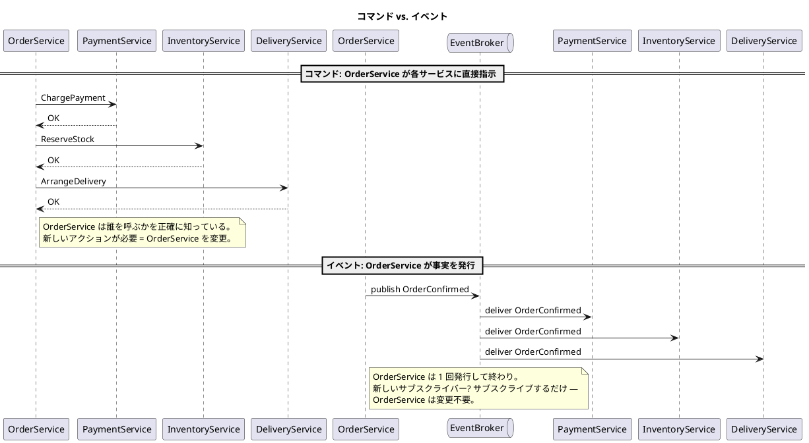
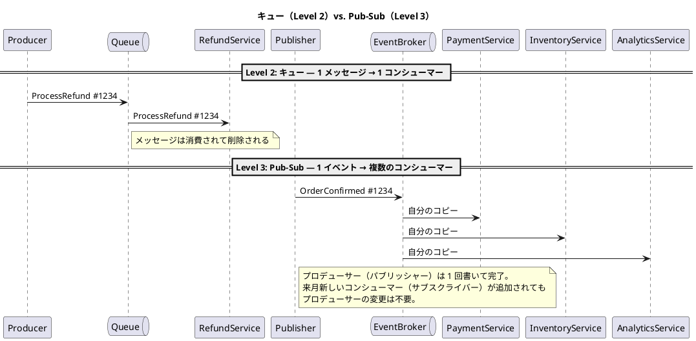
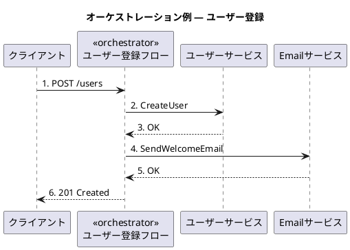
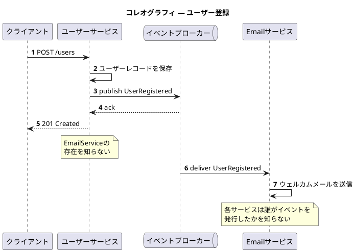

# Microservices 101-04: ワークフローとメッセージング (Workflows & Messaging)

疎結合を維持してサービスを連携する

## 1. はじめに

モジュール 1 では、冪等性と結果整合性によって、障害が発生しても個々の処理を安全に実行する方法を紹介しました。モジュール 2 では、レジリエンスパターンで障害の連鎖を防ぎ、可観測性で素早く問題を特定する方法を紹介しました。モジュール 3 では、データ層の課題を扱いました。データがどこに存在し、誰が所有し、サービス境界を越えてどのように安全に伝播させるかです。モジュール 4 では、もう一層上の**アプリケーション層**へと踏み込みます。

- **コミュニケーション・モデル**: サービスが連携するためにはサービス間で情報を渡す必要があります。そのための 3 つのサービス間コミュニケーションレベルを扱います。
- **ワークフロー・パターン**: 複数のサービスにまたがるビジネスプロセスを調整（coordinate）するための 2 つの主要スタイル — オーケストレーションとコレオグラフィ。

モジュール 3 では、共有データベースという「隠れた結合ポイント」としてデータ層に潜む密結合を扱いました。このモジュールでは、その対となる問題を扱います。アプリケーション層に潜む密結合です。具体的には主に、同期呼び出しチェーンによって生まれる**時間的結合（Temporal Coupling）**と**振る舞い的結合（Behavioral Coupling）**です。

> 解決策は「連携をなくすこと」ではありません。マイクロサービスでは、複数のサービスは必ず連携する必要があります。問題は、各シナリオに対して適切な連携のレベルを選択すること、そしてその選択にともなう結合コストを正確に理解することです。

### 同期呼び出しというメンタルモデル

多くの開発者は、REST API を書くことからサービス開発を学びます。一方のサービスがもう一方を呼び出し、レスポンスを待ち、処理を続けるもので、理解しやすくシンプルで、多くのケースで正しいアプローチです。問題は、「相手側が遅い、または利用不可の場合に何が起きるか」を十分に検討しないままこのモデルをあらゆる場面に適用してしまうことから生まれます。

モノリスでは、これは容易に管理できるものでした。プロセス、ランタイム、障害ドメインがすべて一つだからです。あるモジュールが別のモジュールを呼び出す場合、障害は同じスレッド内で捕捉されます。マイクロサービスでは、独立したデプロイメントへのネットワーク呼び出しになります。その分離こそがマイクロサービスの価値なのですが、呼び出しがタイムアウト、失敗、あるいは呼出連鎖全体に伝播するレイテンシを引き起こす可能性も出てくるのです。

---

## 2. 疎結合 101 — 本当の意味とは

### 結合度を計測しよう

「疎結合（Loose Coupling）」は、マイクロサービスの設計時にもっとも多用されるフレーズの一つです。よくメリットとして引き合いに出されますが、アクション可能なほど具体的に定義されているのを見たことほとんどありません。

具体的な定義としてこう考えるとわかりやすいでしょう: **結合度とは、ある変更を安全にリリースするためにいくつのサービスと調整し変更する必要があるかで測るもの**です。

あるサービスを変更するために、別のチームが依存関係を更新して再デプロイする必要があるなら、リポジトリをどれだけきれいに整理していても「結合している」とみなされます。また一連の処理を遂行するためにダウンストリームの依存が遅くなって自サービスのレスポンスにも影響があるなら、それもまた「結合している」状態です。

可観測性のモジュールでも紹介しましたが、**計測できないものは管理できない**のです。

疎結合なサービスには次の 3 つの性質が必要です：
- **明確な境界（Explicit Boundaries）**: 自身が何を所有し、何を所有しないかを正確に把握している
- **コントラクト（Contracts）**: 呼び出し元に何を約束し、依存先に何を期待するかを定義している — それ以上でも以下でもダメ
- **「前提を置かない」（"Don't Assume"）**: 相手側が素早く応答してくれる、必要なときにはいつでも利用できる状態にある、同じバージョンで稼働し続けている、といった自分に都合のよい前提を置かない

### 結合の 4 つのタイプ

マイクロサービスアーキテクチャで密結合と呼ばれるものには 4 つのタイプが存在します：

| 結合タイプ | 見分けるための質問 | モジュール |
|---|---|---|
| **データ結合（Data Coupling）** | サービス間でテーブルやスキーマを共有していないですか？ | モジュール 101-03 |
| **時間的結合（Temporal Coupling）** | サービス B が遅いとサービス A も遅くなりますか？ | このモジュール |
| **振る舞い的結合（Behavioral Coupling）** | サービス A がサービス B のエラーコードやレイテンシ、レスポンスの仕様を前提としているか？ | モジュール 101-05 |
| **デプロイ結合（Deployment Coupling）** | あるサービスをデプロイするために別のサービスのデプロイも必要ですか？ | モジュール 101-06 |

これらの結合タイプにはそれぞれの原因があり、解決策も別々です。例えば、サービス A と B の間にキューを追加することで時間的結合は解消されますが、サービス A が B の特定のエラーフォーマットに依存したままなら振る舞い的結合は解消されません。自分のサービスがどの結合を孕んでいて、どんな問題を引き起こしているのが、対処法を選ぶ前に正しく見極めてください。

### メンタルモデルの転換: 重複はもはや敵ではない

モノリスでは、コードの重複はとても嫌われます。変更時に複数個所を同期を取って修正しなくてはいけないなんてとんでもない、という理由です。このため、同じロジックが必要な箇所が登場すると、共有ライブラリとして抽出します。これによって冗長性を排除し、変更の影響範囲を下げることができます。このアプローチは一つのデプロイユニット内ではとても合理的です。

マイクロサービスの世界にこのメンタルモデルを持ち込むと、サービス境界が崩れる**分散モノリス（Distributed Monolith）**を生み出してしまいます。コードの重複は減っても、デプロイ結合が増えてしまうからです。

実際にあった移行事例の話をしましょう。移行前のモノリスシステムでは受注（Order）など複数のサブシステムで消費税計算が必要だったので、共有ライブラリが利用されていました。これはモノリスでは合理的な選択です。このシステムをマイクロサービスへと移行することになったのですが、カート、受注、配送といったマイクロサービスを定義したところ、やはり複数のサービスが同じ消費税ロジックを必要としていました。開発チームは「税計算はうちの会社の業務というよりは、法律で定められたもので、所有するドメインも決められないし、このまま共有ライブラリとして配布するほうがいい。」と判断しました。ですが、その後、消費税が改正されることになり、ほとんどすべてのチームが依存関係の調査を行い、自サービスを変更・テストし、リリースウィンドウも全チームで同タイミングになるよう調整しなければなりませんでした。隠れた密結合を埋め込んでしまったわけです。「共通ルール」を一貫性・監査性を保ちながら、複数チームの調整なしに素早く更新しなくてはいけないのなら、それはサービスが所有すべき機能（契約）だったのです。共有ライブラリではなく、Tax Service（税サービス）を導入するべきでした。全サービスが同時に適用しなくてよいレベルの共通ロジックであれば、各サービスにコピー＆ペーストで持たせることも正解です。

> 「When services are loosely coupled, a change to one service should not require a change to another.（サービスが疎結合であれば、あるサービスへの変更によって別のサービスの変更が必要になることはない。）」
> — Sam Newman, *Building Microservices*

マイクロサービスでは、**サービスの独立性と自律性**が優先事項です。コードやデータを重複して保持することは、トレードオフとして許容範囲なのです。変更にあたって、他のチームに事前調整や通知なしに、いきなり変更バージョンをリリースできるかどうかが、一番優先されるべきことなのです。

---

## 3. アプリケーション層の結合 — 同期呼び出しチェーンという落とし穴

モジュール 3 ではデータ層に潜む結合を見てきました。このセクションでは、その対となる問題を扱います。同期呼び出しチェーン（Synchronous Call Chain）によってアプリケーション層に隠れる結合です。

### アプリケーション層結合の 2 つのタイプ

サービス間の直接的な同期呼び出しは、前述した 4 つの結合タイプのうち、以下の 2 種類の結合を生み出す原因になります：

- **時間的結合（Temporal Coupling）**: 呼び出し元は、呼び出し先が*呼び出す時点に*稼働していなければ処理を完了できません。サービス B が遅くなったりダウンすると、サービス A も失敗してしまいます。結合によってサービス A の可用性が B の可用性に依存してしまっているためです。
- **振る舞い的結合（Behavioral Coupling）**: 呼び出し先が利用可能であっても、呼び出し元は呼び出し先の特定の応答仕様やエラーコード、暗黙の前提などに依存していると結合が生じます。呼び出し先がエラーフォーマットを変更するたびに、その変更は呼び出し元のコードにも伝播します。

  **例 — 「空レスポンス＝存在しない」という暗黙の前提:**
  - サービス A（注文 UI / BFF）がサービス B（カタログ）を呼び出す: `GET /products/{id}`
  - A の実装は次の前提に基づいていた: B が `200 OK` で `{}` や `[]` を返した場合、その商品は存在しない
  - その後 B は、存在しない商品に対して `404 Not Found` を返すよう修正された（より正確な REST の仕様に合わせるため）
  - 結果: A はすべての `404` をシステムエラーとして扱い、「商品が見つかりません」と表示する代わりにチェックアウト処理を失敗させてしまう
  - B の変更は意味的に*正しい*改善でした。それでも A は壊れました。これが振る舞い的結合です。A のロジックは B の古いレスポンス規約に暗黙的に依存しており、インターフェースの境界はその依存関係を実行時まで表面化しませんでした。

重要な洞察: 一方を修正しても他方は修正されません。キューを追加すると時間的結合は解消されますが、コントラクトが適切に分離されるまで振る舞い的結合は残ります。

### ファンアウト: パスの健全性 ≠ ノードの健全性

ファンアウトはサービスを適切に分解するアプローチですが、時間的結合を乗算的に増幅します。サービス A が B、C、D を同期的に呼び出す場合、A の可用性はそれらの個別可用性の**平均ではなく、積**になることに留意が必要です。

```
各ノード: 99.9% の可用性          A の可用性: 99.9³ ≈ 99.7%

        ┌───┐                              ┌───┐
        │ A │ ── 呼び出し ──┬──→ [ B 99.9% ]  │ A │  p99 レイテンシ
        └───┘               ├──→ [ C 99.9% ]  └───┘  = max(B, C, D)
                            └──→ [ D 99.9% ]           ↑
                                                ここでスパイクが起きると
                                                A 全体のレイテンシもスパイク

個々のノードは健全に見える。パスの健全性 ≠ ノードの健全性。
```

テールレイテンシも同じ方向に増幅します: A の p99 レイテンシは B、C、D の p99 の**最大値**（平均ではない）にほぼ等しくなります。一つの遅い依存がパス全体を支配します。

ここにリトライ増幅が加わると、更に状況が悪化します。負荷が高まると B が遅くなり、A のリクエストがタイムアウトし、A がリトライします。A の複数の呼び出し元が同時にリトライを行うと、B はすでに過負荷のキューの上に、リトライトラフィックの急増を受けて、さらに過負荷スパイラルになってしまいます。これがまさにモジュール 2 で制御されたリトライのルールが存在する理由です。

**重要な診断の問い:** 「この依存が遅くなったりダウンすると、それを呼び出しているすべてのサービスに何が起きるか？」 答えが「すべて劣化する」であれば、時間的結合は実在しており、対処が必要です。

---

## 4. コマンドとイベント

時間的結合への対応アプローチを紹介する前に、言葉の定義を確認しましょう。

よくある誤解として、コマンドとイベントの違いを情報を伝える手段の違いとして捉えていることがあります — 「コマンドは同期、イベントは非同期。コマンドならキューを使い、イベントならPub-Sub を使う」と覚えてしまっている人がいるのです。実際にはコマンドをキュー経由で送っても問題ありませんし、イベントを同期処理でパブリッシュすることもできます。コマンドとイベントの違いは、実装技術の違いではなく、*送信側が相手側について何を伝えるかという前提*の違いです。そしてその前提によって、また結合が生まれます。

**コマンド**は指示そのもので、コマンドを送るとき、あなたはすでに「誰が何を処理するか」を決めています。メッセージがどの手段で届くかではなく、その前提が結合になっています。一方、**イベント**をパブリッシュするときには、そのような前提は存在しません。イベントとして「起こったこと」という事実をパブリッシュするだけであり、その事実を元にどのサービスが反応しても、誰も反応しなくて関知しないので、結合を生みません。

- **コマンド（"X をやってください"）**: 送信者は誰が実行するかを知っており、結果を期待しています。送信者は受信者の存在とコントラクトに密結合していると言えます。
- **イベント（"X が起きました"）**: 送信者は事実を公開します。誰が反応するか、何サービスが反応するか、いつ反応するか、どのような反応をするのかには関与しません。設計上の疎結合が実現されます。



**コマンド**モデルでは、送信者がすべての受信者を知っておく必要があります。新しいダウンストリームアクションを追加する場合は送信者側を変更しなければなりません。**イベント**モデルでは、送信者はイベントのスキーマだけに責任を持てばよく、新しい受信者が追加される場合もサブスクライブすることで参加でき、送信者側の変更は不要です。

> **注:** 図のコマンドモデルでは同期呼び出しを使っていますが、キュー経由で届けることもできます — 連携手段が変わっても意味は変わりません。送信者が「誰が処理するか」をすでに決めている場合、それはコマンドです。

この違いを意識せずにコマンドとイベントを混在させると**見えない結合**が生まれてしまいます。非同期で配信されているためイベントのように見えていても、コマンドの意図（特定の受信者が処理することを前提としている）を持つメッセージは、疎結合に見えながら実際にはポイント・ツー・ポイントの結合を暗黙的に維持しています。

**識別の問い:** 「送信者は誰がこのメッセージに反応するかを把握している必要がありますか？」
- いいえ → イベントを発行する
- はい → コマンドを送る

---

## 5. コミュニケーションモデル 101 — 3 つのサービス間コミュニケーションレベル

ここではサービス間を繋ぐ（コミュニケーション）方法を結合度の観点から 3 つの段階で解説していきます。それぞれのレベルは、一つ下位のレベルが抱える現実の問題を解決するために洗練されて来ましたが、同時に、新しいトレードオフも抱えることになります。ここにも「銀の弾丸」はないのです。

| レベル | メカニズム | 時間的結合 | 振る舞い的結合 | 主な障害モード |
|---|---|---|---|---|
| 1 — 同期呼び出しチェーン | 呼び出し元が応答を待つ | 最大 | 最大 | カスケードタイムアウト |
| 2 — キュー（コマンド） | プロデューサーがコマンドを書き込み、コンシューマーが非同期処理 | 解消 | 中程度（コマンドスキーマ＋セマンティクス） | キュー深度増大、ポイズンメッセージ |
| 3 — イベント駆動（ファクト） | パブリッシャーが事実を発行し、複数コンシューマーが独立反応 | 解消 | 低め（イベントスキーマ＋互換性） | 暗黙的なフロー、重複配信、順序ギャップ |

### Level 1 — 同期呼び出しチェーン

**メカニズム:** 呼び出し元がリクエストを発行し、各ダウンストリームサービスの完了を同期的に待ってから応答します。

**典型的な用途:** リアルタイムのチェックアウトフロー、ユーザーが次に進む前に処理結果を知る必要があるようなユーザー向け API。

**障害モード:**
- カスケードタイムアウト — チェーン内の一つの遅いノードがパス全体を劣化させる
- リトライ増幅 — 飽和状態での制約のないリトライが過負荷を悪化させる
- オールオアナッシングの可用性 — パスは最も弱いリンクの信頼性にしか達しない

**結合プロファイル:**
- 時間的結合: **最大** — すべての参加者が同時に利用可能でなければならない
- 振る舞い的結合: **最大** — 呼び出し元は各呼び出し先の正確なエラーセマンティクスを処理しなければならない

同期呼び出しが必須のユースケースはあります。設計上で考える際には「同期呼び出しを使うべきか？」ではなく、「フローのどの部分が*同期応答を必要とするか*？」に焦点を当ててください。同期にせざるを得ない部分を最小化し、即応を必要としないものはすべて非同期に移してください。

### Level 2 — キュー（コマンド型）

**メカニズム:** プロデューサーがコマンドメッセージをキューに書き込み、コンシューマーが非同期で処理します。

**Level 1 から変わること:** 時間的結合が解消されます。プロデューサーとコンシューマーは同時に稼働している必要がなくなります。キューがトラフィックスパイクを吸収します。プロデューサーがバーストレートでコマンドを送っても、コンシューマー側は一定の流量で処理できます。

**Level 1 と変わらないこと:** 「注文 #1234 の払い戻しを処理してください」というメッセージは**コマンド**です。特定の意図を持ち、単一の責任ある受信者を暗示しています。コマンドを出すためには、プロデューサーが、どのようなコンシューマーが何の処理のために必要かを把握していなくてはいけません。これはまだポイント・ツー・ポイントの振る舞い的結合の状態です。新しいダウンストリームアクションを追加しようとすると、プロデューサーの変更が必要です。

**よくある誤解:** 「キューを追加したのでイベント駆動になった。」コマンドを伝えるキューは Level 2 であり、Level 3 ではありません。テクノロジーがレベルを決めるのではなく、メッセージのセマンティクス（コマンドかイベントか）が決めます。

**障害モードと必要なセーフガード:**

| セーフガード | 解決する問題 |
|---|---|
| デッドレターキュー（DLQ） | 一つの不正なメッセージが後続のすべてのメッセージを無期限にブロックする |
| バックアウト / 最大リトライ数 | 到達試行回数に上限を設け、DLQ にルーティングする |
| メッセージ TTL | 2 時間の停止中にキューされたコマンドが、時間後に有害な古い処理を実行してしまう |

**配信セマンティクス:** ほとんどのキューは**少なくとも 1 回（at-least-once）**の配信を保証します。Exactly-once は、範囲が限定されたプロダクトの主張か、少なくとも 1 回の配信と**冪等なコンシューマー**の組み合わせで実現されます。実際の設計では、すべてのキューコンシューマーは重複を受け取るものとして設計するほうが、Exactly-once の仕組みを考えるよりも安上がりです。

### Level 3 — イベント駆動（Pub-Sub）

**メカニズム:** プロデューサー（パブリッシャー）が「X が起きました」という "不変の事実" を Pub-Sub モデルを使って発行します。任意の数のコンシューマー（サブスクライバー）は独立したコピーを受け取り、自律的に反応します。

**Level 2 から変わること:**
- パブリッシャーは特定のコンシューマーを意識しなくなります。イベントを発行するだけで、そのイベントに度のサービスが反応して、何の処理を行うかには関与しません。
- キューのメッセージは読まれると削除されますが、Pub-Sub のイベントは読まれた後も、保持期限（リテンション）が切れるまで他のサブスクライバーが参照できる状態のまま残ります。
- 新しいコンシューマーはサブスクライブするだけで参加でき、プロデューサーの変更を必要としません。



**障害モード:**
- **暗黙的なエンドツーエンドフロー**: ワークフロー全体を見せる単一の場所がなく、分散トレーシング（モジュール 2）が必須
- **パーティションをまたいだ順序保証なし**
- **重複配信**: イベントは読まれても削除されないため、各コンシューマーは自身のオフセットマーカーを保持し、どこまで処理済みかを管理します。配信は at-least-once であるため、コンシューマーは冪等でなければなりません（モジュール 1 のルールが直接適用されます）

**識別の問い:** 「パブリッシャーは誰がこれに反応するか気にするか？」 いいえなら → イベントを発行（Level 3）。はいなら → コマンドを送る（Level 2）。

## 3 つのサービス間コミュニケーションレベルまとめ

ここでは **サービス間でどのように情報が受け渡されるか？** について 3 つのレベルで説明しました。レベルが高ければよいのではなく、許容できる障害モードと許容可能な結合コストによって適切なレベルを選択してください。疎結合がよいと盲信してなんでもレベル 3 で実装すればいいというものではありません。
適切なコミュニケーションレベルを選んでも、まだ設計は半分に過ぎません。サービスが疎結合になるほど、また新たな疑問が発生するからです: ビジネスプロセスが複数のサービスにまたがる場合、全体のフローが見えなくなってしまいます。どうしたらいいのでしょうか？
これが次のセクションのテーマです。

---

## 6. ワークフロースタイル: オーケストレーションとコレオグラフィ

キューやイベント駆動によって、サービス間連携の結合の問題が解決されます。ですが、疎結合はトレードオフとして新たな問題を生みます: **ビジネスプロセスが複数のサービスにまたがる場合、全体のフローを誰がどのように管理するべきなのでしょうか？**

### 問題: 疎結合によって生まれる可視性のギャップ

```
疎結合なサービス（Level 2 / 3）:

┌──────────┐     ┌──────────┐     ┌──────────┐
│   User   │     │  Email   │     │  Audit   │
│ Service  │     │ Service  │     │ Service  │
└──────────┘     └──────────┘     └──────────┘
  各サービスは独立してデプロイ・スケール・障害対応 ✓

しかし「新規ユーザー登録」はビジネスプロセスであり、
これらすべてが成功する必要がある:

    1. ユーザーレコードを保存   ✓
    2. ウェルカムメールを送信   ✗ ← ここで失敗
    3. 監査エントリを作成       ?

難しくなる問い:
    「今、プロセスのどこにいるか？」
    「ステップ 2 が失敗した — 誰が気づくか？」
    「ステップ 1 を再実行せずにステップ 2 だけをリトライするには？」
    「登録は完了したか？」— 誰が答えられるか？
```

疎結合によって目指しているのは、サービスが独立してデプロイできるようになること、相互に障害影響を受けなくてすむようになることです。ですが、複数ステップにわたるビジネスプロセスにおいては、業務担当者はどこまで進んだのか、どのステップが成功し、どのステップが失敗したのかといった状態を知らなくてはいけませんし、もし障害が発生したなら必要なところから復旧しなくてはなりません。疎結合な環境では可視性を正しく実装していないとこれが困難になります。ワークフローパターンはまさにこの難しさを解決するための手助けをするものです。

**注意:** 「ワークフロー」と聞いてバッチジョブを思い浮かべる人は少なくありません。大きな違いを一言で言えば、バッチジョブはスケジュール起動で状態を暗黙的に管理し、失敗したらジョブ全体を再実行して復旧するのに対し、ワークフローはビジネスイベントで起動し、各ステップが明示的な状態（PENDING → IN_PROGRESS → DONE / FAILED）を持ち、復旧は該当のステップだけをリトライできます。

> **モノリスのバッチ処理のメンタルモデルを持ち込まないこと:** マイクロサービスにバッチジョブを持ち込むと 2 つの問題が生じます。**データ結合** — 別サービスのデータベースを直接読み取り、ドメイン所有権を回避してしまう。**時間的結合** — 1 ステップが失敗すると、次のスケジュール実行まで以降の処理がすべて止まってしまう。

マイクロサービスの環境であってもバッチが依然として適していることもあります: バックフィル、照合、レポート生成など。ですがユーザー向けのビジネスプロセスには、明示的な状態を持つワークフローを使うようにしてください。

### コミュニケーションパターンとワークフローパターンは違うもの

「**イベント駆動型コミュニケーションとコレオグラフィは同じパターンですか？**」もよくある質問ですが、答えはノーです。
コミュニケーションパターンとワークフローパターンは、**2 つの独立した決定事項**です：

| 決定 | 何のためのパターンか |
|---|---|
| **コミュニケーションパターン** | サービス間でメッセージはどのように伝わるか？（同期 / キュー / Pub-Sub） |
| **ワークフローパターン** | 複数ステップのビジネスプロセスを誰が管理するか？（オーケストレーション / コレオグラフィ） |

特に、ワークフローパターンとしてこの後紹介するコレオグラフィパターンは、イベント駆動型コミュニケーションパターンとの親和性が高いために同じものと捉えられがちですし、実際の設計では自然とセットになることがほとんどですが、異なる観点の設計の組み合わせであることを覚えておいてください。

### オーケストレーション: 指揮者モデル

単一の**ワークフローコーディネーター**（オーケストレーター）が各ステップを順番に明示的に呼び出します。オーケストレーターはステートマシン（ステップごとの状態）を保持し、次のステップが何か、タイムアウトしたらどうするか、リトライしてよいかを知っており、ワークフローに関する single source of truth（単一の真実の源）となります。



- **可視性:** フロー全体の状況を一か所で確認できる
- **障害処理:** 集中管理 — オーケストレーターがリトライやエスカレートを制御
- **ステップの追加:** オーケストレーターのワークフロー定義を変更する
- **リスク:** オーケストレーターが結合ポイントになりうる（ビジネスロジックの暗黙実装になるなどオーケストレーターが全能化）

> ⚠️ **オーケストレーションを同期呼び出しチェーン（Level 2）と混同しないこと。** 同期呼び出しチェーンがワークフロー・オーケストレーションのように実装されることもありますが、本質的には同期呼び出しチェーンには中央の所有者はなく、各サービスが次のサービスを呼び出すだけです。オーケストレーションの場合は、オーケストレーターが**フロー制御の責務を所有します**。シーケンスを決定し、障害を処理し、リトライを管理します。オーケストレーションパターンにおいて、オーケストレーターから各ステップのサービスの呼び出しは、同期（同期呼び出しチェーン）でも非同期（キュー）でもかまいません。

### コレオグラフィ: 振付けモデル

ワークフローを司る中央コーディネーターはありません。各サービスが他のサービスが発行したイベントに自律的に反応し、あらかじめ決められていた振付けどおりに動きます。全体のフローは、イベントサブスクリプションのチェーンから**創発**されます。



- **可視性:** フローは暗黙的。各サービスのサブスクリプションを読み解く必要がある
- **障害処理:** 各サービスが独立して自身の障害を処理する
- **ステップの追加:** 新しいサービスが `UserRegistered` をサブスクライブする — 既存サービスは変更不要
- **リスク:** 「登録が完全に完了したか？」を確認するためには追加の仕組みが必要

### 意思決定フレームワーク

どちらを使うかは要件と制約次第です。現実には、ハイブリットになることが多いです。

**オーケストレーションが向いているケース:**
- ワークフローのステップ間に厳格な順序制御とビジネスルールがある
- 障害処理が明示的で監査可能でなければならない
- ワークフロー状態を監視・照会する単一の場所が必要
- 参加者の数が限定されており、前もって把握できる

**コレオグラフィが向いているケース:**
- イベントコンシューマーが別々のチームによって所有されており、自律的なデプロイが必要
- 既存のサービスを変更せずに新しいコンシューマーを追加したい
- フローがシンプル。どの順序でイベントが処理されても業務上の混乱を招かない

**ハイブリッドを選ぶ（実際には最も一般的）:**
- 境界付きドメインの**内部**はオーケストレーション（例: 注文サービス内部の注文ライフサイクル）
- ドメイン境界を**またぐ**場合はコレオグラフィ（例: `OrderPlaced` イベントが請求・配送・アナリティクスに独立してサブスクライブされる）

ハイブリッドモデルは実用的な最適解となる理由は、複雑な内部ワークフローにはオーケストレーションの可視性を適用しつつ、対外サービス連携にはコレオグラフィの高い疎結合で独立性を維持できるからです。

---

## 7. まとめ

このモジュールの目標は、常に疎結合 Level 3 を選択することでも、常にコレオグラフィを適用することでもありません。コミュニケーション・レベルとワークフローパターン、2 つの独立した責務範囲でそれぞれ**意図的に選択**できるようになることが大切です：

1. **コミュニケーション・レベル**: 許容可能な障害モードと結合コストに基づいて、同期チェーン、キュー、イベント駆動のいずれかを選ぶ。
2. **ワークフローパターン**: 可視性と集中した障害処理が必要なときはオーケストレーション、自律的なチームと独立したデプロイが必要なときはコレオグラフィを選ぶ。

### だいじなこと

- **疎結合を目指すなら、結合度を計測しましょう。** すべての設計上の決定に対して「このサービスを変更すると、他にいくつのサービスを変更しないといけないか？」を考えてみてください。その数が多いほど密結合になっています。
- **At-least-once（メッセージ配信は"少なくとも" 1 回）を設計前提にしましょう。** キューでもイベント駆動でも、コンシューマーは重複メッセージを受け取る可能性があることを念頭においてください。モジュール 1 の冪等性の原則が必要なところです。
- **イベント駆動型において、可観測性は必要条件。** 分散サービスの処理状況を追跡できるような可観測性の実現（モジュール 2）は、イベントサブスクライバーをまたいだ暗黙的なフローにおいては不可欠です。

### 次は何を学ぶか？

このモジュールでは、アプリケーション層でサービスが作業を連携する方法を見てきました。モジュール 5 では次のステップに進みます: サービスが自身のデータを所有して API を公開したとき、それらの **API をコンシューマーを壊さずに安全に進化させる**にはどうすればよいか？

**モジュール 5（API Design for Evolution）** では、後方互換性、バージョニング戦略、expand/contract パターン、コンシューマー駆動のコントラクトテストを扱います。

---

## 付録: 本番環境対応チェックリスト

- [ ] すべての同期依存先にタイムアウトとサーキットブレーカーがある（モジュール 02）。
- [ ] 複数の同期依存先へのファンアウトを最小化し、パス全体の可用性バジェットを計算している。
- [ ] キューコンシューマーは冪等性を実装している（モジュール 01）— at-least-once 配信をデフォルトとして扱う。
- [ ] すべてのキューにデッドレターキュー、最大リトライ数、メッセージ TTL が設定されている。
- [ ] メッセージ設計においてコマンドとイベントが区別されている — サイレントな混在なし。
- [ ] イベントコンシューマーは重複検出（Inbox パターン、モジュール 03）または自然な冪等性を実装している。
- [ ] オーケストレーションされたワークフローには、状態と障害処理の単一の所有者がある。
- [ ] コレオグラフィされたワークフローには、エンドツーエンドのフロー再構築を可能にする分散トレーシングの相関 ID がある。
- [ ] ワークフロースタイルの選択（オーケストレーション / コレオグラフィ / ハイブリッド）が各クロスサービスフローの根拠とともにドキュメント化されている。
