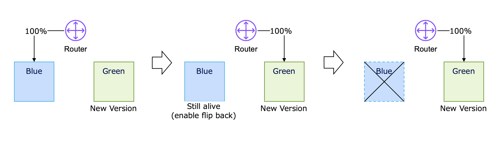

# Microservices 101-06: Deployment Safety

Shipping Changes Safely

## 1. Introduction

In Module 1, we learned how to make individual operations safe under retries through idempotency and eventual consistency. In Module 2, we designed for failure and built observability to find problems quickly. Module 3 addressed data ownership and service boundaries. Module 4 examined workflow coordination and messaging. Module 5 focused on API evolution and compatibility. Module 6 now moves to the **delivery layer**: how to ship change into production without turning every deployment into an outage lottery.

Microservices promise independent deployment. That promise is real, but independence does not automatically create safety. In a monolith, teams often relied on synchronized release windows, code freezes, and planned maintenance events to reduce risk. Those practices traded speed for coordination. You have likely heard complaints from business stakeholders, such as: "It takes over a month to release a change, even though it's just a minor wording tweak." 

In a distributed system, the same model collapses under its own weight. Services ship on different timelines, mixed versions coexist, and teams can no longer rely on shutting down entire services in the middle of the night for weekend release operations.

This creates a new architectural responsibility: **deployment safety**. The question is no longer "how do we prevent all mistakes?" The question is "how do we limit exposure, detect problems early, and recover quickly when a change behaves badly in production?"

> The goal of deployment safety is not perfect software. The goal is controlled blast radius, evidence-based rollout, and fast recovery.

### The Mental Model for This Module

In the monolith world, deployment was often treated as a high-risk project. In the microservices world, deployment must become a routine. That shift changes what "safe" means. Safety no longer comes primarily from long coordination meetings or manual approval chains. It comes from engineering controls: traffic shaping, runtime toggles, observability gates, and rollback readiness.

This matters because deployment is where many earlier design choices are finally tested under real conditions. Idempotency helps retries remain safe during failure. Resilience patterns reduce cascade risk during rollout. Observability provides the signals that decide whether to continue or abort. API compatibility allows old and new versions to coexist. Deployment safety is where all of those disciplines come together.

---

## 2. Progressive Delivery 101 — From Big-Bang Release to Controlled Exposure

### The Old Release Model

Many teams still carry a monolithic release instinct into distributed systems:

- freeze changes
- prepare a large release bundle
- deploy during a special maintenance window
- hope the planning effort prevented surprises

That model feels safe because it centralizes control. But in practice, it creates a different form of risk: large change sets, long feedback cycles, and painful rollback procedures. When a release fails, everything fails together.

### The Distributed Reality

Microservices invert that model.

| Monolith release habit | Microservice delivery habit |
|---|---|
| Deployment is a major event | Deployment is a routine |
| Large bundles of change | Small, frequent changes |
| Safety through coordination | Safety through engineering controls |
| Human judgment gates progress | Automated signals gate progress |

The key idea is **progressive delivery**: instead of exposing a change to 100% of production traffic at once, release it incrementally to a small user slice and expand rollout only as signals remain healthy.

### Risk Avoidance vs. Risk Mitigation

This requires a mindset shift.

- **Risk avoidance** says: delay, coordinate, and try to guarantee nothing goes wrong.
- **Risk mitigation** says: assume some things will go wrong, but design the rollout so that failures are small, visible, and reversible.

That is the core transition from monolithic release thinking to microservice deployment thinking.

### The Real Goal: Blast Radius and MTTR

In deployment safety, two ideas matter more than "zero bugs":

- **Blast radius**: how many users, tenants, requests, or business processes are affected if the change is wrong?
- **MTTR (Mean Time to Recovery)**: how quickly can the system return to a safe state?

If a deployment fails but affects only 1% of traffic for two minutes, that is a far safer system than one that fails rarely but takes 90 minutes to recover once it does.

### The Two Control Planes: Traffic vs. Logic

To contain risk effectively, progressive delivery uses a two-layer defense: **Traffic Control** for the route and **Feature Flags** for the feature.

| Pillar | Focus | Mechanism | Goal |
|---|---|---|---|
| **Pillar 1: Traffic Control (Infrastructure Layer)** | the network route | routers, load balancers, and service mesh rules decide **which instances** receive request volume | validate runtime stability, resource behavior, and version compatibility under real traffic |
| **Pillar 2: Feature Flags (Application Layer)** | the code execution path | runtime toggles in application logic decide **which code path** executes | isolate business-logic risk, enable targeted exposure, and provide instant fallback |

These two planes work best together: traffic controls limit where requests go, while flags limit what behavior is actually activated after requests arrive.

Let's walk through each of them in detail in the following sections.

---

## 3. Traffic Control Patterns — Blue-Green, Canary, and Shadowing

Traffic Control Patterns use infrastructure-level controls to decide **which runtime receives production traffic**. These controls manage exposure even before the application decides which code path to execute.

### Blue-Green Deployment

Blue-Green deployment runs two environments in parallel:

- **Blue** = the current live environment
- **Green** = the new environment being prepared

Traffic stays on Blue while Green is deployed, warmed up, and validated. When ready, routing flips from Blue to Green.

**Best for:**
- infrastructure changes
- runtime or framework upgrades
- larger environment-level replacements

**Strengths:**
- clear cutover point
- fast environment-level rollback by routing back
- good isolation while validating the new stack

**Limitations:**
- the cutover is still effectively 0% to 100%
- hidden application bugs can hit all users immediately after the switch
- data and cache compatibility still matter during rollback

### Canary Release

A canary release sends a small percentage of live traffic to the new version first, then gradually increases it.

Example progression:

`1% -> 5% -> 25% -> 50% -> 100%`

**Best for:**
- routine service releases
- risky logic changes
- validating new behavior under real user traffic

**Strengths:**
- reduces blast radius
- produces real production evidence before full rollout
- supports automated promotion and automated rollback

**Limitations:**
- requires strong observability
- mixed-version operation can complicate debugging
- can be misleading if the canary traffic slice is not representative

### Traffic Shadowing

Traffic shadowing copies production requests to the new service without letting the new service's response affect users.

The existing production path still serves the real response. The new version runs in parallel only for observation.

**Best for:**
- performance testing under real traffic
- validating new algorithms
- load testing without user impact

**Strengths:**
- zero direct customer exposure
- useful for comparing behavior between old and new implementations
- excellent for catching throughput or resource issues

**Limitations:**
- does not validate full end-user behavior because the shadow response is discarded
- duplicated traffic adds operational overhead
- side effects must be controlled so the shadow path does not mutate real state

### Choosing Among the Three

| Pattern | What it controls | Best use | Main risk it reduces |
|---|---|---|---|
| **Blue-Green** | Environment routing | Major environment change | Broken runtime or infrastructure |
| **Canary** | Traffic percentage | New version rollout | Large blast radius from bad code |
| **Shadowing** | Hidden parallel execution | Performance and logic rehearsal | User impact during validation |

These patterns operate outside the business logic. They answer: "Which deployment instance receives traffic?" The next layer answers a different question: "What code path runs once traffic arrives?"

---

## 4. Deploy Is Not Release — Runtime Behavior Control

### Moving code is a technical event; activating a feature is a business decision.

The most important conceptual distinction in this module is this:

- **Deploy**: move code, containers, and configuration into production
- **Release**: expose new behavior to real users

In the monolith era, these two actions were usually inseparable. Once a new version was deployed, every user was immediately exposed to the new behavior. If something failed, the impact was system-wide.

Microservices remove that constraint. Teams can deploy new code without exposing it right away. The code can run in production while the new behavior stays behind a feature flag, remains disabled by default, or is visible only to a limited cohort.

This shift, from deployment as a technical event to release as a business decision, is a core foundation of modern software delivery.

### Feature Flags

Feature flags shift control from the infrastructure layer to the application layer. Instead of routing users to a different deployment, the system decides at runtime whether to execute the old path or the new path.

Feature flags let **deploy** and **release** happen independently.

Common feature-flag use cases:

| Use case | How it works | Why it matters |
|---|---|---|
| **Dark launch (hidden deployment)** | Deploy the code with the flag OFF so the feature runs in production but remains invisible to users. | Verifies startup/runtime behavior and warms dependencies before user exposure. |
| **Gradual rollout** | Enable by cohort or percentage (employees -> 1% -> 10% -> 100%). | Limits blast radius while validating behavior under real traffic. |
| **A/B experimentation** | Route different cohorts to different flagged paths. | Supports evidence-based product and UX decisions. |
| **Kill switch (emergency disablement)** | Turn the flag OFF instantly without redeploying. | Provides fast recovery when new logic degrades reliability or business outcomes. |

The key operational advantage is simple: **you can disable behavior faster than you can redeploy code**.

### Traffic Control vs. Feature Flags

These mechanisms are often confused, but they solve different problems.

| Control plane | Focus | Main mechanism | Typical use |
|---|---|---|---|
| **Traffic control** | Which instances receive traffic | Router, gateway, load balancer, service mesh | Canary, Blue-Green, Shadowing |
| **Feature flags** | Which code path executes | Runtime configuration inside the app | Dark launch, cohort rollout, kill switch |

The strongest delivery posture often combines both:

- use a canary to limit exposure to a new build
- use feature flags to limit exposure to a new behavior within that build

One controls the route. The other controls the logic.

---

## 5. Observability Gates

Progressive delivery is not simply "release slowly." It is **release only when production evidence says it is safe**.

An **observability gate** is a predefined checkpoint that evaluates production signals during a rollout and decides whether the rollout should:

* continue,
* pause,
* or roll back.

Without an observability gate, a canary release is merely **slow guessing**.

Then, what should an observability gate measure? - A good rollout gate combines **technical health** and **business health**.

### Technical Health

These signals tell us whether the new version is operationally healthy.

Typical examples include:

* HTTP 5xx error rate
* Timeout rate
* p95 / p99 latency
* Queue depth
* Consumer lag
* Restart or exception rate

If these metrics exceed predefined thresholds, the rollout should stop immediately.

### Business Health

Infrastructure may look perfectly healthy while the product quietly becomes worse.

Business gates measure whether the new behavior is actually helping users.

Typical examples include:

* Checkout completion rate
* Billing mismatch rate
* Workflow completion rate
* Search success rate
* AI suggestion acceptance rate or override rate

A deployment is considered unhealthy if customer outcomes degrade—even when CPU, memory, and error rates remain normal.

### SaaS Requires Tenant-Level Gates

In multi-tenant systems, aggregate metrics can hide severe localized failures.

Imagine a rollout affecting only one enterprise customer.

Platform-wide metrics still appear green.

That customer, however, experiences:

* 5% request failures
* 90-second queue delays
* missing billing events

Therefore, for the production gate, it is also necessary to define metrics such as error rates per tenant, the impact of "noisy neighbors," and billing accuracy.

### Silent Failures Are the Most Dangerous

Some deployments silently reduce product quality without HTTP 500.

Examples include:

* AI suggestions become noticeably worse.
* Search ranking quality drops.
* Recommendation click-through decreases.
* Authorization rules reject legitimate users.
* Billing events stop being generated.

These deployments appear "healthy" from an infrastructure perspective but still damage customers and revenue.

Observability gates should therefore include **business-domain metrics**, not just infrastructure metrics.

### The Rollout Rule

A deployment is **not** considered successful because it completed.

It is successful only after the observability gate confirms:

* technical health remains within SLO,
* business outcomes remain healthy,
* tenant impact is acceptable,
* and rollback thresholds were never crossed.

Only then should traffic exposure increase from 1% to 10%, 50%, and finally 100%.

### Predefine the Failure Conditions

You need criteria not only for deciding to proceed through the gate but also for deciding to turn back. Be sure to define the rollback conditions **in advance** as well.

Examples:

- roll back if canary 5xx rate exceeds baseline by more than `0.1%`
- roll back if p95 latency increases by more than `50ms`
- roll back if any tenant's localized error rate exceeds `1.0%` for 3 minutes
- roll back if successful checkout rate drops by more than `5%`

These thresholds are explicit and easy to automate. By agreeing on metrics ​​in advance, rollbacks can be automatically applied to gates using pre-committed rules, without the need for case-by-case judgment by humans who are subject to cognitive biases during stressful trouble situations.

### Connection to Module 101-02

Observability in Module 2 was about diagnosing production systems under failure. In this module, the same discipline becomes rollout governance. The question changes from "What is broken?" to "Is it safe to continue exposing this change?"

The underlying principle is the same: measure reality, reduce uncertainty, and act on evidence.

---

## 6. Rollback Readiness — Reversibility Must Be Designed Up Front

Rollback is not an emergency improvisation. It is part of the deployment design.

If a team only asks "how do we undo this?" after the rollout has already failed, they started too late.

### MTTR Matters More Than Release Perfection

In distributed systems, some defects will escape testing. The design question is not whether bugs are possible. It is whether the platform can recover quickly and predictably when they appear.

That is why MTTR is a core deployment metric.

Low-MTTR systems usually share these properties:

- rollback is automated or one-step
- kill switches exist for risky logic
- routing can revert quickly
- observability clearly indicates whether recovery worked

### Backward-Compatible State Is Part of Rollback

Code rollback is only half of the problem. Data and state must also remain compatible.

Examples of rollback traps:

- a new release writes data the old code cannot read
- a migration deletes or renames a column that the old version still expects
- a cache format change makes rollback restore broken behavior

This is where Module 5 connects directly to deployment safety. Expand & Contract is not just an API evolution tool. It is also a deployment safety tool because it allows old and new behavior to coexist during rollback windows.

### The No-Formality Rule

Rollback should not require a management ritual.

If restoring a safe state depends on:

- an emergency approval meeting
- manual database surgery
- hunting through undocumented scripts
- waiting for one specific engineer to wake up

then the system is not rollback-ready.

### What "Ready" Looks Like

A deployment is rollback-ready when:

- the old path can still run safely against current state
- the disablement mechanism is known and tested
- rollback criteria are predefined
- operators can tell quickly whether rollback succeeded

Your goal is to become the kind of engineer who makes rollbacks a routine, reliable part of daily operations rather than a heroic response to crises.

---

## 7. Practical Walkthrough — Designing a Rollout for a Risky Change

Walkthrough a deployment strategy using a specific scenario:

> In our new version, we will add a ranking algorithm applied to Search Service. For now, search results are sorted based on static popularity, but the new algorithm sorts them according to customers' purchase history. It is a big challenge and if the new ranking algorithm performs poorly, it will directly impact sales.

In this scenario, we must simultaneously consider business risks, technical risks, and the complexity of a rollback.

### Step 1: Separate Deployment from Release

Deploy the new algorithm model first, but keep it disabled behind a feature flag.

This allows the service to:

- start successfully in production
- establish connections and warm caches
- expose the new code only when the team is ready

### Step 2: Choose the Traffic Strategy

Because the risk is primarily application behavior, use a canary rollout rather than a full Blue-Green cutover.

Example canary progression:

`1% -> 5% -> 10% -> 25% -> 50% -> 100%`

Make sure that each promotion step should be blocked by observability gates.

### Step 3: Define the Kill Switch

The algorithm itself should be controlled by a flag such as:

`search.ranking.v2.enabled`

The feature flag configuration must support:

- global disablement
- tenant-specific targeting
- internal-only activation

If the new logic misbehaves, the team should be able to disable it in seconds without waiting for a redeploy, for example, only change the boolean value in configuration service.

### Step 4: Keep the Old Path Warm

Rollback is safer if the previous path is still healthy.

In our scenario, the old path relies on static popularity data. If you route traffic away from the old path, the cache for those popularity scores might evoke cache eviction. Or make sure that the background cron job that calculates popularity might not be turned off prematurely. If you have to roll back, the system hits an empty cache or stale data, causing a massive latency spike or completely broken search results.  

During the rollout, we will maintain dependencies that support old paths such as the following.

- keep the old path to work healthy
- prevent cache eviction
- keep data pipelines active

### Step 5: Define Success and Abort Signals

For this scenario, rollout gates might include:

- search error rate
- search latency
- click-through or conversion rate
- result relevance complaints or human overrides
- tenant-specific anomalies

And abort rules might include:

- stop rollout if search p95 latency increases by more than `75ms`
- stop rollout if conversion drops by more than `3%`
- stop rollout if any strategic tenant shows sustained elevated failure

This is what deployment safety looks like in practice: not "we hope the new algorithm is good," but "we defined exactly how the system decides whether the rollout deserves to continue."

---

## 8. Closing — Safe Delivery Is an Architectural Capability

Deployment safety is often described as an operations concern. That is too narrow.

In a microservices environment, deployment safety is an architectural capability built from multiple disciplines:

- compatibility discipline from Module 5
- resilience and observability from Module 2
- data ownership and boundaries from Module 3
- workflow decoupling from Module 4
- retry correctness from Module 1

Safe delivery emerges when these ideas reinforce each other.

### The Final Mindset Shift

The real transition across this series is not only technical decomposition. It is a change in how teams reason about software delivery.

- We stop expecting one perfect synchronized release.
- We accept coexistence of versions and continuous change.
- We design systems so failure can be contained, observed, and reversed.

Independent deployment is not free. It is earned through compatibility, telemetry, automation, and operational discipline.

### Series Closing

Across the Microservices 101 series, the journey has been consistent:

- Module 1 taught safe retries and eventual consistency.
- Module 2 taught resilience and observability.
- Module 3 taught service boundaries and data ownership.
- Module 4 taught coordination patterns for loose coupling.
- Module 5 taught API evolution without breaking consumers.
- Module 6 taught how to ship those changes safely.

That is the broader lesson of microservices architecture: autonomy only works when it is supported by disciplined boundaries and disciplined delivery.

> Deployment safety is where architecture proves whether it can survive real change.

---

## Appendix: Production-Ready Checklist

- [ ] Deploy and release are treated as separate decisions for risky changes.
- [ ] Every high-risk rollout has a defined blast-radius strategy (Blue-Green, Canary, Shadowing, or Feature Flag).
- [ ] Risky logic changes have a tested kill switch.
- [ ] Rollout success criteria and rollback criteria are defined before exposure begins.
- [ ] Observability gates evaluate both technical health and business/domain signals.
- [ ] Tenant-level or cohort-level metrics are monitored where localized failure matters.
- [ ] Canary traffic percentages and promotion steps are predefined.
- [ ] The previous version or code path remains healthy during the rollback window.
- [ ] Database, cache, and event/state changes remain backward-compatible during rollout.
- [ ] Rollback can be executed quickly without ad hoc approval chains or undocumented steps.
- [ ] Feature flags are removed or cleaned up after the rollout is complete to avoid permanent operational clutter.
- [ ] Teams treat deployment safety as part of service design, not only as an operations responsibility.