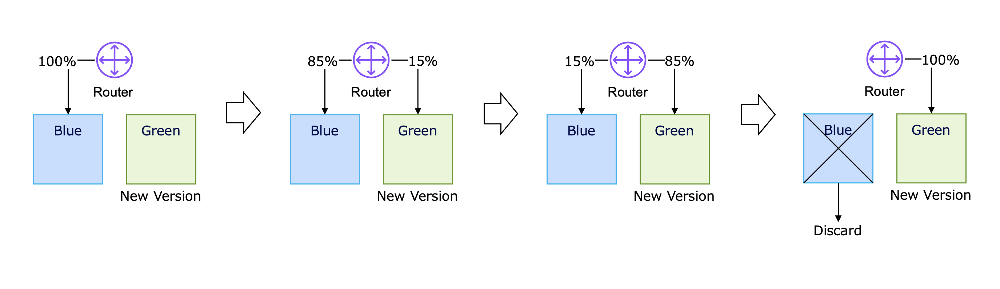
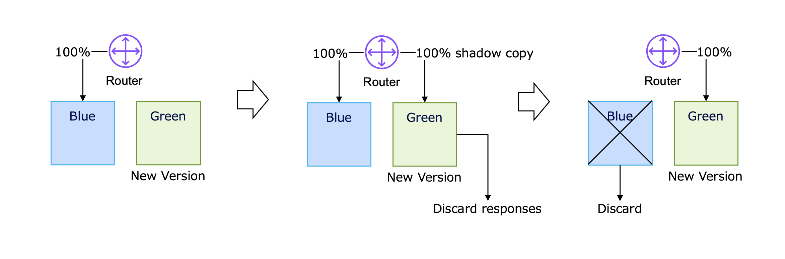

# Microservices 101-06: Deployment Safety（デプロイ安全性）

変更を安全に本番環境へ

## 1. はじめに

モジュール 1 では、冪等性と結果整合性によって、リトライ下でも個々の処理を安全にする方法を学びました。モジュール 2 では、障害を前提にした設計と、問題を素早く発見するための可観測性を扱いました。モジュール 3 では、データの所有権とサービス境界を扱いました。モジュール 4 では、ワークフロー連携とメッセージングを扱いました。モジュール 5 では、API をどう進化させるか、互換性をどう保つかに焦点を当てました。モジュール 6 では、**デリバリー層**を扱います。つまり、変更を本番環境に安全に届ける方法です。

マイクロサービスアーキテクチャの利点はそれぞれのサービスが独立してデプロイできることにあります。この価値は時々、独立しているから変更しても安全という誤解に繋がることがあります。モノリスでは、多くのチームがリリースウィンドウを同期するべく調整し、一定期間コードをフリーズしたりする綿密に計画されたメンテナンスイベントによってリスクを下げてきました。リリースの安全性を得るのと引き換えに、デリバリーのスピードは犠牲にしていたのです。「ちょっとした画面の文言修正なのに、変更をリリースするのに 1 ヶ月以上もかかる」といったビジネス部門からの不満を耳にしたことがあるのではないでしょうか。

分散システムでは、このモデルはすぐに限界に達します。サービスごとにリリースタイミングは異なり、新旧バージョンは同居し、実際のユーザートラフィックが継続的に新しいコードへ流れ込むからです。
分散システムでは、従来の「協調リリース」というモデルは到底実現不可能です。各サービスはそれぞれ異なるスケジュールでリリースされ、異なるバージョンが混在して稼働することも当たり前です。リリースのために週末の深夜にサービス全体を停止させるよう運用に頼ることはできないのです。

そこで必要になるのが**安全なデプロイ戦略**です。ここでの大きなメンタルモデルの転換は「どうすればミスを完全になくせるか」から「ミスは起こる。変更によって本番サービスに問題が生じたとき、どうすれば影響範囲を絞り、早く検知し、素早く回復できるか」です。

> 「安全なデプロイ」が目指すものは完璧なソフトウェアではありません。目的は、影響範囲を制御化におき、勘ではなくエビデンスに基づいてロールアウトの失敗を検出でき、そして素早く復旧することにあります。

### このモジュールのメンタルモデル

モノリス時代、リリース（あまりデプロイという言葉は使われていなかった）とは定期的に発生する高リスクな一大プロジェクト・イベントの一つでした。マイクロサービスの世界では、デプロイは日々のルーチンワークの一つです。

このプラクティスの転換によって、「安全」の意味も変わります。安全性は、長い調整会議や手作業の承認フローから生まれるものではなく、エンジニアリング上の設計と制御から生まれます。このモジュールで解説するトラフィック制御、ランタイムトグル、可観測性ゲート、そしてロールバック準備です。

この視点が重要なのは、これまでのモジュールで学んだ設計判断が、本番環境で最後に試される場がデプロイだからです。冪等性は障害時のリトライを安全にし、レジリエンスはロールアウト中の障害連鎖を減らし、可観測性は継続か中止かを判断するシグナルを提供し、API 互換性は新旧バージョンの共存を可能にします。デプロイ安全性は、これらすべての規律が合流する地点なのです。

---

## 2. Progressive Delivery 101 — ビッグバン型リリースから制御された段階的な公開へ

### 従来のリリースモデル

多くのチームは今でも、モノリス時代のリリース感覚を分散システムに持ち込んでしまっています。

- 変更を凍結する
- 大きなリリースの束を準備する
- 特別なメンテナンス時間帯にデプロイする
- 十分に計画したのだから大丈夫だろうと期待する（祈る）

このモデルは、制御を一か所に集めるので安全に見えます。しかし実際には別の種類のリスクを生みます。変更セットが大きくなり、フィードバックが遅くなり、ロールバックが痛みを伴うようになります。All-or-Nothing ですべてが一緒に失敗します。

### 分散システムの現実

せっかくマイクロサービスの世界に来たのですから、このモデルを反転させましょう。

| モノリスのリリース習慣 | マイクロサービスのデリバリー習慣 |
|---|---|
| デプロイは一大イベント | デプロイはデイリールーチン |
| 変更は大きくまとめて | 変更は小さく頻繁に |
| 調整で安全性を確保 | エンジニアリングで安全性を設計・制御 |
| 人間が最終判断 | シグナルで自動化 |

ここでの中心となる概念が **Progressive Delivery** です。新しい変更をいきなり本番環境で 100% のトラフィックにさらすのではなく、小さなユーザー スライスに段階的にリリースし、信号が正常な場合にのみロールアウトを拡張するデプロイアプローチです。

### リスク回避からリスク緩和へ

このためには、考え方の転換が必要です。

- **リスク回避**: 遅らせてでも調整し、とにかく問題が起きないようにしようとする
- **リスク緩和**: 問題が起きる前提で、失敗を小さく、見える形にし、元に戻せるように設計する

これが、モノリス的なリリース発想から、マイクロサービス的なデプロイ発想への重要なメンタルモデルの転換です。

### 本当の目標: 影響範囲と MTTR

デプロイ安全性では、「バグゼロ」よりも重要な概念が 2 つあります。

- **影響範囲（Blast Radius）**: 変更が間違っていたとき、どれだけのユーザー、テナント、リクエスト、業務プロセスに影響するか
- **MTTR（Mean Time to Recovery）**: 安全な状態にどれだけ早く戻せるか

あるデプロイが失敗しても、2 分間だけ 1% のトラフィックにしか影響しないなら、めったに失敗しないが一度失敗すると 90 分復旧できないシステムよりはるかに安全です。

### 2 つの制御プレーン: トラフィック vs. ロジック

リスクを効果的に抑制するために、Progressive Delivery では、流入経路には **トラフィック制御**、機能制御には **フィーチャーフラグ** という 2 層の防御を使用します。

| 制御プレーン | 制御対象 | 仕組み | 目的 |
|---|---|---|---|
| **トラフィック制御（インフラ層）** | ネットワーク経路 | ルーター、ロードバランサー、サービスメッシュのルールで、どのインスタンスがリクエストを受けるかを決める | 実トラフィック下で、ランタイム安定性、リソース挙動、バージョン互換性を検証する |
| **フィーチャーフラグ（アプリケーション層）** | コード実行パス | アプリケーション内のランタイムトグルで、どのコードパスを実行するかを決める | ビジネスロジックのリスクを分離し、段階公開を可能にし、即時フォールバックを実現する |

この 2 つのプレーンは組み合わせて使うと最も効果的です。トラフィック制御は「どこに」リクエストを流すかを制御し、フィーチャーフラグはリクエスト到達後に「何を」実行するかを制御します。

次のセクションでそれぞれ詳しく見ていきましょう。

---

## 3. トラフィック制御パターン — Blue-Green、Canary、Shadowing

トラフィック制御パターンでは、**どのランタイムが本番トラフィックを受け取るか**を決めるインフラ層の制御を使います。これらは、アプリケーションがどのコードパスを実行するかを決める前の段階で、露出範囲を制御します。

### Blue-Green デプロイメント

Blue-Green デプロイメントでは、2 つの環境を並行で稼働させます。

- **Blue** = 現在の本番環境
- **Green** = これから切り替える新環境

トラフィックは Blue に流したまま、Green をデプロイし、ウォームアップし、検証します。準備が整ったら、ルーティング（トラフィック経路）を Blue から Green に切り替えます。

**向いているもの:**
- インフラ変更
- ランタイムやフレームワークのアップグレード
- 環境レベルの大きな置き換え

**強み:**
- 切り替え点が明確
- ルーティングを戻すことで環境レベルのロールバックが速い
- 新しいスタックを分離して検証しやすい

**制約:**
- 切り替え自体は 0% -> 100% に近い
- アプリケーション上の隠れた不具合は全ユーザーに即時露出する可能性がある
- ロールバック時にもデータやキャッシュの互換性が重要

### Canary リリース

Canary リリースでは、まずごく一部の本番トラフィックだけを新バージョンへ送り、様子を見ながら徐々に割合を増やしていきます。

**向いているもの:**
- 通常のサービスリリース
- リスクの高いロジック変更
- 実ユーザートラフィック下での新しい動作の検証

**強み:**
- 不具合時の影響範囲を小さくできる
- 全体展開前に本番環境の評価結果が得られる
- 自動昇格と自動ロールバックに向いている

**制約:**
- 強い可観測性が必要
- 新旧バージョン混在運用でデバッグが複雑になる
- カナリア対象のトラフィックが偏っていると誤った安心感を生む

### Traffic Shadowing

Traffic Shadowing では、本番リクエストは既存バージョンのサービスに全てルーティングしたまま、そのリクエストを複製して新しいサービスへも送ります。ただし新サービス側のレスポンスはユーザーには返しません。

実際のレスポンスは引き続き既存の本番経路が返し、新バージョンを裏側で検証できます。

**向いているもの:**
- 実トラフィックでの性能検証
- 新アルゴリズムの検証
- ユーザー影響なしの負荷試験

**強み:**
- 顧客への直接影響がゼロ
- 旧実装と新実装の挙動比較に向いている
- スループットやリソース問題の発見に有効

**制約:**
- シャドウ側のレスポンスは捨てるので、完全なユーザー行動の検証にはならない
- リクエスト複製による運用オーバーヘッドがある
- シャドウ経路が実状態を書き換えないように副作用を制御する必要がある

### 3 つの使い分け

| パターン | 何を制御するか | 向いている用途 | 逓減できるリスク |
|---|---|---|---|
| **Blue-Green** | 環境ルーティング | 大きな環境変更 | ランタイムやインフラ破損 |
| **Canary** | トラフィック割合 | 新バージョンの段階展開 | 悪いコードによる大きな爆発半径 |
| **Shadowing** | 見えない並行実行 | 性能とロジックのリハーサル | 検証中のユーザー影響 |

これらのパターンはビジネスロジックの外側で動作します。ポイントは「どのデプロイインスタンスにトラフィックを送るか」です。次の層では「トラフィック到着後に、どのコードパスを実行するか」を制御する仕組みを紹介します。

---

## 4. Deploy と Release を区別する — 実行環境の挙動を制御

### コードの更新は技術的なイベント、機能の有効化はビジネス上の決定

このモジュールで最も重要な概念です。

- **Deploy**: コード、コンテナ、設定を本番環境に配置すること
- **Release**: 実際のユーザーに新しい振る舞いを見せること

モノリス時代では、これら 2 つのアクションは同時に行われていたため、切り離せないものでした。新しいバージョンがデプロイされると、すべてのユーザーがすぐに新しい動作を利用できるようになりました。そのかわり、何かが不具合があれば、その影響はシステム全体に及びました。

マイクロサービスはその制約を取り除きます。チームは、新しいコードをデプロイしても、公開しない状態を維持することができます。新しいコードが本番環境にデプロイされていても、新しい動作の利用可否をフィーチャーフラグで制御したり、限られたユーザー群のみが使えるように限定することができます。

技術的なイベントとしての**Deploy**を、ビジネス上の意思決定としての**Release**から分離することは、最新のソフトウェアデリバリーにおいては非常に重要なことです。

### フィーチャーフラグ

フィーチャーフラグは、インフラ層ではなくアプリケーション層でリリースを制御します。別のデプロイ先へユーザーを振り分けるのではなく、一つのデプロイの中でアプリケーションが実行時に旧パスと新パスのどちらを使うかが決まります。

フィーチャーフラグにより、**Deploy** と **Release** を独立して扱えるようになります。

フィーチャーフラグの代表的なユースケース:

| ユースケース | どう機能するか | なぜ重要か |
|---|---|---|
| **ダークローンチ（隠れたデプロイ）** | コードのデプロイ後もフラグを OFF に保ち、機能は本番で動かしつつユーザーには見せない。 | ユーザー公開前に、起動・ランタイム挙動の確認や依存先のウォームアップができる。 |
| **段階的ロールアウト** | ユーザー群や割合で有効化する（社員限定 -> 1% -> 10% -> 100%）。 | 実トラフィックで検証しながら、影響範囲を小さく保てる。 |
| **A/B 実験** | ユーザー群ごとに異なるフラグ経路へ振り分ける。 | プロダクトや UX の意思決定を、勘ではなくデータで行える。 |
| **キルスイッチ（緊急停止）** | 再デプロイせずにフラグを即時 OFF にする。 | 新ロジックが信頼性やビジネス指標を悪化させた際に、迅速に回復できる。 |

運用上の最大の利点はシンプルです。**新しいコードを再デプロイするよりも、新しい振る舞いを止めるほうが速い**ということです。

### トラフィック制御とフィーチャーフラグの違い

この 2 つは混同されがちが、解決できる問題が違うことを覚えておいてください。

| 制御プレーン | 焦点 | 主な仕組み | 主な用途 |
|---|---|---|---|
| **トラフィック制御** | どのインスタンスがトラフィックを受けるか | ルーター、ゲートウェイ、ロードバランサー、サービスメッシュ | Canary、Blue-Green、Shadowing |
| **フィーチャーフラグ** | どのコードパスを実行するか | アプリ内の実行時設定 | ダークローンチ、限定公開、キルスイッチ |

一方はルートを制御し、もう一方はロジックを制御します。マイクロサービスの世界では、両方を組み合わせて使います。

- カナリアで新しいビルドへの露出を絞る
- フィーチャーフラグでそのビルド内の新しい挙動への露出をさらに絞る

---

## 5. 可観測性ゲート

Progressive Delivery は、単に「ちょっとずつリリースすること」ではありません。**本番環境の挙動が安全だとエビデンスで確認できたときにだけリリースの範囲を広げていくこと**が重要です。

**可観測性ゲート**とは、ロールアウト中の本番環境から得られるメトリクス、シグナルを評価し、次のアクションを決めるために事前定義されたチェックポイントです。

* 継続するか
* 一時停止するか
* あるいはロールバックするか

可観測性ゲートがなければ、Canary リリースは単なる**ゆっくりした当て推量**になってしまいます。

では、可観測性ゲートは何を測るべきでしょうか。よいロールアウトゲートは、**技術的健全性**と**ビジネス健全性**を組み合わせます。

### 技術的健全性

これらのシグナルは、新バージョンがシステム運用上健全かどうかを示します。

典型例:

* HTTP 5xx エラー率
* タイムアウト率
* p95 / p99 レイテンシ
* キュー滞留数
* コンシューマー遅延
* 再起動率または例外率

これらのメトリクスが事前定義した閾値を超えたら、ロールアウトは直ちに停止すべきです。

### ビジネス健全性

インフラが完全に健全に見えていても、プロダクト品質は静かに悪化していることがあります。

ビジネスゲートは、新しい挙動が本当にユーザーに価値をもたらしているかを測定します。

典型例:

* チェックアウト完了率
* 課金不整合率
* ワークフロー完了率
* 検索成功率
* AI 提案の受け入れ率や上書き率

CPU、メモリ、エラー率が正常でも、顧客成果が悪化していればそのデプロイは不健全です。

### SaaS にはテナント単位のゲートが必要

マルチテナントシステムでは、メトリクスを集約することで特定の顧客に対する深刻な局所障害を隠してしまうことがあります。

たとえば、あるロールアウトが 1 社のエンタープライズ顧客だけに影響しているケースを考えてみます。

プラットフォーム全体のメトリクス（全顧客で集約、平均されてしまう）は GREEN（問題なし）を示していますが、対象の顧客でだけ、次のような問題が起きているかもしれません。

* リクエスト失敗率 5%
* キュー遅延 90 秒
* 課金イベント欠落

そのため、本番ゲートとして、テナント別のエラー率やノイジーネイバー影響、課金の正しさといったメトリクスも定義する必要があります。

### サイレント障害が最も危険

一部の不具合は HTTP 500 を出すことなく、プロダクト品質を静かに悪化させます。

例:

* AI 提案の質が目に見えて低下する
* 検索順位の品質が低下する
* レコメンドのクリック率が低下する
* 認可ルールが正当なユーザーを拒否する
* 課金イベントが生成されなくなる

これらのデプロイはインフラ視点では「健全」に見えても、顧客と売上を損ないます。

したがって、可観測性ゲートにはインフラメトリクスだけでなく、**ビジネス・ドメインメトリクス**mも含める必要があります。

### ロールアウトのルール

デプロイが「完了したから成功」ではありません。

可観測性ゲートで以下を確認できて初めてそのリリースが成功とみなせるのです。

* 技術的健全性が SLO の範囲内である
* ビジネス成果が健全である
* テナント影響が許容範囲内である
* ロールバック閾値を一度も超えていない

Cnary リリースでは、この条件を評価しながらトラフィック露出を 1% から 10%、50%、そして 100% へと拡大していくようにします。

### 失敗条件を事前に定義する

ゲートを進む判断だけでなく、戻る判断基準も必要です。ロールバック条件も**事前に**定義しておきましょう。

例:

- カナリアの 5xx 率がベースラインより `0.1%` 以上悪化したらロールバック
- p95 レイテンシが `50ms` 以上増加したらロールバック
- 任意のテナントで局所エラー率が 3 分間 `1.0%` を超えたらロールバック
- 成功したチェックアウト率が `5%` 以上下がったらロールバック

こういった閾値は、明示的なので自動化しやすいです。指標値をを事前に合意しておけば、ストレスのかかるトラブル状況下で認知バイアスの影響を受ける人間がケースバイケースで判断することなく、事前にコミットされたルールで自動的にゲートにロールバックが適用されるようにしておきましょう。

### モジュール 101-02 の振り返り

モジュール 2 の可観測性は、障害下にある本番システムを診断するためのものでした。このモジュールでは、同じ規律がロールアウトガバナンスになります。デプロイにおけるポイントは「何が起きているのか」を知ることから「この変更の公開をさらに進めてよいかどうか」の判断基準として利用される点です。

根底にある原則は同じです。現実を計測し、不確実性を減らし、エビデンスに基づいて行動できるように定義しておくことです。

---

## 6. ロールバック準備 — 可逆性を設計しておく

ロールバックは緊急時の暫定対応ではありません。デプロイ設計の一部です。

ロールアウトが失敗してから「どうやって戻すのか」と考え始めるようでは遅すぎます。

### リリースの完璧さより MTTR が重要

どんなシステムでも一部の不具合はテストをすり抜けてしまうものです。設計時に、バグが起きうるかどうか考えても仕方ありません。大事なことは、バグが出たときに、プラットフォームが素早く、予測可能な形で回復できるように設計されているかどうかです。

だからこそ、MTTR はデプロイの中核メトリクスになります。

MTTR の低い（= よい）システムには次のような特徴があります。

- ロールバックが自動化されている、あるいは 1 ステップで実行できる
- リスクの高いロジックにキルスイッチがある
- ルーティングを素早く戻せる
- 可観測性によって回復が成功したかどうかをすぐ判断できる

### 後方互換な状態もロールバックの一部

振る舞いがロールバックされるだけでなく、データや処理状態も互換でなければなりません。

ロールバックの落とし穴の例:

- 新バージョンが旧コードで読めないデータを書き込んでいて、コードを戻しても動かない
- マイグレーションで旧バージョンが必要とするカラムを削除または改名したので、コードを戻しても動かない
- キャッシュ形式変更により、コードを戻しても挙動が壊れたままになる

モジュール 5 の API 進化を振り返ってください。Expand & Contract は API 進化のためだけの戦略ではなく、これまでの挙動と新しい挙動がロールバックウィンドウ中に共存しても大丈夫な状態を目指すので、デプロイ安全性にとっても重要な戦略になります。

### 形式主義を排するルール

ロールバックに管理儀式を持ち込むようでは、スピードをk損ない、「うまくいくかもしれない」といった曖昧な判断基準が紛れ込んでしまいます。

もしロールバックのプロセスが、次のようなものに依存しているなら見直してください。

- 緊急承認会議
- 手作業のデータベース修復
- 事前定義されていないスクリプト
- 特定の一人のエンジニアの到着

### 「準備できている」状態とは

次の条件を満たすとき、そのデプロイはロールバック準備ができている、と言えるでしょう。

- 現在の状態に対して旧パスが安全に動作できる
- 無効化の方法が既知で、テストされている
- ロールバック基準が事前定義されている
- オペレーターがロールバック成功を素早く判断できる

トラブル対応戦歴を自慢するエンジニアではなく、日常作業の一つとしてロールバックを組み込むことのできるエンジニアになりましょう。

---

## 7. 実践ウォークスルー

具体的なシナリオでデプロイ戦略を考えてみましょう。

新バージョンでは、Search Service にランキングアルゴリズムを追加します。これまで検索結果は基に静的に人気順で並べ替えられていましたが、新しいアルゴリズムでは顧客の購入履歴に基づいて並べ替えが行われます。ランキングの新しいロジックが悪ければ、売上に影響が出ます。

このシナリオでは、ビジネスリスク、技術リスク、ロールバック複雑性を同時に考えなくてはいけません。

### ステップ 1: Deploy と Release を分離する

まず新アルゴリズムのコードだけをデプロイし、フィーチャーフラグを使って機能は無効のままにします。

これによりサービスは:

- 本番で正常起動できる
- 接続やキャッシュをウォームアップできる
- チームが準備できたタイミングでのみ新コードを露出できる

### ステップ 2: トラフィック戦略を選ぶ

リスクの中心がアプリケーションの振る舞いにあるので、全面的な Blue-Green 切り替えではなく、Canary ロールアウトを使います。

例:

`1% -> 5% -> 10% -> 25% -> 50% -> 100%`

露出を上げていく段階それぞれを、可観測性ゲートでブロックするように計画します。

### ステップ 3: キルスイッチを定義する

アルゴリズム自体は、例えば次のようなフラグで制御します。

`search.ranking.v2.enabled`

このフラグは次をサポートするようにしておきます。

- 全体一括の無効化
- テナント単位のターゲティング
- 社内利用者だけへの有効化

新ロジックが不安定なら、再デプロイを待たず数秒で無効化できる必要があります。

### ステップ 4: 旧パスを温かいまま保つ

ロールバックは、以前のパスが健康な状態で残っているほど安全です。

このシナリオでは、古いパスは静的な人気データに依存します。古いパスからトラフィックをルーティングすると、これらの人気スコアのキャッシュによってキャッシュの削除が引き起こされる可能性があります。また、人気度を計算するバックグラウンド cron ジョブが途中でオフにならないようにしてください。そうしないと、ロールバックする必要に迫られた場合、システムが空のキャッシュや古いデータに遭遇して、大幅な遅延のスパイクやおかしな検索結果を返すようになってしまいます。

ロールアウト中も以下のような古いパスをサポートする依存関係を維持しまします。

- 古いパスが正しく稼働できるようにしておく
- キャッシュクリアを防止する
- 人気スコアを算出するデータパイプラインをアクティブに保つ

### ステップ 5: 成功シグナルと中止シグナルを定義する

このシナリオでのロールアウトゲートには、例えば次が入ります。

- 検索エラー率
- 検索レイテンシ
- クリック率やコンバージョン率
- 結果品質への苦情や人手修正率
- テナントごとの異常

また中止ルールには以下のような項目があるでしょう。

- 検索 p95 レイテンシが `75ms` 以上増えたら停止
- コンバージョン率が `3%` 以上下がったら停止
- 戦略的に重要なテナントで継続的な異常が出たら停止

これが実践的なデプロイ安全性です。新アルゴリズムが正しくかつ、ビジネス的にもうまく動くこと期待するのではなく、ロールアウトを続ける価値があるかどうかを**システムがどう判断するか**を明確に定義し、それをできるだけ自動化できるように設計し、準備します。

---

## 8. まとめ

デプロイ安全性は運用上の関心事として説明されることが多いですが、実際にはもっと広い意義を持つことが理解できたでしょうか。

マイクロサービス環境におけるデプロイ安全性は、複数の規律や線略を駆使して組み立てる**アーキテクチャ上の能力**です。

- モジュール 1 の安全なリトライ
- モジュール 2 のレジリエンスと可観測性
- モジュール 3 のデータ所有権と境界
- モジュール 4 の疎結合なワークフロー連携
- モジュール 5 の互換性規律

ここまでに紹介してきたプラクティスや考え方を互いに補強し合うことで、安全なデリバリーを実現できます。

### 最後のメンタルモデル転換

このシリーズ全体を通じた本当に伝えたいことは、単なる技術的な知識ではありません。チームがソフトウェアデリバリーに向かい合うためのメンタルモデルやチーム文化そのものの変化が必要だということです。

- 一度きりの完璧な同期リリースを期待するのをやめる
- バージョン共存と継続的変化を受け入れる
- 失敗は起きるものという前提を受け入れる
- 何か起きたときに、その範囲を制限し、観測できるようにし、ロールバックできるように設計する

マイクロサービスの価値「独立したデプロイ」は誰かが魔法のような仕組みを提供してくれるものではありません。互換性、テレメトリ、自動化、運用規律によって**自分たちで設計し、実装する**ものです。

### シリーズの締めくくり

Microservices 101 シリーズ全体の振り返りです。

- モジュール 1 は安全なリトライと結果整合性を扱いました。
- モジュール 2 はレジリエンスと可観測性を扱いました。
- モジュール 3 はサービス境界とデータ所有権を扱いました。
- モジュール 4 は疎結合のための協調パターンを扱いました。
- モジュール 5 はコンシューマーを壊さずに API を進化させる方法を扱いました。
- モジュール 6 は、それらの変更をどう安全に出荷するかを扱いました。

どれも、マイクロサービスアーキテクチャには欠かせない規律です。自律性は、規律ある境界と規律あるデリバリーに支えられてはじめて成立します。

---

## 付録：本番対応チェックリスト

- [ ] リスクの高い変更では、Deploy と Release が別の意思決定として扱われている。
- [ ] すべての高リスクなロールアウトに、爆発半径を制御する戦略（Blue-Green、Canary、Shadowing、Feature Flag のいずれか）がある。
- [ ] リスクの高いロジック変更には、テスト済みのキルスイッチがある。
- [ ] ロールアウトの成功基準とロールバック基準が、露出開始前に定義されている。
- [ ] 可観測性ゲートが技術的健全性とビジネス/ドメインシグナルの両方を評価している。
- [ ] 局所障害が重要な場合、テナント単位またはコホート単位のメトリクスが監視されている。
- [ ] カナリアのトラフィック割合と昇格ステップが事前定義されている。
- [ ] 以前のバージョンまたは旧コードパスが、ロールバックウィンドウ中も健全に保たれている。
- [ ] データベース、キャッシュ、イベント/状態変更が、ロールアウト中も後方互換を保っている。
- [ ] ロールバックは、その場の承認会議や文書化されていない手順に依存せず素早く実行できる。
- [ ] フィーチャーフラグはロールアウト完了後に整理・削除され、恒久的な運用ノイズにならない。
- [ ] チームがデプロイ安全性を運用部門だけの責任ではなく、サービス設計の一部として扱っている。