# Session 3 (2h): Data Boundaries & Ownership

## Outline

### Goals

* Understand the historical and cultural reasons why shared databases persist — even in teams that have already split their services.
* Understand how shared databases create change/perf/ops coupling, and how data ownership boundaries isolate change.
* Design transaction boundaries across services using outbox and inbox patterns.
* Choose the right query pattern (API composition, CQRS) when data lives in multiple services.

### Agenda (120 min)

**0–15: Hook + historical background**

* The “monolith database as the last shared wire” story
* Strong Consistency vs Eventual Consistency (quick contrast)
  * Strong consistency: after a successful write, every read sees the latest committed value
  * Eventual consistency: replicas/views/services may lag, but converge if updates stop
  * RDB products made strong consistency practical with ACID transactions, foreign-key constraints, and sometimes 2PC/XA-style coordination
  * Why teams cling to shared DBs: strong consistency feels simpler and safer at query time
* Why the shared DB habit is so hard to break: historical context
  * Relational DB as the default for 40+ years — ACID is deeply trusted
  * Shared DB = shared truth: a cultural assumption, not just a technical one
  * Read replicas as a “temporary compromise” that becomes permanent
  * The organizational pattern: one DBA team owns the DB, many app teams read from it
  * Why microservice extraction often stops at the service layer — the DB migration feels too risky
* Coupling taxonomy:
  * Change coupling, performance coupling, operational coupling
* Mindset shift needed: from "shared truth" to "owned contracts"

**15–40: DB-per-service & schema ownership**

* One service, one schema, one owner (ideal target state)
* Bridge pattern (enterprise-friendly):
  * One physical DB but strict table ownership, no cross-service joins, no shared migrations
* As purpose-specific databases emerged, teams could no longer assume one RDBMS and its JOIN semantics across all services
* Reference by ID, not by join
* Schema as a contract: what you expose vs what you hide
* Migration safety: expand/contract pattern
* The master data trap:
  * "Who owns the Product Master? The Customer Master?"
  * Diagnostic question: does a master data maintenance *business team* exist?
  * If not — the monolith table is the wrong model, not just the wrong location
  * "Master data" as seen by different bounded contexts:
    * Catalog Service owns: name, description, images, categories
    * Pricing Service owns: list price, discount rules, currency
    * Inventory Service owns: SKU, stock level, warehouse location
    * Shipping Service owns: dimensions, weight, hazmat flags
  * Each service owns its slice; none owns "the product"

**40–60: Exercise 1 (master data decomposition)**

* You are handed a 60-column `products` table shared by 5 services
* Diagnostic questions:
  * which business team is responsible for each column group?
  * which service is the *system of record* for each attribute?
  * which columns appear in every service's query — and which are only used by one?
* Design output:
  * Source-of-truth map: attribute → owning service
  * split the 60 columns across bounded-context tables with clear owners
  * define what each service's API exposes about "product"
  * identify what joins disappear and what network calls replace them
  * decide which attributes need to be replicated (denormalized) into consumers vs resolved on demand

**60-80: Query patterns for split data**

* API composition: orchestrate reads across services at the API layer
* Frontend composition: sometimes the browser/mobile app performs the join
* CQRS: maintain a read-optimized projection from events/CDC
* Denormalization as a feature, not a bug: duplicate stable attributes to buy speed and decoupling
  * Rule of thumb: if data changes every second (stock level), query it; if it changes once a month (product name), duplicate it
* How consumers realize upstream changes: subscribe to owner-service events
* When to use each: latency, consistency, operational cost
* Anti-pattern: re-introducing a shared DB as a "read replica"

**80-100: Transaction boundaries & outbox pattern**

* Why distributed transactions are impractical
* The dual-write problem: DB write + message publish
* Outbox pattern: write to DB + outbox table in one local transaction
* Inbox / idempotent consumer: safe at-least-once processing
* CDC basics: database-level change capture as an alternative publish path
* Cloud-native alternatives: managed change feeds/streams can replace the custom relay layer

**100–115: Exercise 2 (change propagation design)**

* Order service must reliably emit `OrderCreated` after persisting
* Naive approach fails on partial failure
* Design:
  * Outbox table schema (event_id, aggregate_id, payload, status, created_at…)
  * Relay behavior (polling/streaming, retries, ordering expectations)
  * Downstream projection update flow
  * Consumer idempotency strategy (dedupe store / unique constraint)
  * What happens on relay crash / duplicate delivery / replay

**115–120: Wrap + 3 takeaways**

* Ownership boundary = data boundary; share IDs, not tables
* Reliable messaging needs the outbox pattern, not dual-write
* Query patterns replace cross-service joins; pick the simplest that works

### Handout (1-pager you can share)

* DB-per-service checklist (ownership, exposure, migration rules)
* Master data diagnostic: "who is the system of record?" question checklist
* Bounded-context data split template (columns → owner → API surface)
* Outbox table schema + relay pseudocode
* Query pattern comparison table (API composition vs CQRS vs shared read replica)
* Rules-of-thumb checklist (ownership, joins, outbox, projections, migration)
* Schema migration playbook (expand/contract steps)

---

## Session 3 — Slide Outline (Lecture Part)

### Slide 1 — Cover

**Slide Title:** Microservices 101-03: Data Boundaries & Ownership - Own Domain and Move Data Safely -
**Slide contents:**
* (Speaker introduces the session, title slide only)

**Speaker notes:**
(none)

---

### Slide 2 — Introduction of This Series

**Slide Title:** Microservices 101 series
**Slide contents:**
* 101-01 Idempotency & Eventual Consistency — Safe Retries and Async Systems
* 101-02 Resilience & Observability — Design for Failure and Debug Fast
* **101-03 Data Boundaries & Ownership — Own the domain and move data safely**
* 101-04 API Design for Evolution — Contracts and Backward Compatibility
* 101-05 Messaging & The "Buy vs. Build" Lever — Async Communication
* 101-06 Production Safety & Multi-Tenancy — Feature Flags and Isolation

**Speaker notes:**
* "Session 1 was correctness under retries: idempotency and eventual consistency."
* "Session 2 was stability and diagnosability: resilience controls and observability."
* "Session 3 is about data: where it lives, who owns it, and how to move it reliably across service boundaries."
* "This is often where microservice migrations stall — not because of APIs or deployments, but because of shared databases."

---

### Slide 3 — Agenda

**Slide Title:** Agenda
**Slide contents:**

* Introduction
* Data Ownership 101
* Exercise 1 (design) [30 min]
* Data on the Move 101
* Exercise 2 (design) [15 min]
* Rules of thumb + wrap up

**Scope note:** This session introduces event-driven change propagation only as needed for data ownership and projections. Pub-sub architecture patterns are covered in depth in Session 101-05.

**Speaker notes:**

* "Two halves today: ownership and isolation (DB-per-service, schema), then change propagation and read patterns (outbox, CDC, API composition, CQRS)."
* "Exercises are hands-on design: first split the master table by ownership, then design end-to-end change propagation from write to projection update."
* "The operational checklist moves to the handout so the wrap-up can stay focused on three takeaways."
* "Transition: let's set the goal for what you should be able to do by the end."

---

### Slide 4 — Title

**Slide Title:** Data Boundaries & Ownership
**Subtitle / key message:** *Own the domain and move data safely.*

**Slide contents:**

* What you'll learn:
  * Why shared databases are the last hidden coupling in microservices
  * How to design ownership boundaries and safe schema migrations
  * How to publish events reliably without dual-write
  * Which query pattern fits when data lives in multiple services
* What you'll be able to do:
  * Draw a clear data ownership boundary between services
  * Design an outbox-based publish flow that survives partial failure
  * Choose between API composition and CQRS for read requirements

**Speaker notes:**

* "A common trap: you split services, you split deployments, but you keep one shared database. The database becomes the last invisible coupling point."
* "This session gives you the tools to break that coupling safely and keep data flowing reliably."
* "Links to prior sessions: eventual consistency (Session 1) and observability (Session 2) apply directly once data is distributed."

---

### Slide 5 Dividor - Data Boundaries

---

### Slide 6 — Hook: The "Independent Tables" Pitfall

**Slide Title:** The "Independent Tables" Pitfall
**Subtitle / key message:** *True independence isn't just about table names; it's about transaction boundaries.*

**Slide contents:**

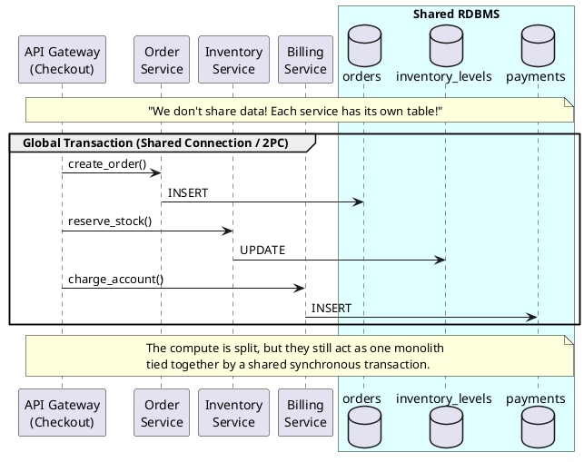

**Speaker notes:**

* "This is one of the most common pitfalls I see. Teams split the compute layer, but keep the database. To justify it, they say: 'We just use separate tables!'"
* "But if you look at their code, they wrap API calls to those tables in a single database transaction."
* "This means the system still relies on global strong consistency provided by the RDB. If any table's rules change, or the DB locks up during a commit, the entire macro-operation fails."
* "This is exactly what holding onto the shared database looks like in practice."

---

### Slide 7 — The Strong Consistency World

**Slide Title:** The Strong Consistency World
**Subtitle / key message:** *Why we cling to the shared database: strong consistency feels safe.*

**Slide contents:**

* **The Promise:** Every read sees the latest write instantly.
* **The 40-Year Habit:** RDBMS tools taught us to rely on the database for safety.
  * ACID Transactions
  * Foreign Key Constraints
  * Cross-Table Coordination
* **The Trap:** We became structurally dependent on the DB engine to enforce cross-domain business rules.

**Speaker notes:**

* "Before we talk about ownership, it's worth naming what the shared database gives people psychologically: strong consistency feels immediate and easy to reason about."
* "RDB products made that world extremely powerful, and because those features worked so well, many applications grew to depend on them."
* "The transaction hook we saw in the previous slide? That's a direct attempt to hold onto this strong consistency world, even after the services were split."

---

### Slide 8 — The Distributed World

**Slide Title:** What Changes in the Distributed World
**Subtitle / key message:** *Separate deploys, shared schema — still one monolith at the data layer.*

**Slide contents:**

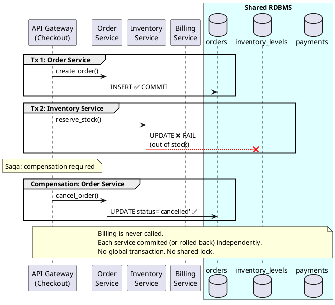

**Speaker notes:**

* "This is what the distributed world actually looks like. Each service manages its own transaction boundary — it commits or rolls back independently."
* "Notice we still use one shared database here — the difference is not where the tables live, but that each service opens and closes its own transaction without involvement from the others."
* "When Inventory fails, Billing is never called. Order needs to be compensated — cancelled. This is the Saga pattern we covered in Session 1."
* "Your first reaction is probably: 'This is so much more complicated than just wrapping it all in one transaction!' — and you're right."
* "Hold that thought. The next slide explains why teams choose to carry this complexity anyway."

---

### Slide 9 — Why Accept the Complexity?

**Slide Title:** So Why Accept All This Complexity?
**Subtitle / key message:** *Because the alternative scales badly and breaks teams.*

**Slide contents:**

| Shared Transaction | Independent Boundaries |
|---|---|
| Simple to write | Hard to undo at scale |
| One team's migration breaks everyone | Each team deploys independently |
| DB is the authority | API is the contract |
| Scale the whole DB together | Scale each service separately |
| One failure cascades | Blast radius is contained |

**Speaker notes:**

* "You just saw that the distributed world is more complicated. Let me be direct about why teams still choose it."
* "With a shared DB, one team's late-night migration breaks everyone. One batch job locks a table your payment flow depended on."
* "At small scale, the simplicity wins. But as teams and traffic grow, the coupling becomes the bottleneck — not the features."
* "The goal is not to make things complicated. The goal is to make each service's blast radius small enough that one team's bad day doesn't become everyone's."
* "But here is the catch: you cannot build an isolation if you don't know where the business boundary is. If you just separate tables based on technical convenience, you're just moving the coupling, not removing it."
* "Transition: To find the right boundary, we have to stop looking at our database schemas and start looking at the business itself. We need to look at Domains."

### Slide 10 — Domain Boundary = Data Boundary

**Slide Title:** Domain Isolation: Data Follows the Business
**Subtitle / key message:** *Microservices model Domain Knowledge, not just Data Structures.*

**Slide contents:**

* **The Shift in Perspective:**
  * **Traditional (RDBMS)**: Group data by normalization, keys, and structural convenience.
  * **Microservices (Domain)**: Group data by behavior, lifecycle, and business ownership.
* **What is a "Domain Boundary"?**
  * It is a "Sphere of Knowledge" where one team has the authority to change rules.
  * The database is a persistent side effect of this knowledge—not the starting point.
* **The Transaction as a Guardian:**
  * Transactions protect **Business Invariants** (rules that must always be true).
  * If two pieces of data must be consistent in real-time, they are part of the *same* Domain.

**Speaker notes:**

* "We need to get back to the core of microservices: they represent business domains, not just web servers."
* "The problem we face is often that we model the *data structure* (the entity 'Product') rather than the *domain behavior* (the act of 'Selling' vs. 'Counting Stock')."
* "Stop thinking about 'splitting tables.' Start thinking about 'carving out spheres of knowledge.' A domain boundary is the line where one team has total autonomy over their rules."
* "The transaction is the technical enforcement of that boundary. It protects the rules that must never be broken within that domain. If a rule has to cross a transaction, it's no longer a rule—it's a workflow process."
* "Transition: When we forget this and try to put everything 'Product-related' into one place because it 'looks the same,' we fall into the Master Data trap."

---

### Slide 11 — The Master Data Trap

**Slide Title:** The Master Data Trap
**Subtitle / key message:** *The "Everything Table" is where ownership goes to die.*

**Slide contents:**

* **The question teams always ask:**
  * "We're splitting services. Which service should own the `products` table?"
  * "Should Customer Master live in the User Service or the CRM?"
* **The diagnostic question to ask back:**
  * "Does your company have a single business team whose job is to maintain every attribute of a product?"
  * The answer is almost always **No**.
* **Why large master tables accumulate:**
  * No clear owner → Everyone adds columns, nobody deletes them.
  * Shared dependency → One team's migration risk is shared by all.
  * Structural convenience → "It's all product-related, so it should be in one table."

**Speaker notes:**

* "This is the question I'm asked most often in microservice migrations: 'which service should own the Product Master?'"
* "My first answer is always: 'does your company have a single team whose job is to maintain product data?' — not just use it, but *maintain* it as their primary business function."
* "If the answer is No — and it almost always is — then the monolith `products` table isn't just a technical problem; it's a model of a business function that doesn't actually exist in your company."
* "It grew because every team added the columns they needed. Nobody truly owns the integrity of the whole row, but everybody is highly dependent on it."
* "SQL JOINs and database-level materialized views traditionally helped us turn a blind eye to this missing ownership. In a microservices world, where boundaries are explicit, you can no longer ignore it."

---

### Slide 12 — Bounded Context: Thinking in Domains

**Slide Title:** Bounded Context: Thinking in Domains
**Subtitle / key message:** *A "Product" is not a row; it is a collection of business functions.*

**Slide contents:**

* **The Bounded Context Lens:**
  * "Product" means something different to each service:
  
  | Domain | What it cares about |
  |---|---|
  | **Catalog** | name, description, images, categories |
  | **Pricing** | list price, discount rules, currency |
  | **Inventory** | SKU, stock level, warehouse location |
  | **Logistics** | weight, dimensions, hazmat flags |
  | **Finance** | tax class, cost price, accounting code |

* **The Result:**
  * Each domain owns and maintains its own specific slice of the "Product."
  * No single service "owns the product" entity—they own the **Domain Attributes**.
  * **Autonomy realized**: Catalog can change a description without checking with Finance or Logistics.

**Speaker notes:**

* "The fix is Bounded Context thinking. We stop trying to find a home for the 'Product row' and start finding homes for 'Product Attributes' based on who creates and uses them."
* "In this world, 'Product' isn't a single thing; it's a concept that spans multiple domains. Each domain is the absolute authority over its own attributes."
* "The practical test for a healthy boundary: Can a team change their columns without coordinating with anyone else? If not, you haven't split the domain; you've just split the table."
* "Transition: let's make this concrete with Exercise 1. We're going to take a real master table and try to find the hidden boundaries inside it."

---

### Slide 13 - Exercise 1

**Slide Title:** Exercise 1
**Slide contents:** (divider)

---

**Facilitation Guide:** See `session03-exercise1.md` for full worksheet, model answers, and debrief prompts.

**Timing:** 25–30 min  
**Structure:**
* Part A (10 min): Diagnose ownership for 6 column groups (Presentation, Pricing, Stock, Logistics, Financial, Metadata)
* Part B (10 min): Design service schemas and APIs
* Part C (8 min): Resolve hard cases (status, SKU, created_at, product detail page)
* Part D (bonus, 5 min): Migration path

**Speaker notes — Opening the exercise:**

* "You inherit a shared `products` table with ~60 columns. Five services (Catalog, Pricing, Inventory, Shipping, Finance) all write to the same table. There's no dedicated 'product team.'"
* "Your job: assign ownership to each column. Decide which service is the system of record for each piece of data."
* "The hard part: some columns could belong to multiple teams. Your task is to make that explicit and choose."
* "Reference: the full schema is in the Appendix of the worksheet."

**Key teaching moment:**

> "The diagnostic question: Can you name a specific business role responsible for this column? If not, it doesn't belong in a single table."

**Common pitfall to watch for:**

* Groups often keep related columns together (e.g., "all financial stuff goes to Finance") instead of asking *who changes this*.
* Redirect: "Does Finance *create* this data, or do they just *read* it for reporting?"

**After Part C (transition to next slides):**

* "Exercise 1 solved the ownership question. But now you face three new problems: How do you read across services? How do you keep data in sync? How do you notify consumers of changes?"
* "That's what Slides 14–18 and Exercise 2 address."

---

### Slide 14 Divider - Data on the Move

---

### Slide 15 — Bridge: From Product Master to Owned Data

**Slide Title:** Before: Shared Product Master
**Subtitle / key message:** *Five services are split in code, but still tightly coupled in data.*

**Slide contents:**

**Before (shared product master)**

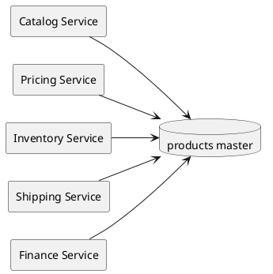

**Speaker notes:**

* "This is the current-state anti-pattern: one product master table touched by all five services."
* "Even if services are separately deployed, data ownership is still shared, so change risk is shared."
* "Keep this picture in mind as the baseline. Next slide shows the target shape without changing the 5-service scenario."

---

### Slide 16 — Bridge: From Product Master to Owned Data

**Slide Title:** After: Owned Product Data Model
**Subtitle / key message:** *Same five services, explicit data ownership, and safer change boundaries.*

**Slide contents:**

**After (owned data model, still 5 services)**

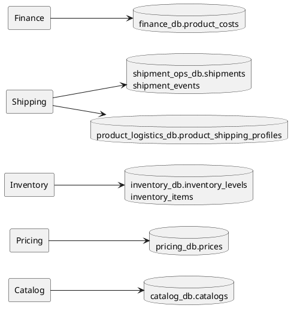

**Speaker notes:**

* "This is the target-state model from Exercise 1: each service owns its slice of product data."
* "We intentionally keep Shipping as one service with two datastores: shipment operations and product logistics attributes."
* "Now the ownership boundary is explicit, so we can discuss interaction boundaries: reference by ID, not by join."

---

### Slide 17 — Reference by ID, Not by Join

**Slide Title:** Reference by ID, Not by Join
**Subtitle / key message:** *IDs cross service boundaries. Joins do not.*

**Slide contents:**

* Replace cross-service join dependencies with a stored ID
* Ownership stays with the source service
* Consumers call the owning service to resolve the reference when needed

**Before (shared schema, join):**

```sql
-- Order service queries inventory directly
SELECT o.id, i.sku, i.quantity
FROM orders o
JOIN inventory i ON o.product_id = i.id   -- cross-schema join
```

**After (separate schemas, reference by ID):**

```
Order: { order_id: "ORD-1", product_id: "PROD-42", quantity: 2 }
-- To get product details: call Inventory Service GET /products/PROD-42
```

**Speaker notes:**

* "In the exercise, you just split the tables. Now your SQL JOINs are broken. This is the fix."
* "The ID is the contract. The owning service controls what it returns when you resolve that ID."
* "This introduces a network call where there was a local join — that's intentional. The coupling was hidden in the join; now it's explicit."
* "Common question: 'Can we keep querying directly like before?' — in a microservice setup, keep the ID locally and ask the owning service when you need details."
* "Latency concern is real; we'll address it with query patterns (API composition, caching) later in this session."
* "Transition: but splitting the data is just the beginning. It creates a brand new set of problems."

---

### Slide 18 — After the Split: A New Problem Appears

**Slide Title:** We Split the Data. Now What?
**Subtitle / key message:** *Ownership solves the write problem. It immediately creates a read problem and a change-notification problem.*

**Slide contents:**

**Where we are now**

* Catalog owns: `name`, `description`, `images`
* Pricing owns: `list_price`, `discount_rules`
* Inventory owns: `sku`, `quantity_on_hand`
* No more shared table. No more cross-service JOINs.

**The new questions this creates**

**Question 1 — Reading at query time:**

> "A product detail page needs name (Catalog) + price (Pricing) + stock status (Inventory). Previously one SQL query. Now three services. How do I assemble that response?"

**Question 2 — High-frequency reads:**

> "I need to render a product list with 200 items and all their attributes. API composition means hundreds of service calls. Can I still have something like a materialized view?"

**Question 3 — Change notification:**

> "Catalog updated a product name. Pricing has a denormalized copy of that name in its own table. How does Pricing know the name changed? Can I subscribe to changes?"

**The answers — preview of the rest of this session:**

* **Question 1** → API composition: orchestrate reads at the API layer at query time
* **Question 2** → Prefer a consumer-owned read projection (CQRS) over DB-level materialized views; avoid shared read replicas
* **Question 3** → Events via the outbox pattern: services publish changes as events; consumers subscribe and update their projections

**Speaker notes:**

* "Exercise 1 solved ownership. I want to pause and name the three questions that ownership immediately creates — because teams often feel they've traded one problem for three."
* "Question 1 is solvable with API composition — parallel HTTP calls assembled at the API layer. We'll cover that in a moment."
* "Question 2 is the read-table question. The safe answer is: use a consumer-owned projection, not a shared read replica. We call this CQRS."
* "Why not DB-level materialized views here? In many teams they grow into JOIN-heavy or aggregated cross-domain tables, which quietly reintroduce hidden coupling."
* "Question 3 is the change-notification question. This is what the outbox pattern solves: making sure that when a write happens in one service, a reliable event reaches every subscriber."
* "These three questions are connected. The outbox is the notification mechanism. The projection is the read optimization. API composition is the simple case when you don't need the optimization."
* "Transition: before details, let's map the patterns we cover next."

---

### Slide 19 — Pattern Roadmap (Data on the Move)

**Slide Title:** Choosing Read and Write Approaches
**Subtitle / key message:** *When “SQL JOIN” shortcuts are unavailable, use these patterns to design safely.*

**Slide contents:**

* **Read-side design patterns**
  * Gather Data on Demand
    * Direct synchronous service-to-service calls
    * API Composition in a backend layer
    * Client-side composition in the frontend
  * Prepare Data Ahead of Time
    * Cache
    * Aggregated read view
  * Anti-pattern: shared read replica
  
* **Write-side reliability patterns**
  * Why distributed transactions are impractical
  * Synchronous update during the write flow
    * Scheduled refresh
    * Batch refresh
    * Event-driven asynchronous update

**Speaker notes:**

* "This slide is a map for beginners: top half is how to read across services, bottom half is how updates move safely."
* "For reads, you have two practical choices: get data when needed, or prepare data ahead of time."
* "For updates, you choose how quickly changes must appear: during the request, on a schedule, in batches, or event-driven."
* "There is no single best pattern. Start from why: required freshness, expected traffic, and team operational capacity."
* "These patterns are not mutually exclusive. In many real systems, teams combine multiple patterns for different use cases."
* "Next, we will walk through each option with concrete examples and simple selection rules."

---

### Slide 20 — Read Patterns: Gather Data on Demand

**Slide Title:** Read Patterns: Gather Data on Demand
**Subtitle / key message:** *Use this when you need fresh data and can accept extra calls at request time.*

**Slide contents:**

* Common options:
  * Direct synchronous service-to-service calls
  * API Composition — orchestrate calls at the API layer
  * Frontend composition — the browser/mobile app fetches and stitches the data itself
* Strengths:
  * Fresh data at request time
  * No extra copy to maintain
* Trade-offs:
  * Higher latency as fan-out grows
  * More runtime dependencies between services
  * More complex failure handling

**Comparison Table:**

| Pattern | Freshness | Coupling | Best For |
|---|---|---|---|
| **Direct Calls** | Strong (real-time) | Low/Medium | Simple read paths, few downstream calls |
| **API Composition** | Strong (real-time) | Low/Medium | Moderate reads, strong consistency needs |
| **Frontend Comp.** | Strong (real-time) | Low (for backend) | Mobile/Web apps already calling APIs |

**Speaker notes:**

* "This slide covers one read strategy family: gather data when the request arrives."
* "Use this family when freshness matters more than peak throughput, such as product detail or admin detail pages."
* "Quick positioning of the three options: Direct service call is the lightest start, API composition centralizes stitching in one backend place, and Frontend composition lets the client assemble when UI ownership is strong."
* "Direct calls are the simplest, but they can create point-to-point dependencies if they spread across many paths."
* "API composition keeps stitching logic in one backend place, which is easier to govern and observe."
* "Frontend composition can work well when the client already calls multiple APIs and can tolerate partial rendering."
* "As call fan-out grows, latency and failure handling become the main reason to consider pre-built read models in the next slides."

---

### Slide 21 — API Composition

**Slide Title:** API Composition
**Subtitle / key message:** *Orchestrate reads at the API layer; assemble the response from multiple services.*

**Slide contents:**

**Good for:**
  * Low-to-medium read volume
  * Data that must be fresh (strong read-after-write consistency)
  * Simple join: few services, few calls

**Tradeoffs:**
* Latency = max(downstream calls) — mitigate with parallelism and caching
* Availability: if any downstream is down, composition may fail or degrade partially
* Frontend composition is a valid variant when the UI can call multiple endpoints directly and own the stitching logic
* Good fit: admin dashboards, detail pages, lower-QPS reads

**Diagram / illustration (optional):**

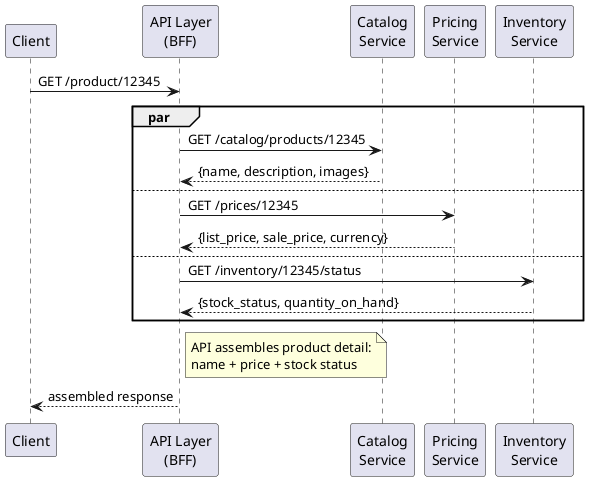

* **When to use:** read must be fresh, fan-out is small, and request volume is moderate
* **Watch out:** tail latency and downstream availability coupling
* **Mitigation:** parallel calls, timeouts, fallback/partial response, caching

**Speaker notes:**

* "API composition means one backend endpoint gathers fresh data from multiple services and returns one response."
* "Concrete example: `GET /checkout/summary?cartId=...` is freshness-critical, because price, stock, and shipping promise can change right before purchase."
* "Use it when fan-out is small and request volume is moderate."
* "By contrast, `GET /products/{id}` usually tolerates cache or pre-aggregation for name/image/description, since those fields change less often."
* "Main risks are latency and dependency failures, so use parallel calls, timeouts, caching, and partial fallback."
* "Direct calls and Frontend composition are also valid; this slide focuses on API composition as the default starting point."
* "Transition: if read volume grows and slight lag is acceptable, move to CQRS read projection."

--- 

### Slide 22 — Read Patterns: Prepare Data Ahead of Time

**Slide Title:** Read Patterns: Prepare Data Ahead of Time
**Subtitle / key message:** *Pre-compute or pre-position data so reads are fast and simple.*

**Slide contents:**

* Common options:
  * **Cache** — store a recent copy close to the reader; serve without calling upstream services
  * **Aggregated read view** — a pre-joined table built for one specific screen or use case
* Strengths:
  * Low latency at read time — no fan-out calls at request time
  * Simple read path for high-traffic screens
* Trade-offs:
  * Extra storage required
  * Refresh logic needed to keep the copy current
  * Data may be slightly stale depending on how often it is refreshed

**Illustration note:** Product list page view fed by updates from Catalog, Pricing, and Inventory

**Speaker notes:**

* "Think of this family as: do the heavy lifting before the request arrives, not during it."
* "Cache is the simplest entry point — save a recent response and serve it directly. Works well when reads far outnumber writes."
* "An aggregated read view goes one step further: a dedicated table pre-joining the fields needed for one screen — for example, product list page combining name, price, and stock status into a single query."
* "The shared cost of both: freshness. How quickly does a change in Catalog or Pricing reach this copy? That depends on how the refresh is triggered."
* "The event-driven way to keep these views fresh — and owned by the consuming service — is what the next slide covers."

---

### Slide 23 — Aggregated Read View

**Slide Title:** Aggregated Read View: Pre-Join for High-Traffic Screens
**Subtitle / key message:** *Build a read-optimized copy once; serve it many times with one local query.*

**Slide contents:**
* **When to use:** high-traffic list/search reads, large API fan-out, eventual consistency acceptable
* **Watch out:** extra storage, update pipeline complexity, stale windows
* **Mitigation:** freshness monitoring, refresh mechanism
* **Important note:** `product_list_view` is owned by the query service. Catalog, Pricing, and Inventory never update the view directly; they publish change events to the query service.

**Diagram:**
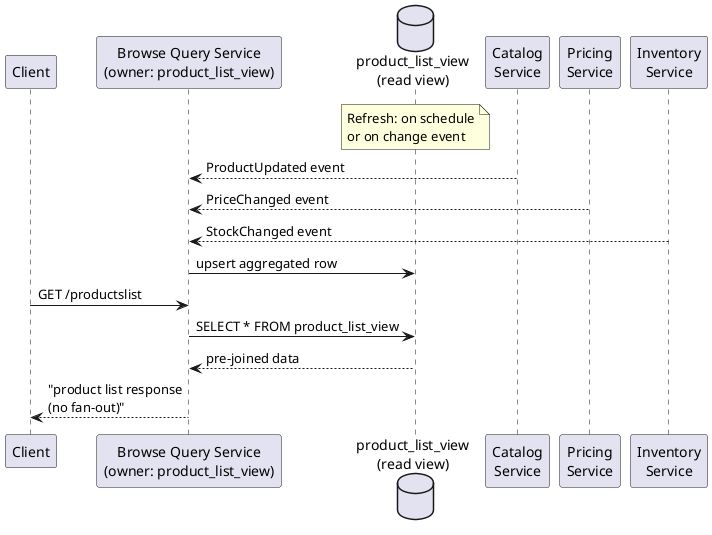

**Speaker notes:**
* "This pattern answers Slide 18 Question 2: for a 200-item product list, yes, you can use a materialized-view-like approach as a consumer-owned aggregated read view."
* "Use this pattern when API composition fan-out is too large for high-traffic list or search pages."
* "At read time, the query service runs one local query instead of hundreds of service calls."
* "Trade-off: faster reads and simpler request path, but The view may temporarily mismatch with source tables, but will be eventually consistent."
* "Boundary rule: `product_list_view` is owned only by the query service; Catalog, Pricing, and Inventory publish change events and never write the view directly. Instead they publish change events to the query service"
* "Any refresh mechanism is also required for the view to catch up with the source. This will be showed in the Write-side patterns section."
* "Next slide: let's look at a common shortcut that seems similar but is dangerous in microservices - the shared read replica anti-pattern."

---

### Slide 24 — Anti-Pattern: Shared Read Datastore

**Slide Title:** Anti-Pattern — Shared Read Datastore
**Subtitle / key message:** *It looks convenient, but it quietly re-introduces coupling.*

**Slide contents:**

* Pattern: source services directly write one shared read datastore used for cross-service queries
* Why it feels attractive: familiar querying style and quick setup
* Why it re-introduces coupling:
  * Any schema change still requires coordination across all services that read from the replica
  * Services become aware of each other's table structures again
  * Scaling and migration are coupled again
  * Ownership boundaries become blurry: no one clearly owns the read schema as a product

**Diagram (anti-pattern):**
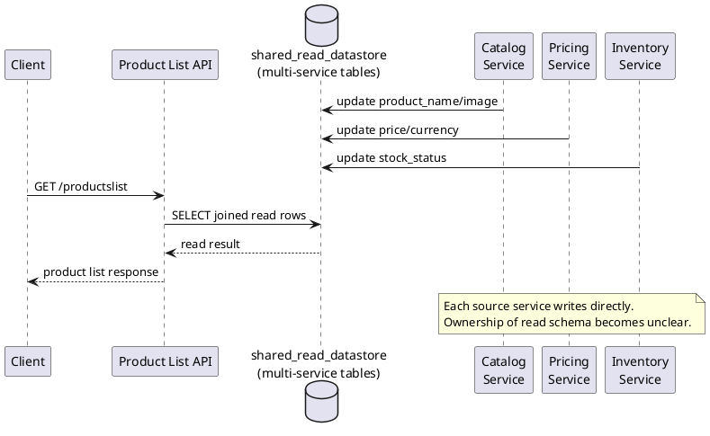

**Preferred alternatives:**

* API composition — fresh data, moderate QPS
* Consumer-owned cache — simple optimization for repeated reads
* Consumer-owned aggregated read view — high QPS, tolerate slight lag

**Speaker notes:**

* "I've seen this pattern appear within weeks of a migration as a 'temporary' solution — it then becomes permanent."
* "Compared with Slide 23, the key difference is ownership: here multiple services write the same read datastore directly."
* "Simple test: can Service A change a column without notifying Service B or C? If not, coupling is back."
* "Transition: once we create consumer-owned copies, the next question is how source changes propagate reliably to them."

---

### Slide 25 — Write-Side Question: How Do Derived Views Stay Updated?

**Slide Title:** Write-Side Patterns: How Do Copies Stay in Sync?
**Subtitle / key message:** *Once we create a read-friendly copy, we must keep it updated.*

**Slide contents:**

* Typical update approaches:
  * Local same-service update
  * Scheduled refresh
  * Batch refresh
  * Event-driven asynchronous pdate
* Choice depends on:
  * How fresh data must be
  * How much complexity the team can operate

**Illustration (e-commerce example):**
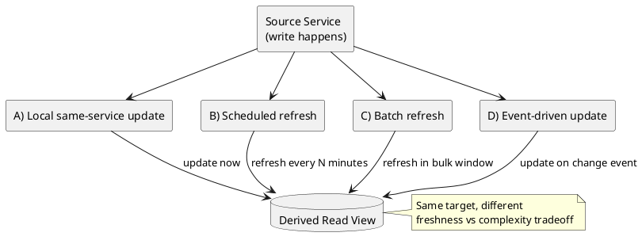

**Speaker notes:**

* "Denormalized or copied data does not maintain itself; we must maintain it, so we need an explicit update strategy."
* "Here are four patterns, and you choose based on freshness needs, consistency expectations, and change frequency."
* "Local same-service update means updates inside one service boundary, not a cross-service transaction."
* "The other three patterns are cross-service and asynchronous, so changes are copied with eventual consistency."
* "Also plan for failure cases: if something goes wrong, source and target can become inconsistent."
* "Transition: next slide is a quick event-driven update walkthrough, then we move to the first failure mode: the dual-write trap."

---

### Slide 26 — Event-Driven Update (Quick View)

**Slide Title:** Event-Driven Update: What Happens, Step by Step
**Subtitle / key message:** *A source service emits a change event, and consumers update their own read models asynchronously.*

**Slide contents:**

* **Step 1:** Source service commits a business change
* **Step 2:** Source publishes a change event (for example, `ProductPriceChanged`)
* **Step 3:** Consumer service receives the event and updates its local copy/read view
* **Step 4:** Reads use the updated local view (with small propagation lag)

**Diagram:**
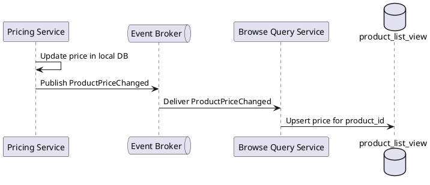

**Speaker notes:**

* "Event-driven update means we do not call every consumer synchronously from the write path."
* "Instead, the source publishes one change event, and each consumer updates its own local view."
* "This improves decoupling and scale, but introduces propagation lag, so data becomes eventually consistent (Module 1)."
* "Operationally, delivery is usually at-least-once: events can be delayed or retried, so consumers must handle duplicates safely. (Remember Module 2)"
* "But what if DB write and event publish are two independent steps with no atomicity? If one succeeds and the other fails, you may lose the event entirely — with no record of what went wrong."
* "That is the dual-write problem: the risk of data loss, not just duplication. Next slide."

---

### Slide 27 — When DB Write and Event Publish Disagree

**Slide Title:** When DB Write and Event Publish Disagree
**Subtitle / key message:** *Two separate steps can fail independently. How do we handle it?*

**Slide contents:**

**The problem:**
* `UPDATE prices` succeeds, but `publish(ProductPriceChanged)` fails → consumers never see the new price
* Or: publish succeeds, but DB update fails → consumers apply a price that was never committed
* Either way: pricing DB and `product_list_view` disagree

**How do we handle this? — Two complementary layers**

| Layer | What it solves | Mechanism |
|---|---|---|
| **Outbox (producer side)** | Never lose an event record | Atomic local write: business data + outbox in one transaction |
| **Inbox pattern / Idempotent consumer** | Safely handle duplicate delivery | Inbox table or natural idempotency (Module 1) |
| **Together** | Exactly-once business outcomes | At-least-once publishing + at-least-once consumption |

* **Why not 2PC (DB + broker)?**
  * Couples DB and broker at commit time → reduces availability and adds latency
  * Ties your architecture to a specific middleware → platform lock-in
  * In event-driven systems, eventual consistency is the accepted model, not global commits

**Speaker notes:**

* "Pricing Service updates the price and publishes an event. These are two separate operations. If either fails alone, source and consumers diverge — and you may have no recovery record."
* "The fix is two complementary layers, not one silver bullet."
* "Producer side: the outbox pattern ensures no event record is ever lost. Business data and event are written atomically in one local transaction."
* "Consumer side: idempotent consumption ensures duplicate deliveries are harmless. This is Module 1's idempotency principle applied to the consumer layer."
* "Together: at-least-once publishing + at-least-once consumption = exactly-once business outcomes."
* "Why not 2PC? It couples DB and broker at commit time, reducing availability, and ties you to specific middleware — platform lock-in."

---

### Slide 28 — The Outbox Pattern

**Slide Title:** The Outbox Pattern - Relay Flow
**Subtitle / key message:** *Relay moves committed changes to the broker asynchronously.*

**Slide contents:**

**Diagram / illustration (optional):**

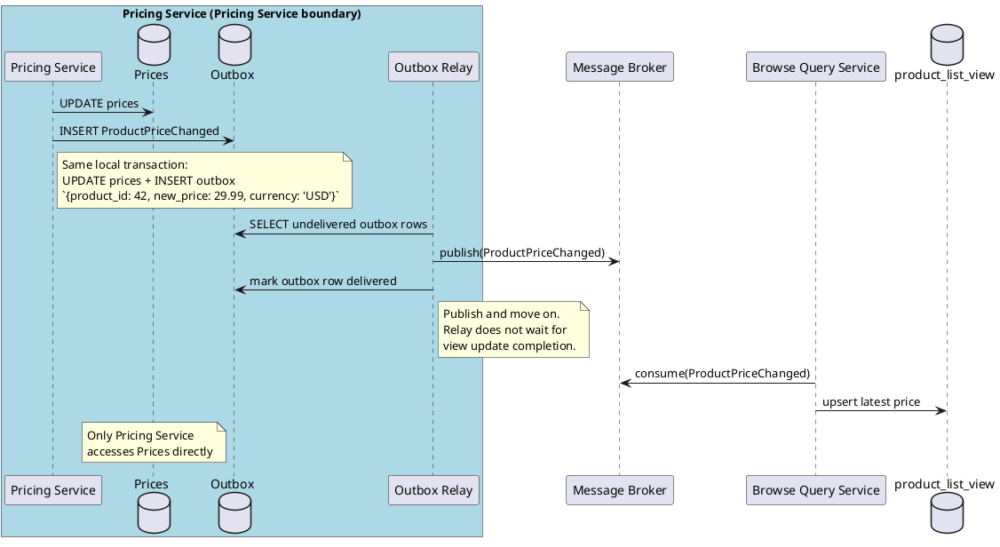

**Speaker notes:**

* "This diagram shows how the Outbox Pattern works and introduces the Relay component."
* "Key step: Pricing Service writes business data and the outbox record in one local transaction. Atomicity ensures we never lose the change event record."
* "The outbox table is simple: an ID, a topic name, the event payload (JSON), a timestamp, and a delivered flag. For example, the payload here would be something like `{product_id: 42, new_price: 29.99, currency: 'USD'}` — just the price change detail that consumers need."
* "Relay polls the outbox, publishes each event to the broker, then marks the row as delivered. It is entirely decoupled from Pricing Service's business logic."
* "Relay is fire-and-forget: publish and move on. It does not wait for downstream consumers."
* "Service boundary stays explicit: only Pricing Service writes `prices`; other services react via events, never by accessing the database directly."

---

### Slide 29 — Inbox Pattern & Idempotent Consumers

**Slide Title:** Inbox Pattern - Idempotent Consumers
**Subtitle / key message:** *Deduplicate on the consumer side; assume every message may arrive more than once.*

**Slide contents:**

* Bridge from Slide 27: we said consumer-side safety is either **natural idempotency** or an **inbox table**
* Problem: relay sends at-least-once → consumer may receive duplicates
* **Inbox pattern:** record processed message IDs in a local `inbox` table before processing
  * Check: if `message_id` already exists → skip (idempotent replay)
  * Write: insert `message_id` + process in one local transaction
* Alternatively: use natural idempotency (e.g., `INSERT ... ON CONFLICT DO NOTHING`)

**Diagram (inbox dedupe flow):**

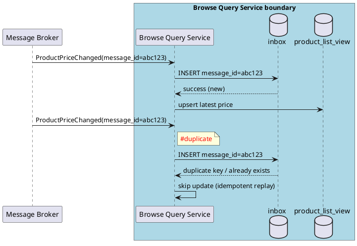

**Inbox table (minimal schema):**

The inbox datastore holds a record of successfully processed messages—typically just the message ID (as primary key for deduplication) and a timestamp when processed. This lightweight table enables the consumer to idempotently replay incoming messages.

```sql
CREATE TABLE inbox (
  message_id  UUID PRIMARY KEY,
  processed_at TIMESTAMPTZ NOT NULL DEFAULT now()
);
```

**Speaker notes:**

* "Quick bridge from Slide 27: we introduced two consumer-side options — natural idempotency or an inbox table. This slide zooms into the inbox option."
* "Inbox is the consumer-side complement of outbox: outbox makes publishing reliable; inbox makes consuming safe."
* "This directly applies Session 1's idempotency principle to the consumer layer."
* "The message_id is the deduplication key. Scope it to the topic + consumer to avoid cross-topic collisions."
* "Transition: an alternative to relay processes is CDC — Change Data Capture."

---

### Slide 30 — Version Check Pattern

**Slide Title:** Version Check Pattern
**Subtitle / key message:** *A consumer may receive valid events out of order, so it must reject stale updates.*

**Slide contents:**

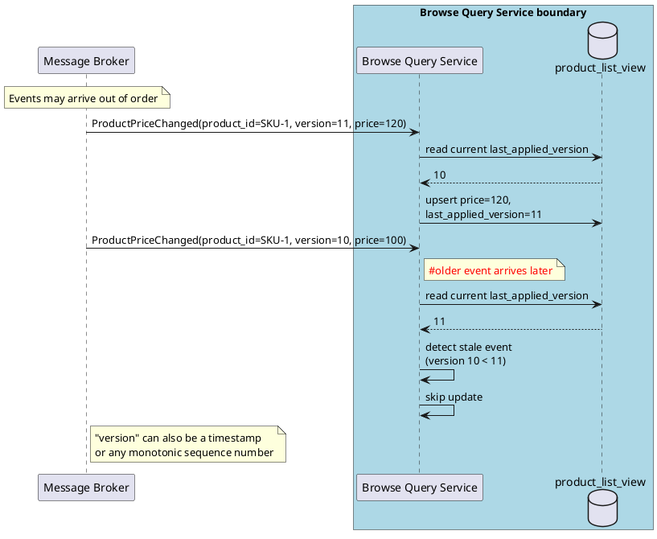

**Speaker notes:**

* “Inbox answered *what if the same message appears twice?*"
* "This slide answers the second intuitive question: *what if an older event arrives after a newer one?*”
* “Message ordering is not guaranteed in distributed systems. Retries, consumer restarts, and partitioning can all change arrival order. That is not a bug; it is a normal property of asynchronous messaging.”
* “The pattern is simple: each event carries a monotonic version. The consumer compares it with `last_applied_version` in its local view. If the incoming version is older, it skips the update.”
* “Why this matters: a stale overwrite often fails silently. No exception, no obvious alert — just incorrect data being served to users.”
* “Some brokers, such as Kafka, give you ordering within a partition for the same key. That helps, but it is not a complete guarantee for the whole system. The version check is still your safety net.”
* “So on the consumer side: **inbox** handles duplicates, and **version check** handles stale or out-of-order events. Together they address two of the most common consumer-side failure modes.”

---

### Slide 31 - Exercise 2

**Slide Title:** Exercise 2
**Slide contents:** Change Propagation Pipeline

See session03-exercise2.md

**Exercise 2 — Change Propagation Pipeline (Outbox + Projection)**

**Scenario:**
Catalog updates a product name. Search and Pricing each keep their own denormalized read model. You must ensure both consumers reflect the change reliably without shared DB access.

**Design tasks:**

* Define the owner-side write + outbox transaction (`products` + `outbox`)
* Define the event contract (event name, key fields, version, timestamp)
* Define consumer update logic for projection tables (idempotent upsert)
* Define handling for duplicate events and out-of-order delivery
* Define operational signals to monitor lag and failed updates

**Expected output:**

* Sequence diagram from owner write to consumer projection refresh
* Minimal schemas: owner outbox + consumer projection + consumer dedupe/inbox
* One failure drill: relay crash and replay, then prove final convergence

---

### Slide 32 — Session Summary

**Slide Title:** Session Summary
**Subtitle / key message:** *Own the data first. Then choose patterns deliberately.*

**Slide contents:**

1. **Ownership first** — one service, one schema; every attribute has exactly one system of record
2. **Read patterns come in two families:**
   * Gather on demand (API composition)
   * Prepare ahead of time (aggregated read view / CQRS)
3. **Write-side reliability** — outbox (no event lost), inbox (duplicates harmless), version check (stale events rejected)
4. **Every copy needs an owner** — who refreshes it, how stale is acceptable, whose read problem does it solve?
5. **Choose patterns by business constraints** — freshness, latency, complexity, failure tolerance — not by fashion

**Speaker notes:**

* "Let me bring the whole session together. We started with a shared database and asked: what breaks when we split?"
* "Data boundaries follow domain boundaries. Once ownership is clear, two questions appear: how do consumers read data they don't own, and how do derived views stay up to date."
* "Read patterns: gather on demand is simple but adds runtime coupling. Prepare ahead of time decouples at the cost of eventual consistency. Neither is universally better — choose by the use case."
* "Write-side reliability: the outbox guarantees no event is lost. The inbox and version check guarantee the consumer handles duplicates and ordering safely."
* "One guardrail I want you to remember: any cache, replica, or aggregated view must have a clear owner and purpose. Without that, copied data becomes unmanaged coupling."
* "Eventual consistency is not 'anything goes' — it means the team explicitly decides where temporary lag is acceptable and designs the user experience around it."

---

### Slide 33 — Bridge to Next Session

**Slide Title:** What's Next — API Design for Evolution
**Subtitle / key message:** *Owned data needs an owned API that can evolve safely.*

**Slide contents:**

* Session 4 (next): **API Design for Evolution**
  * Backward compatibility, versioning strategies
  * Error model, pagination/filtering consistency
  * Contract testing and consumer-driven contracts

* The chain:
  * Session 1: correctness under retries (idempotency, eventual consistency)
  * Session 2: stability and diagnosability (resilience, observability)
  * **Session 3: data ownership and reliable messaging**
  * Session 4: API evolution without breaking consumers
  * Session 5: pub-sub architecture patterns (event design, delivery, reliability patterns)

**Speaker notes:**

* "Data ownership gives you the isolation; API design gives you the evolution safety."
* "We'll carry the expand/contract principle from today directly into API versioning strategy."
* "And when you're ready for deeper event architecture decisions, Session 101-05 is the dedicated pub-sub deep dive."
* "Same baseline: assume consumers depend on your contract — design for backward compatibility first."

---

### Slide 34 — Wrap: 3 Takeaways

**Slide Title:** 3 Takeaways
**Slide contents:**

1. **Own your data:** one service, one schema — share IDs, not tables
2. **Outbox, not dual-write:** make event publishing atomic with the business transaction
3. **Query patterns replace joins:** use API composition or CQRS; avoid shared read replicas

**Speaker notes:**

* "If you leave with these three, you can safely migrate a shared database incrementally."
* "Start small: pick one service, extract its tables, enforce the ownership rule, add the outbox."
* "Build on Session 1 and 2: idempotency, eventual consistency, and observability all apply in this data layer too."


# EOF