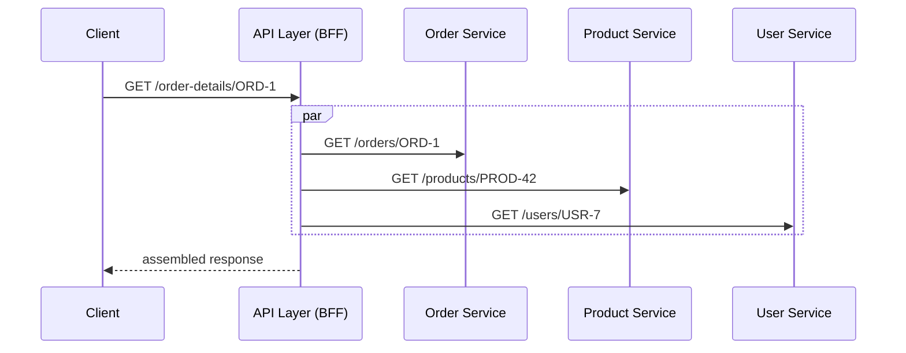

# Session 3 (2h): Data Modeling & Storage Patterns

## Outline

### Goals

* Understand the historical and cultural reasons why shared databases persist — even in teams that have already split their services.
* Understand how shared databases create change/perf/ops coupling, and how data ownership boundaries isolate change.
* Design transaction boundaries across services using outbox and inbox patterns.
* Choose the right query pattern (API composition, CQRS-lite) when data lives in multiple services.

### Agenda (120 min)

**0–15: Hook + historical background**

* The “monolith database as the last shared wire” story
* Strong Consistency vs Eventual Consistency (quick contrast)
  * Strong consistency: after a successful write, every read sees the latest committed value
  * Eventual consistency: replicas/views/services may lag, but converge if updates stop
  * RDB products made strong consistency practical with ACID transactions, foreign-key constraints, and sometimes 2PC/XA-style coordination
  * Why teams cling to shared DBs: strong consistency feels simpler and safer at query time
* Why the shared DB habit is so hard to break: historical context
  * Relational DB as the default for 40+ years — ACID is deeply trusted
  * Shared DB = shared truth: a cultural assumption, not just a technical one
  * Materialized views/read replicas as “temporary compromise” that becomes permanent
  * The organizational pattern: one DBA team owns the DB, many app teams read from it
  * Why microservice extraction often stops at the service layer — the DB migration feels too risky
* Coupling taxonomy:
  * Change coupling, performance coupling, operational coupling
* Mindset shift needed: from "shared truth" to "owned contracts"

**15–40: DB-per-service & schema ownership**

* One service, one schema, one owner (ideal target state)
* Bridge pattern (enterprise-friendly):
  * One physical DB but strict table ownership, no cross-service joins, no shared migrations
* As purpose-specific databases emerged, teams could no longer assume one RDBMS and its JOIN semantics across all services
* Reference by ID, not by join
* Schema as a contract: what you expose vs what you hide
* Migration safety: expand/contract pattern
* The master data trap:
  * "Who owns the Product Master? The Customer Master?"
  * Diagnostic question: does a master data maintenance *business team* exist?
  * If not — the monolith table is the wrong model, not just the wrong location
  * "Master data" as seen by different bounded contexts:
    * Catalog Service owns: name, description, images, categories
    * Pricing Service owns: list price, discount rules, currency
    * Inventory Service owns: SKU, stock level, warehouse location
    * Shipping Service owns: dimensions, weight, hazmat flags
  * Each service owns its slice; none owns "the product"

**40–60: Exercise 1 (master data decomposition)**

* You are handed a 60-column `products` table shared by 5 services
* Diagnostic questions:
  * which business team is responsible for each column group?
  * which service is the *system of record* for each attribute?
  * which columns appear in every service's query — and which are only used by one?
* Design output:
  * Source-of-truth map: attribute → owning service
  * split the 60 columns across bounded-context tables with clear owners
  * define what each service's API exposes about "product"
  * identify what joins disappear and what network calls replace them
  * decide which attributes need to be replicated (denormalized) into consumers vs resolved on demand

**60-80: Query patterns for split data**

* API composition: orchestrate reads across services at the API layer
* Frontend composition: sometimes the browser/mobile app performs the join
* CQRS-lite: maintain a read-optimized projection from events/CDC
* Denormalization as a feature, not a bug: duplicate stable attributes to buy speed and decoupling
  * Rule of thumb: if data changes every second (stock level), query it; if it changes once a month (product name), duplicate it
* How consumers realize upstream changes: subscribe to owner-service events
* When to use each: latency, consistency, operational cost
* Anti-pattern: re-introducing a shared DB as a "read replica"

**80-100: Transaction boundaries & outbox pattern**

* Why distributed transactions are impractical
* The dual-write problem: DB write + message publish
* Outbox pattern: write to DB + outbox table in one local transaction
* Inbox / idempotent consumer: safe at-least-once processing
* CDC basics: database-level change capture as an alternative publish path
* Cloud-native alternatives: managed change feeds/streams can replace the custom relay layer

**100–115: Exercise 2 (change propagation design)**

* Order service must reliably emit `OrderCreated` after persisting
* Naive approach fails on partial failure
* Design:
  * Outbox table schema (event_id, aggregate_id, payload, status, created_at…)
  * Relay behavior (polling/streaming, retries, ordering expectations)
  * Downstream projection update flow
  * Consumer idempotency strategy (dedupe store / unique constraint)
  * What happens on relay crash / duplicate delivery / replay

**115–120: Wrap + 3 takeaways**

* Ownership boundary = data boundary; share IDs, not tables
* Reliable messaging needs the outbox pattern, not dual-write
* Query patterns replace cross-service joins; pick the simplest that works

### Handout (1-pager you can share)

* DB-per-service checklist (ownership, exposure, migration rules)
* Master data diagnostic: "who is the system of record?" question checklist
* Bounded-context data split template (columns → owner → API surface)
* Outbox table schema + relay pseudocode
* Query pattern comparison table (API composition vs CQRS-lite vs shared read replica)
* Rules-of-thumb checklist (ownership, joins, outbox, projections, migration)
* Schema migration playbook (expand/contract steps)

---

## Session 3 — Slide Outline (Lecture Part)

### Slide — Cover

**Slide Title:** Microservices 101 - Session 3: Data Modeling & Storage Patterns
**Slide contents:**
* (Speaker introduces the session, title slide only)

**Speaker notes:**

* "Session 1 was correctness under retries: idempotency and eventual consistency."
* "Session 2 was stability and diagnosability: resilience controls and observability."
* "Session 3 is about data: where it lives, who owns it, and how to move it reliably across service boundaries."
* "This is often where microservice migrations stall — not because of APIs or deployments, but because of shared databases."

---

### Slide — Introduction of This Series

**Slide Title:** Microservices 101 series
**Slide contents:**
* 101-01 Idempotency & Eventual Consistency — Safe Retries and Async Systems
* 101-02 Resilience & Observability — Design for Failure and Debug Fast
* **101-03 Data Modeling & Storage Patterns — Boundaries and Eventual Reads**
* 101-04 API Design for Evolution — Contracts and Backward Compatibility
* 101-05 Messaging & The "Buy vs. Build" Lever — Async Communication
* 101-06 Production Safety & Multi-Tenancy — Feature Flags and Isolation

**Speaker notes:**
* "Here is where we are in the series. The first two sessions laid a foundation for correctness and stability."
* "Session 3 takes us into the deeper architectural challenges: owning data safely and effectively."
* "The following sessions (101-04 to 101-06) will build on this data baseline to cover API evolution, deeper messaging, and shipping safely."

---

### Slide — Agenda

**Slide Title:** Agenda
**Slide contents:**

* Introduction
* Data Ownership 101
* Exercise 1 (design) [30 min]
* Data on the Move 101
* Exercise 2 (design) [15 min]
* Rules of thumb + wrap up

**Scope note:** This session introduces event-driven change propagation only as needed for data ownership and projections. Pub-sub architecture patterns are covered in depth in Session 101-05.

**Speaker notes:**

* "Two halves today: ownership and isolation (DB-per-service, schema), then change propagation and read patterns (outbox, CDC, API composition, CQRS-lite)."
* "Exercises are hands-on design: first split the master table by ownership, then design end-to-end change propagation from write to projection update."
* "The operational checklist moves to the handout so the wrap-up can stay focused on three takeaways."
* "Transition: let's set the goal for what you should be able to do by the end."

---

### Slide 1 — Title

**Slide Title:** Data Modeling & Storage Patterns
**Subtitle / key message:** *Own your data. Move it reliably. Query it without re-coupling.*

**Slide contents:**

* What you'll learn:
  * Why shared databases are the last hidden coupling in microservices
  * How to design ownership boundaries and safe schema migrations
  * How to publish events reliably without dual-write
  * Which query pattern fits when data lives in multiple services
* What you'll be able to do:
  * Draw a clear data ownership boundary between services
  * Design an outbox-based publish flow that survives partial failure
  * Choose between API composition and CQRS for read requirements

**Speaker notes:**

* "A common trap: you split services, you split deployments, but you keep one shared database. The database becomes the last invisible coupling point."
* "This session gives you the tools to break that coupling safely and keep data flowing reliably."
* "Links to prior sessions: eventual consistency (Session 1) and observability (Session 2) apply directly once data is distributed."

---

### Slide 2 — Hook: The Last Shared Wire

**Slide Title:** The Database Is Often the Last Shared Wire
**Subtitle / key message:** *Separate deploys, shared schema — still one monolith at the data layer.*

**Slide contents:**

**Why this feels attractive**

* **Strong consistency:** after a successful write, every read sees the latest committed data
* RDB products reinforced this with ACID transactions, foreign-key restrictions, and transaction coordination features
* Shared DB makes this easy to assume across modules

**What changes in distributed systems**

* **Eventual consistency:** different services, replicas, and projections may observe the new value at different times
* They should converge, but not necessarily immediately

* Services deployed independently ✓
* APIs versioned and contracts defined ✓
* Database: still one shared schema ✗
* Result:
  * Schema change in Service A breaks Service B
  * A table join couples two services at query time
  * A FK constraint enforces runtime dependency
  * Any migration requires coordinated deployment across teams

**Speaker notes:**

* "Before we talk about ownership, it's worth naming what the shared database gives people psychologically: strong consistency feels immediate and easy to reason about."
* "Quick contrast: strong consistency means once a write is committed, every subsequent read sees that latest value. Eventual consistency means different readers may observe the change at different times, but the system converges."
* "RDB products made that world extremely powerful: ACID transactions, foreign-key restrictions, and sometimes 2PC/XA-style coordination let applications rely on one strongly consistent source of truth."
* "Because those features worked so well, many applications became structurally dependent on them. That's one of the root causes of the monolith database pattern."
* "That tradeoff matters here because DB-per-service often means giving up the illusion that every part of the system can read one perfectly current shared truth at all times."
* "We've already introduced eventual consistency earlier in the series; here we connect it directly to the data ownership problem."
* "Teams often extract services successfully but leave the database shared for 'just a little while.' That little while becomes permanent."
* "Shared schema means shared deployment risk: you cannot change a column without checking every service that reads it."
* "Foreign keys and joins are a sign that two services are actually one service pretending to be two."
* “Transition: before we talk about the fix, let’s understand *why* this pattern is so persistent — it has deep historical roots.”

---

### Slide 3 — Why the Shared DB Habit Persists

**Slide Title:** Why the Shared DB Habit Is Hard to Break
**Subtitle / key message:** *This is not just a technical problem. It’s a 40-year default being questioned.*

**Slide contents:**

**The historical default**

* Relational databases have been the dominant storage layer since the 1980s
* ACID transactions gave teams a trusted, single source of truth
* Foreign keys, constraints, and transaction coordination features made cross-module consistency easy to enforce in one place
* “Put everything in one DB” was the correct, proven answer for decades
* The DBA role emerged around protecting and optimizing that central database

**How organizations adapted**

* One central DB → managed by a central DBA team
* Many application teams → all read from (and often write to) the same DB
* Joins, views, and stored procedures became the integration layer between teams
* Materialized views and read replicas added as “good enough” performance fixes

**What microservices ask you to undo**

* Microservices challenge the “shared truth” model at its foundation
* The ask: give up cross-service joins, give up FK guarantees across teams, give up the central authority
* For many builders, that feels like giving up correctness — not gaining it

**Why teams stop halfway**

* Service extraction is visible and concrete (deploy boundary, API, team ownership)
* DB migration is risky, invisible to users, and easy to defer
* “We’ll split the DB later” → later never comes
* Materialized views, shared read replicas, and cross-schema joins become permanent fixtures

**The real blocker is often cultural**

* Trust in the relational DB as the arbiter of truth is deeply ingrained
* Teams that share a DB implicitly share responsibility — and blame
* DB-per-service requires teams to trust each other’s APIs instead of each other’s tables
* This is a culture and ownership shift, not just a tooling change

**Speaker notes:**

* “Before we talk about DB-per-service, I want to acknowledge why it’s hard — and why most teams haven’t done it yet.”
* “The shared DB is not a mistake. It was the right answer for 40 years. ACID transactions, relational integrity, SQL — these are genuinely powerful tools.”
* “And because those tools were so powerful, many systems grew around them: foreign keys across modules, one transaction spanning many business concerns, sometimes even distributed transaction managers. That technical success created organizational dependence.”
* “What changed is scale, team autonomy, and deployment independence. Those pressures expose the hidden cost of shared ownership.”
* “The hardest part is cultural: in a shared DB world, the database is the authority. Every team trusts the same tables. Splitting that means trusting APIs — and the teams behind them — instead.”
* “I’ve seen teams extract 10 services and still share one database. Not because they didn’t know better, but because the DB migration felt riskier than the payoff was clear.”
* “The goal of this session is to make the payoff clear — and give you a concrete, low-risk path to start the split.”
* “Transition: now let’s look at what the ownership model looks like when you do make the move.”

---

### Slide 4 — DB-per-Service Principle

**Slide Title:** DB-per-Service: One Owner, One Schema
**Subtitle / key message:** *If two services share a DB, they share deployment risk.*

**Slide contents:**

* Rule: each service owns its own database (or schema/namespace)
* Only the owning service reads or writes its tables directly
* Other services access data through the service's API, not directly through the DB
* Once services can use different storage technologies, cross-service JOIN is no longer a safe or portable assumption
* Benefits:
  * Independent schema evolution
  * Independent scaling and storage choices
  * Clear blast radius: a broken migration affects one service, not all

**Diagram / illustration (optional):**

```
Service A ──► DB-A (tables: orders, order_items)
Service B ──► DB-B (tables: inventory, stock_movements)
Service C ──► API call ──► Service A (never direct DB-A access)
```

**Speaker notes:**

* "DB-per-service is a principle, not a physical server requirement. It can mean separate logical schemas on the same host — but the ownership rule is strict."
* "The enforcement point is access: no service may issue a SQL query against another service's tables."
* "Another reason this matters: over time, many purpose-specific databases emerged. The moment one service uses a different storage engine, the old assumption of 'we can always join later in SQL' stops being true."
* "Think of the database schema as part of the service's private implementation, not a shared contract."
* "Transition: if you can't join, how do you relate data across services? Reference by ID."

---

### Slide 5 — Reference by ID, Not by Join

**Slide Title:** Reference by ID, Not by Join
**Subtitle / key message:** *IDs cross service boundaries. Joins do not.*

**Slide contents:**

* Replace cross-service FK with a stored ID
* Ownership stays with the source service
* Consumers call the owning service to resolve the reference when needed

**Before (shared schema, join):**

```sql
-- Order service queries inventory directly
SELECT o.id, i.sku, i.quantity
FROM orders o
JOIN inventory i ON o.product_id = i.id   -- cross-schema join
```

**After (separate schemas, reference by ID):**

```
Order: { order_id: "ORD-1", product_id: "PROD-42", quantity: 2 }
-- To get product details: call Inventory Service GET /products/PROD-42
```

**Speaker notes:**

* "The ID is the contract. The owning service controls what it returns when you resolve that ID."
* "This introduces a network call where there was a local join — that's intentional. The coupling was hidden in the join; now it's explicit."
* "Latency concern is real; we'll address it with query patterns (API composition, caching) later in this session."
* "Transition: ownership also means owning schema change. Let's talk about safe migration."

---

### Slide 6 — Schema Ownership & Safe Migration (Expand/Contract)

**Slide Title:** Schema Changes: Expand First, Contract Later
**Subtitle / key message:** *Never remove a column while any consumer still reads it.*

**Slide contents:**

* Schema is a contract with all current consumers (even your own service's prior deploys)
* Dangerous pattern: rename or drop a column in one deployment
* Safe pattern — **expand/contract**:
  1. **Expand:** add the new column; write to both old and new
  2. **Migrate:** backfill old rows to new column
  3. **Cut over:** update all reads to use new column
  4. **Contract:** drop the old column after all consumers are updated
* Never skip step 4 — schema debt accumulates fast

**Speaker notes:**

* "This is the same discipline you'd apply to a public API, but applied to your own DB schema — because your prior deploys are still a consumer during rolling updates."
* "The danger is that a fast rename feels harmless in dev but breaks an older pod still in-flight during a rolling deploy."
* "Automate the tracking: keep a migration status log so you know which old columns are safe to drop."
* "Transition: the hardest ownership question in practice isn't 'how do we split?' — it's 'who actually owns this data?' Let's talk about master data."

---

### Slide 7 — The Master Data Trap

**Slide Title:** Who Owns the Product Master?
**Subtitle / key message:** *If no business team owns it, the data model is wrong — not just the location.*

**Slide contents:**

**The question teams always ask**

* "We're splitting services. Which service should own the `products` table?"
* "Should Customer Master live in the User Service or the CRM?"

**The diagnostic question to ask back**

* "Does your company have a team whose job is to maintain product data as a business function?"
* If yes → that team's tooling is the system of record. Build a Product Data Service around that business function.
* If no → the monolith table is the wrong abstraction, not just the wrong location

**Why large master tables accumulate**

* Different teams needed different product attributes → they added columns to the shared table
* Nobody owned the whole thing → nobody could safely remove anything
* Cross-service joins and materialized views were added to serve each team's read needs
* Result: a 60-column table where 5 services each use 10 different columns

**The bounded-context lens**

* "Product" means something different to each service:

  | Service | What it cares about |
  |---|---|
  | Catalog / Search | name, description, images, categories, tags |
  | Pricing | list price, discount rules, currency, promotions |
  | Inventory | SKU, stock level, reorder threshold, warehouse |
  | Shipping | dimensions, weight, hazmat flags, carrier rules |
  | Tax / Finance | tax class, cost price, country of origin |

* Each service owns and maintains its slice
* No single service "owns the product" — the product is a collection of bounded contexts

**What changes**

* Instead of one `products` table → each service owns its domain columns
* Cross-service reads use IDs to resolve the reference from the authoritative service
* Attributes needed for performance in another context are denormalized (projected) via events

**Speaker notes:**

* "This is the question I'm asked most often in microservice migrations: 'which service should own the Product Master?'"
* "My first answer is always: 'does your company have a team whose job is to maintain product data?' — not use it, but *maintain* it as a business function."
* "If yes, that team and their tooling should be the system of record. You build a service around that business function."
* "If no — and often the answer is no — then the monolith `products` table is the wrong model. It grew because every team added the columns they needed. Nobody owns it; everybody depends on it."
* "The fix is bounded-context thinking: what does 'product' mean to Catalog? To Pricing? To Inventory? To Shipping? Those are different domains with different owners, different lifecycles, and different write frequencies."
* "The practical test: can a column change be made by one team without coordinating with any other team? If not, the ownership boundary is wrong."
* "Large master tables with complex JOINs and materialized views are almost always a symptom of missing bounded-context thinking — not a storage technology problem."
* "Transition: let's make this concrete with Exercise 1."

---

### Exercise 1 (Divider)

**Slide Title:** Exercise 1
**Slide contents:** (divider)

See session03-exercise1.md

---

**Exercise 1 — Master Data Decomposition**

**Scenario:**
You inherit a shared `products` table with ~60 columns, currently read and written by five services: Catalog, Pricing, Inventory, Shipping, and Finance. There is no dedicated "product data" business team.

**Step 1 — Diagnose ownership (10 min)**

For each column group below, answer:
* Which business function creates or updates this data?
* Which service is (or should be) the *system of record*?
* Which other services only *read* this — and could they use an ID to resolve it on demand instead?

| Column group | Example columns |
|---|---|
| Presentation | name, description, images, slug, tags |
| Pricing | list_price, sale_price, currency, discount_rules |
| Stock | sku, quantity_on_hand, reorder_threshold, warehouse_id |
| Logistics | weight_kg, dimensions_cm, hazmat_flag, carrier_code |
| Financial | cost_price, tax_class_id, country_of_origin |
| Meta | created_at, updated_by, version, status |

**Step 2 — Draw the split (10 min)**

* Assign each column group to a service owner
* For each service, define:
  * what its table schema looks like (just the columns it owns)
  * what API it exposes about "product" to other services
* Identify which cross-service queries become network calls — and which are worth caching or projecting

**Step 3 — Discuss the hard cases (5 min)**

* `status` (active/inactive/discontinued): which service owns it? What if Pricing and Inventory have different opinions?
* `sku`: is it a Catalog concept or an Inventory concept?
* If a Finance report needs product name + cost price + tax class — what's the query strategy?

**Facilitation note:**
Challenge the group: "If you can't name a specific team or role that is responsible for a column, it probably doesn't belong in a single master table."

---

### Slide 8 — After the Split: A New Problem Appears

**Slide Title:** We Split the Data. Now What?
**Subtitle / key message:** *Ownership solves the write problem. It immediately creates a read problem and a change-notification problem.*

**Slide contents:**

**Where we are now**

* Catalog owns: `name`, `description`, `images`
* Pricing owns: `list_price`, `discount_rules`
* Inventory owns: `sku`, `quantity_on_hand`
* No more shared table. No more cross-service JOINs.

**The new questions this creates**

**Question 1 — Reading at query time:**

> "A product detail page needs name (Catalog) + price (Pricing) + stock status (Inventory). Previously one SQL query. Now three services. How do I assemble that response?"

**Question 2 — High-frequency reads:**

> "I need to render a product list with 200 items and all their attributes. API composition means hundreds of service calls. Can I still have something like a materialized view?"

**Question 3 — Change notification:**

> "Catalog updated a product name. Pricing has a denormalized copy of that name in its own table. How does Pricing know the name changed? Can I subscribe to changes?"

**The answers — preview of the rest of this session:**

* **Question 1** → API composition: orchestrate reads at the API layer at query time
* **Question 2** → Yes — a consumer-owned projection (CQRS-lite): the event-driven equivalent of a materialized view
* **Question 3** → Events via the outbox pattern: services publish changes as events; consumers subscribe and update their projections

**Speaker notes:**

* "Exercise 1 solved ownership. I want to pause and name the three questions that ownership immediately creates — because teams often feel they've traded one problem for three."
* "Question 1 is solvable with API composition — parallel HTTP calls assembled at the API layer. We'll cover that in a moment."
* "Question 2 is the materialized view question. The answer is yes — you can absolutely have a pre-built, denormalized read table. But the consumer owns it, and events keep it fresh. We call this CQRS-lite."
* "Question 3 is the change-notification question. This is what the outbox pattern solves: making sure that when a write happens in one service, a reliable event reaches every subscriber."
* "These three questions are connected. The outbox is the notification mechanism. The projection is the read optimization. API composition is the simple case when you don't need the optimization."
* "Transition: let's cover the notification mechanism first — how do changes get published reliably?"

---

### Slide 9 — Why Distributed Transactions Are Impractical

**Slide Title:** Distributed Transactions: Why We Avoid Them
**Subtitle / key message:** *2PC is theoretically possible. Operationally, it's a liability.*

**Slide contents:**

* Two-phase commit (2PC) requires a coordinator that all participants trust
* Failure of coordinator during commit leaves participants in an uncertain state
* Any participant blocking holds locks across service boundaries
* Result: availability goes down, latency goes up, operational complexity spikes

**What we do instead:**

* Local transactions + explicit state + compensating actions (Saga, from Session 1)
* Reliable event publishing via **outbox pattern**

**Speaker notes:**

* "2PC can technically work, but it trades availability for consistency in a way that distributed systems pay dearly for."
* "In practice, the coordinator becomes a single point of failure and a scaling bottleneck."
* "The distributed systems community has largely moved toward saga + outbox: local commits, eventual convergence, explicit compensation."
* "This links directly to Session 1: saga compensation is how we handle partial failure without global transactions."
* "And it connects directly to the questions from Slide 5.5: if we can't use shared transactions to keep services in sync, events are the answer. The outbox is how those events are published reliably."
* "Transition: the first practical problem is reliable event publishing — the dual-write trap."

---

### Slide 10 — The Dual-Write Problem

**Slide Title:** The Dual-Write Trap
**Subtitle / key message:** *Writing to DB and publishing to a queue in two steps is never atomic.*

**Slide contents:**

* Naive approach:
  1. `INSERT INTO orders ...` (DB write succeeds)
  2. `queue.publish("OrderCreated", ...)` (queue publish fails)
* Or reversed:
  1. `queue.publish(...)` (succeeds)
  2. `INSERT INTO orders ...` (DB write fails)
* In both cases: system state is inconsistent — DB and downstream consumers disagree

**Speaker notes:**

* "This looks obvious when drawn out, but it's surprisingly common in production code."
* "The problem: you have two independent systems and no shared transaction boundary."
* "Some teams try to 'fix' this with retries or reconciliation jobs — but the race condition is still there."
* "The real fix is to make publish and persist part of the same local transaction. That's the outbox pattern."

---

### Slide 11 — The Outbox Pattern

**Slide Title:** The Outbox Pattern
**Subtitle / key message:** *Persist and publish in one local transaction; relay delivers asynchronously.*

**Slide contents:**

* **Step 1:** In one DB transaction, write to the business table AND the `outbox` table
* **Step 2:** A relay process (separate) reads undelivered outbox rows and publishes to the queue/broker
* **Step 3:** On successful publish, mark the outbox row as delivered (or delete it)

**Outbox table (minimal schema):**

```sql
CREATE TABLE outbox (
  id          UUID PRIMARY KEY,
  topic       TEXT NOT NULL,
  payload     JSONB NOT NULL,
  created_at  TIMESTAMPTZ NOT NULL DEFAULT now(),
  delivered   BOOLEAN NOT NULL DEFAULT false
);
```

**Why it works:**

* DB + outbox write = one ACID transaction → no dual-write inconsistency
* Relay retries until delivered → at-least-once delivery guarantee
* Consumer must be idempotent (see inbox pattern)

**Diagram / illustration (optional):**

```mermaid
sequenceDiagram
  participant S as Order Service
  participant DB as Database (orders + outbox)
  participant R as Relay Process
  participant Q as Message Broker

  S->>DB: BEGIN; INSERT orders; INSERT outbox; COMMIT
  R->>DB: SELECT undelivered outbox rows
  R->>Q: publish(OrderCreated)
  R->>DB: mark outbox row delivered
```

**Speaker notes:**

* "The key insight: the outbox table lives in the same database as your business data, so both writes share one ACID transaction."
* "The relay is simple, boring, and restartable — it only needs to deliver what's already committed."
* "Relay crashes are safe: on restart it re-reads undelivered rows and re-publishes. The consumer must handle duplicates."
* "Transition: what about the consumer side? That's the inbox pattern."

---

### Slide 12 — Inbox Pattern & Idempotent Consumers

**Slide Title:** Inbox Pattern: Safe At-Least-Once Consumption
**Subtitle / key message:** *Deduplicate on the consumer side; assume every message may arrive more than once.*

**Slide contents:**

* Problem: relay sends at-least-once → consumer may receive duplicates
* **Inbox pattern:** record processed message IDs in a local `inbox` table before processing
  * Check: if `message_id` already exists → skip (idempotent replay)
  * Write: insert `message_id` + process in one local transaction
* Alternatively: use natural idempotency (e.g., `INSERT ... ON CONFLICT DO NOTHING`)

**Inbox table (minimal schema):**

```sql
CREATE TABLE inbox (
  message_id  UUID PRIMARY KEY,
  processed_at TIMESTAMPTZ NOT NULL DEFAULT now()
);
```

**Speaker notes:**

* "Inbox is the consumer-side complement of outbox: outbox makes publishing reliable; inbox makes consuming safe."
* "This directly applies Session 1's idempotency principle to the consumer layer."
* "The message_id is the deduplication key. Scope it to the topic + consumer to avoid cross-topic collisions."
* "Transition: an alternative to relay processes is CDC — Change Data Capture."

---

### Slide 13 — CDC Basics

**Slide Title:** CDC: Change Data Capture
**Subtitle / key message:** *Read changes from the DB's own log — no application-level relay needed.*

**Slide contents:**

* CDC reads the DB's write-ahead log (WAL) or binlog to capture row-level changes
* Examples: Debezium (Postgres/MySQL), AWS DMS, Google Datastream
* Outbox + CDC = capture outbox row inserts from the WAL and publish to broker
* Cloud-native equivalents: DynamoDB Streams, Cosmos DB Change Feed, and similar managed change streams
* Benefits:
  * No relay process to maintain
  * Captures changes even from legacy code paths that don't call your relay
  * Can align with a buy-over-build approach for cloud-native teams
* Tradeoffs:
  * Infrastructure dependency (Kafka, connector cluster)
  * Schema changes in WAL can break CDC pipelines
  * Suitable for higher-traffic or platform-level setups

**Diagram / illustration (optional):**

```
DB WAL ──► CDC Connector (Debezium) ──► Kafka Topic ──► Consumer
```

**Speaker notes:**

* "CDC is a powerful tool at platform scale, but it adds operational complexity."
* "For small teams, a simple poll-based relay against the outbox table is often the right starting point."
* "Think of CDC as the outbox pattern at the infrastructure level: same guarantees, different operational model."
* "For cloud-native teams, many modern databases already provide outbox-like change streams. That can be the pragmatic buy-over-build choice instead of writing your own relay process."
* "Scope note: today we cover CDC only as a data-change propagation mechanism; full pub-sub architecture design is Session 101-05."
* "Transition: now that we can publish changes reliably, let's answer the read question: how do consumers build fast views from distributed owners?"

---

### Slide 14 — Query Patterns for Split Data

**Slide Title:** Reading Data That Lives in Multiple Services
**Subtitle / key message:** *Joins are gone. Here are the patterns that replace them.*

**Slide contents:**

* Problem: a UI needs `{ order, product_details, user_profile }` from three services
* Option A: **API composition** — orchestrate calls at the API layer
* Option A2: **Frontend composition** — the browser/mobile app fetches and stitches the data itself
* Option B: **CQRS-lite** — maintain a read-optimized projection updated via events
* Denormalization is often the feature that makes Option B worthwhile
* Option C (anti-pattern): **shared read replica** — re-introduces the shared DB coupling

**Comparison Table:**

| Pattern | Freshness | Complexity | Best For |
|---|---|---|---|
| **API Composition** | Strong (real-time) | Low/Medium | Moderate reads, strong consistency needs |
| **CQRS-lite** | Eventual | High | High-volume reads, complex search/filtering |
| **Frontend Comp.** | Strong (real-time) | Low (for backend) | Mobile/Web apps already calling APIs |
| **Shared Replica** | Strong | High (coupling) | *Anti-pattern* in strict microservices |

**Speaker notes:**

* "Once data is split, you need a strategy for reading across boundaries."
* "There is no single right answer: use the simplest pattern that meets your latency, consistency, and operational constraints."
* "And in microservices, losing JOIN is not a failure. We often pay a little extra in storage to buy speed and decoupling through denormalization."
* "Transition: let's look at each option."

---

### Slide 15 — API Composition

**Slide Title:** API Composition
**Subtitle / key message:** *Orchestrate reads at the API layer; assemble the response from multiple services.*

**Slide contents:**

* A dedicated layer (BFF, API gateway, or the calling service) issues parallel calls
* Assembles the result before returning to the client
* Good for:
  * Low-to-medium read volume
  * Data that must be fresh (strong read-after-write consistency)
  * Simple join: few services, few calls

**Tradeoffs:**

* Latency = max(downstream calls) — mitigate with parallelism and caching
* Availability: if any downstream is down, composition may fail or degrade partially
* Frontend composition is a valid variant when the UI can call multiple endpoints directly and own the stitching logic
* Good fit: admin dashboards, detail pages, lower-QPS reads

**Diagram / illustration (optional):**



**Speaker notes:**

* "API composition is the simplest approach: no new infrastructure, no eventual consistency lag — just parallel HTTP calls."
* "And sometimes the best place to compose is not the backend at all, but the browser or mobile app. Frontend composition can reduce backend orchestration load when the UI is already calling multiple services."
* "The risk is fan-out latency and availability coupling: if Product Service is down, the whole response may fail."
* "Mitigate with caching (product details rarely change), partial degradation (return order data without product details), and timeouts (Session 2)."
* "Transition: when freshness can be relaxed and QPS is high, CQRS-lite is more efficient."

---

### Slide 16 — CQRS-lite (Read Projection)

**Slide Title:** CQRS-lite: Your Event-Driven Materialized View
**Subtitle / key message:** *Yes, you can still have a materialized view — you own it, events keep it fresh.*

**Slide contents:**

**What it is**

* A consuming service subscribes to events from one or more source services
* It builds and maintains a local, denormalized read-optimized table — its own projection
* Reads hit the local projection directly — no fan-out calls, no JOINs at read time
* This is deliberate denormalization: duplicate stable attributes locally to reduce coupling and latency

**How it compares to a traditional materialized view**

| Traditional materialized view | CQRS-lite projection |
|---|---|
| Defined in the DB, refreshed by the DB engine | Defined and owned by the consuming service |
| Sources via SQL query against shared tables | Sources via events from the owning services |
| Refresh triggered by DB scheduler or manual command | Updated when `ProductNameChanged` event arrives |
| Couples consumer directly to source schema | Consumer depends only on the event contract |

**Example:**

```
Source events:  CatalogProductUpdated, PricingRuleChanged, InventoryStockChanged
Projection:     product_search_index { product_id, name, list_price, in_stock, ... }
Read:           SELECT * FROM product_search_index WHERE category = ? ORDER BY list_price
```

**Tradeoffs:**

* Reads are fast and independent (no downstream calls at read time)
* Data is eventually consistent — projection lags behind source events by milliseconds to seconds
* Consumer must handle duplicate events and out-of-order delivery (Session 1: idempotent consumer)
* Projection rebuild needed if event history is unavailable — design for this from day one
* Rule of thumb: query highly volatile fields; duplicate relatively stable fields
* Good fit: high-QPS reads, list/search views, reporting

**Speaker notes:**

* "Remember Question 2 from Slide 5.5: 'Can I still have a materialized view?' This is the answer: yes — and CQRS-lite is exactly that."
* "The key difference from a traditional materialized view: you own this table, you define its schema for your specific read use case, and events from the source services keep it fresh."
* "This is also where denormalization becomes a feature, not a bug. Duplicating `product_name` into an order or search view is often the right tradeoff if it buys decoupling and read speed."
* "The dependency also flips in your favor: instead of querying source tables directly, you depend on the event contract. If Catalog renames a column internally, it doesn't break your projection — as long as the event shape stays compatible."
* "This is eventually consistent — your projection may lag the source by milliseconds to a few seconds. Design your UX accordingly (Session 1 principles apply)."
* "Practical rule of thumb: if the value changes every second, like stock level, query it. If it changes once a month, like product name, duplicate it."
* "Two operational risks to plan for: duplicate events (use idempotent upserts on the projection) and out-of-order delivery (use an event sequence or version field to avoid overwriting newer data with older)."
* "Scope note: we use events here for projection freshness; deeper pub-sub architecture topics (topic design, delivery semantics, consumer groups, DLQ strategy) are in Session 101-05."
* "The operational cost is real: you need event subscriptions, projection storage, update logic, and a rebuild strategy. Don't reach for this when API composition is sufficient."
* "Transition: next — the anti-pattern that looks like this but re-introduces all the schema coupling we just removed."

---

### Slide 17 — Anti-Pattern: Shared Read Replica

**Slide Title:** Anti-Pattern — Shared Read Replica
**Subtitle / key message:** *A shared read DB feels harmless. It isn't.*

**Slide contents:**

* Pattern: services write to their own DBs; a shared replica aggregates all tables for read queries
* Why it feels attractive: cheap, familiar, no new infrastructure
* Why it re-introduces coupling:
  * Any schema change still requires coordination across all services that read from the replica
  * Services become aware of each other's table structures again
  * Scaling and migration are coupled again

**Preferred alternatives:**

* API composition (fresh data, moderate QPS)
* CQRS projection (high QPS, tolerate slight lag)
* Direct service calls with response caching

**Speaker notes:**

* "I've seen this pattern appear within weeks of a migration as a 'temporary' solution — it then becomes permanent."
* "The test: can you change a column in Service A's schema without telling Service B or C? If not, the coupling is back."
* "Transition: let's apply this end-to-end with Exercise 2: owner write -> outbox event -> consumer projection update."

---

### Exercise 2 (Divider)

**Slide Title:** Exercise 2
**Slide contents:** (divider)

See session03-exercise2.md

---

**Exercise 2 — Change Propagation Pipeline (Outbox + Projection)**

**Scenario:**
Catalog updates a product name. Search and Pricing each keep their own denormalized read model. You must ensure both consumers reflect the change reliably without shared DB access.

**Design tasks:**

* Define the owner-side write + outbox transaction (`products` + `outbox`)
* Define the event contract (event name, key fields, version, timestamp)
* Define consumer update logic for projection tables (idempotent upsert)
* Define handling for duplicate events and out-of-order delivery
* Define operational signals to monitor lag and failed updates

**Expected output:**

* Sequence diagram from owner write to consumer projection refresh
* Minimal schemas: owner outbox + consumer projection + consumer dedupe/inbox
* One failure drill: relay crash and replay, then prove final convergence

---

### Slide 18 — Handout

**Slide Title:** Handout: Keep the Checklist
**Subtitle / key message:** *The detailed checklist belongs in your pocket, not in the closing lecture slide.*

**Slide contents:**

* DB-per-service checklist (ownership, exposure, migration rules)
* Master data diagnostic: who is the system of record?
* Bounded-context split template: attribute -> owner -> API surface
* Outbox + inbox reference schema
* Query pattern comparison: API composition vs CQRS-lite vs shared read replica
* Rules-of-thumb checklist for migrations and ownership boundaries

**Speaker notes:**

* "The detailed checklist is still important, but it's more useful as a handout than as a heavy wrap-up slide."
* "Use it when you're back at your desk designing a split, a migration, or a projection."
* "Transition: let's close the session with the three points I want you to remember without notes."

---

### Slide 19 — Bridge to Next Session

**Slide Title:** What's Next — API Design for Evolution
**Subtitle / key message:** *Owned data needs an owned API that can evolve safely.*

**Slide contents:**

* Session 4 (next): **API Design for Evolution**
  * Backward compatibility, versioning strategies
  * Error model, pagination/filtering consistency
  * Contract testing and consumer-driven contracts

* The chain:
  * Session 1: correctness under retries (idempotency, eventual consistency)
  * Session 2: stability and diagnosability (resilience, observability)
  * **Session 3: data ownership and reliable messaging**
  * Session 4: API evolution without breaking consumers
  * Session 5: pub-sub architecture patterns (event design, delivery, reliability patterns)

**Speaker notes:**

* "Data ownership gives you the isolation; API design gives you the evolution safety."
* "We'll carry the expand/contract principle from today directly into API versioning strategy."
* "And when you're ready for deeper event architecture decisions, Session 101-05 is the dedicated pub-sub deep dive."
* "Same baseline: assume consumers depend on your contract — design for backward compatibility first."

---

### Slide 20 — Wrap: 3 Takeaways

**Slide Title:** 3 Takeaways
**Slide contents:**

1. **Own your data:** one service, one schema — share IDs, not tables
2. **Outbox, not dual-write:** make event publishing atomic with the business transaction
3. **Query patterns replace joins:** use API composition or CQRS-lite; avoid shared read replicas

**Speaker notes:**

* "If you leave with these three, you can safely migrate a shared database incrementally."
* "Start small: pick one service, extract its tables, enforce the ownership rule, add the outbox."
* "Build on Session 1 and 2: idempotency, eventual consistency, and observability all apply in this data layer too."

