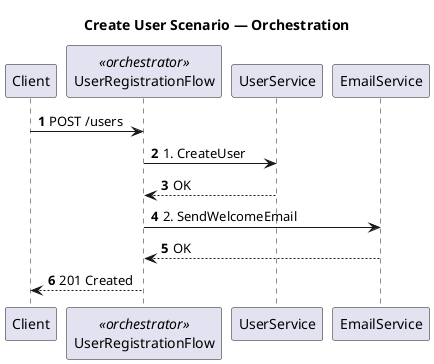
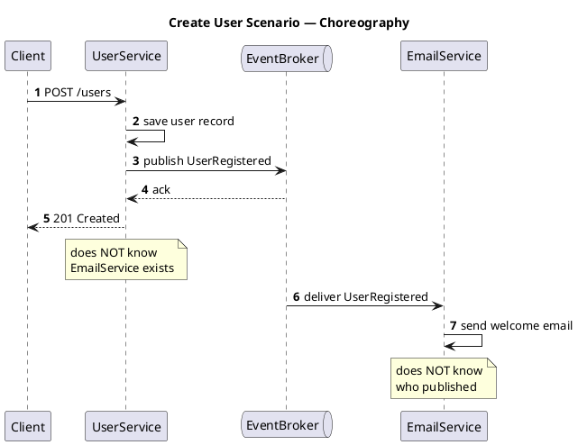

# Session 4 (2h): Workflows & Messaging — Coordination for Loose Coupling

## Outline

### What a reader expect to be able to explain (clearly, to others)
* What "Loose Coupling" really means.
* The difference between sync chains, queues, and event-driven — in one minute each — as three levels of service communication between microservices.
* What makes workflow coordination state-driven and event/command-driven in microservices.
* The difference between commands vs events (“please do X” vs “X happened”) and why mixing them causes brittle systems.
* The difference between orchestration vs choreography without hand-waving.

### Goals

* Define "loose coupling" concretely — not as a vague ideal, but as a measurable property: how many services must change or be available for a given change to ship safely.
* Extend the coupling analysis from Module 03 (data layer) to the application layer: explain how synchronous API call chains create temporal coupling and behavioral coupling that shared databases do not.
* Distinguish the three levels of service communication between microservices — synchronous chains, queues, and event-driven — and explain what failure modes each level introduces, so beginners stop conflating "async" with "event-driven."
* Distinguish orchestration from choreography as workflow design styles, articulate the concrete tradeoffs of each, and choose the appropriate style for a given scenario.

### Agenda (120 min)

**0–12: Loose Coupling 101 — what it actually means**

* Coupling defined concretely: how many services must change or be available for *this* change to ship safely?
  * Not a binary state — a spectrum; measure it, don't just claim it
* Three properties of a loosely coupled service:
  * Explicit boundaries: what it owns and what it doesn't
  * Contracts: what it promises to callers, what it expects from dependencies — nothing more
  * "Don't assume": never assume the other end is fast, available, or correct

**12–27: Application-layer coupling — the sync call chain trap**

* Module 03 showed coupling in the *data* layer (shared tables as invisible handcuffs)
* This session shows coupling in the *application* layer — same concept, different shape
* Two coupling types introduced by direct synchronous calls:
  * Temporal coupling: the caller cannot complete unless the callee is alive *right now*
  * Behavioral coupling: the caller must correctly handle the callee's latency profile, error codes, and response semantics
* Fan-out: Service A calls B, C, D synchronously
  * Path health ≠ node health: A's success rate is the *product* of B's, C's, and D's
  * Tail latency compounds: A's p99 latency ≈ max(B p99, C p99, D p99) — one slow dependency dominates
* Retry amplification under saturation:
  * Slow downstream × bounded retry policy × multiple upstream callers = overload spiral
  * Revisit Module 02's controlled-retry rules — they exist precisely because of this
* The key question: "If this dependency is slow or down, what happens to every service that calls it?"

**27–55: Communication Models 101 — three levels of service communication**

* Terminology guardrail: "communication level" means a decoupling profile (who waits on whom, who knows whom, and failure shape), not a design maturity score of good vs. bad.
* These levels are not a ladder to "Level 3 = best"; choose the level that fits the business constraint and failure tolerance.
* One vocabulary rule before walking the levels — commands vs. events:
  * Command ("please do X"): the sender knows who executes it and expects a result — tight coupling intent
  * Event ("X happened"): the publisher doesn't know who reacts or when — loose coupling intent
  * Level 2 carries commands; Level 3 publishes events — that single difference drives their distinct failure profiles
  * Mixing them without awareness is a common source of invisible coupling
* Beginners commonly conflate levels 2 and 3; the difference matters for reliability design

* **Level 1 — Synchronous call chains**
  * Caller waits for every downstream to complete before responding
  * Failure modes: cascading timeout; one slow node blocks the whole path; retries amplify load (see previous section)
  * Coupling: maximum temporal coupling — all participants must be alive simultaneously

* **Level 2 — Queues (commands / work distribution)**
  * Producer writes a command message; consumer processes it asynchronously
  * Temporal decoupling: producer and consumer don't need to be alive at the same time
  * Still point-to-point: one producer intent → one consumer responsibility; the producer knows there is a consumer
  * Failure modes: queue depth growth under overload; poison messages blocking the queue; ordering sensitivity across partitions
  * Common misconception: "we use a queue, so we're event-driven" — queues carry *commands*, not necessarily *facts*

* **Level 3 — Event-driven (publish facts)**
  * Producer publishes "X happened" as a fact; any number of consumers react independently
  * Temporal decoupling with independent consumers: producer publishes without waiting; consumers react in their own timing
  * Fan-in capability: multiple event types can trigger the same consumer; new consumers can join without any producer change
  * Failure modes: implicit end-to-end flow (hard to observe); ordering not guaranteed across partitions; duplicate delivery requires idempotent consumers (Module 01)
  * The distinguishing question: "Does the publisher care who acts on this?" — No → event; Yes → command

**55–75: Workflow Styles 101 — orchestration vs. choreography**

* **One-sentence anchor before diving in:** batch is time-driven + centralized; a workflow is state-driven + event/command-driven — so if you're here, you've already decided you need a workflow, not a batch job. The question is: which style?
* **Transition:** "Who manages the sequence when multiple services are involved? Two styles."

* Orchestration — The Conductor model:
  * A single workflow coordinator (orchestrator) explicitly calls each participant in sequence
  * Owns the state machine: knows which step is next, handles timeouts and retries
  * Example: a `RefundWorkflowService` that calls PaymentService, InventoryService, NotificationService
  * Pros: flow is visible in one place, failures are centralized and actionable, easy to add timeouts/retries per step
  * Cons: the orchestrator is a coupling point; changes to any participant may require orchestrator changes; can become a "God Service"
* Choreography — The Dance model:
  * No central coordinator; each service reacts to events from other services
  * Flow emerges from a chain of event subscriptions (Level 3 coordination in practice)
  * Example: `OrderPlaced` → InventoryService reserves → emits `InventoryReserved` → PaymentService charges → emits `PaymentCaptured` → ShippingService schedules
  * Pros: services are loosely coupled; easy to add new participants (subscribe to events); each team deploys independently
  * Cons: overall flow is implicit and spread across services; debugging requires stitching together event logs; hard to know when the workflow is "done"
* Side-by-side comparison: the same 4-step refund process drawn both ways
* Key diagnostic question: "If this workflow changes, how many teams need to be notified?"

**75–100: Exercise 1 (Mapping — both styles)**

* Scenario: Design a "Refund Process" using both orchestration and choreography
* The process has four steps:
  1. Validate refund eligibility
  2. Reverse the original payment
  3. Restore inventory
  4. Notify the customer
* Orchestration design questions:
  * Which service owns the workflow coordinator? What state does it persist?
  * What is the happy-path sequence of calls?
  * What does the orchestrator do if step 2 succeeds but step 3 times out?
  * How does the UI know the refund is complete?
* Choreography design questions:
  * What events does each service emit, and which events does each service subscribe to?
  * How do you know when all four steps have completed?
  * How do you prevent step 4 from triggering twice if the `PaymentReversed` event is delivered more than once?
  * Where is the refund status visible to an external caller?
* Debrief comparison:
  * Which style made the failure-handling discussion easier?
  * Which style is easier to extend with a 5th step (e.g., audit logging)?
  * Which style would you choose for this scenario and why?

**100–115: Wrap + Q&A**

* Choose **orchestration** when:
  * The workflow has strict sequencing and business rules
  * Failure handling needs to be explicit and auditable
  * You need a single place to monitor workflow state
  * The number of participants is bounded and known upfront
* Choose **choreography** when:
  * You want to add new consumers without changing existing services
  * Participants are owned by separate teams and need autonomy
  * The flow is simple enough that implicit ordering doesn't cause confusion
* Hybrid approach (common in practice):
  * Orchestration *within* a bounded domain (e.g., Order lifecycle inside Order Service)
  * Choreography *across* domain boundaries (e.g., OrderPlaced event consumed by Billing, Shipping, Analytics independently)

**115–120: Wrap + 3 takeaways**

* Event-driven does not mean reliable: design for at-least-once delivery from the start
* Choose orchestration when you need visibility; choose choreography when you need decoupling

### Handout (1-pager you can share)

* One-line anchor note: batch is time-driven + centralized; workflows are state-driven + event/command-driven (to prevent beginner confusion)
* Service communication levels (Level 1: Sync chains → Level 2: Queues → Level 3: Event-driven): failure modes at each level
* Orchestration vs. Choreography decision checklist
* When to use each style reference card (orchestration within domain, choreography across domains)

---

## Session 4 — Slide Outline (Lecture Part)

### Slide 1 — Cover

**Slide Title:** Microservices 101-04: Workflows & Messaging
**Subtitle / key message:** *Coordination for Loose Coupling*
**Slide contents:**
* (Speaker introduces the session, title slide only)

**Speaker notes:**
* "Welcome to Session 4 of Microservices 101."
* "Today is about coordination: how services work together, and what happens when that coordination fails."
* "We'll focus on communication and workflow choices that keep services loosely coupled as systems grow."

---

### Slide 2 — Introduction of This Series

**Slide Title:** Microservices 101 series
**Slide contents:**
* 101-01 Idempotency & Eventual Consistency — Safe Retries and Async Systems
* 101-02 Resilience & Observability — Design for Failure and Debug Fast
* 101-03 Data Boundaries & Ownership — Own the domain and move data safely
* **101-04 Workflows & Messaging — Coordination for Loose Coupling**
* 101-05 API Design for Evolution — Evolve contracts without breaking consumers
* 101-06 Deployment Safety — Ship changes safely with canary/blue-green and feature flags

**Speaker notes:**
* "Session 1 was correctness under retries: idempotency and eventual consistency."
* "Session 2 was stability and diagnosability: resilience controls and observability."
* "Session 3 was data: ownership boundaries, outbox pattern, and query patterns for split data."
* "In Session 3 we tackled coupling in the *data* layer — shared databases as invisible handcuffs."
* "Today we shift one layer up: coupling in the *application* layer — how services coordinate work, and what goes wrong when that coordination is too tight."

---

### Slide 3 — Agenda

**Slide Title:** Agenda
**Slide contents:**
* Introduction
* Loose Coupling 101
* Communication Models 101
* Workflow Styles 101: Orchestration vs. Choreography
* Exercise 1 — Design a refund process in both styles [25 min]
* Wrap up

**Speaker notes:**
* "We open with the mental model: what loose coupling actually means, measured concretely, not as a vague ideal."
* "Then we extend that analysis to the application layer — sync call chains, fan-out, tail latency, retry amplification."
* "The core section is three levels of service communication — sync chains, queues, and event-driven — and the failure mode of each."
* "We'll also make one guardrail explicit: communication level means decoupling profile and tradeoff, not architecture maturity ranking."
* "Workflow styles give you a design vocabulary: orchestration when you need visibility, choreography when you need decoupling."
* "Exercise 1 makes you draw both styles for the same scenario so the tradeoff becomes concrete, not theoretical."

---

### Slide 4 — Key Takeaways

**Slide Title:** Workflows & Messaging
**Subtitle / key message:** *Understand communication and coordination. Design for failure.*

**Slide contents:**
* What you'll learn:
  * Loose coupling — measured, not assumed
  * Application-layer coupling and how to break it
  * Orchestration vs. choreography — tradeoffs
* What you'll be able to do:
  * Tell apart queues (commands) from event-driven (facts)
  * Spot temporal coupling in a service dependency graph
  * Draw a workflow in both styles and argue which fits

**Speaker notes:**
* "After this module, you can explain: what loose coupling actually means; the three service communication levels in one minute each; the command vs. event distinction and why mixing them silently creates brittle systems; and orchestration vs. choreography without hand-waving."
* "These aren't academic definitions — every item maps directly to a design decision you'll face in production."

---

### Slide 5 — Divider: Loose Coupling 101

---

### Slide 6 & 7 — Hook

**Slide Title:** "Tax logic isn't owned by any domain — let's share it as a library."
**Subtitle / key message:** *A reasonable monolith decision becomes a coupling trap in microservices.*

**Slide contents:**

```
  MONOLITH — fine                       MICROSERVICES — inherited as-is

  ┌────────────────────────────┐    ┌─────────────────────────────────────┐
  │  ┌──────────┐ ┌──────────┐ │    │  [Cart]  [Order]  [Delivery]  [...] │
  │  │ Order    │ │ Delivery │ │    │     │        │         │        │   │
  │  │Subsystem │ │Subsystem │ │    │     └────────┴────┬────┘        │   │
  │  └────┬─────┘ └────┬─────┘ │    │                  │             │   │
  │       └─────┬───────┘       │    │         tax_calc v2.1          │   │
  │   ┌─────────▼──────────┐    │    │          (shared lib)          │   │
  │   │  tax_calculation   │    │    │                                 │   │
  │   │  (common library)  │    │    │  tax law changes                │   │
  │   └────────────────────┘    │    │    → lib update                 │   │
  │    [one deployment unit]    │    │    → ALL teams must coordinate  │   │
  └────────────────────────────┘    │      and redeploy together      │   │
         ✓ One unit ships           └─────────────────────────────────────┘
                                              ✗ Distributed monolith

                                    The fix: treat tax as a capability

                                    ┌─────────────────────────────────────┐
                                    │  [Cart]  [Order]  [Delivery]  [...] │
                                    │     │        │         │             │
                                    │     └────────┼─────────┘             │
                                    │              ▼                       │
                                    │       [ Tax Service ]                │
                                    │        versioned API                 │
                                    │        single owner                  │
                                    └─────────────────────────────────────┘
                                      tax law changes → only Tax Service
                                      ships. Callers are untouched.  ✓
```

* The monolith decision was correct — it was one deploy unit anyway
* Carried into microservices unchanged, it locks all teams to the same release cycle
* **The fix:** `Tax Service` — one owner, versioned API, independent deployability

**Speaker notes:**
* "Here's a real migration story. In the monolith, Order and Delivery both need tax calculation. A shared library is the natural choice — perfectly fine when everything ships as one unit."
* "The team migrates to microservices. Cart, Order, Delivery, and others all need tax logic. They reason: 'Tax is mandated by law, no single domain owns it — let's keep distributing it as a library.' The logic sounds solid."
* "But the first time tax law changes, every team must update the dependency, test their service, and coordinate a release window together. That's the hidden coupling cost, collected every single time tax rules change."
* "If a 'common rule' must be consistent, auditable, or updated quickly without coordinating many teams, it should be a service-owned capability (contract), not a shared library."
* "The correct design is a Tax Service: one team owns it, one API is versioned, and only that service ships when rules change. Every caller stays untouched."
* "This is the diagnostic question we'll carry through the whole session: **how many services must change or redeploy for this one change to ship?** If the answer is many — you have a distributed monolith, regardless of how the boxes are drawn."

---

### Slide 8 — Inside the House vs. Outside the House

**Slide Title:** Monolith vs. microservices: inside the house vs. outside
**Subtitle / key message:** *Same process = shared assumptions. Separate services = explicit contracts.*
**Slide contents:**

| | Monolith | Microservices |
|---|---|---|
| Runtime | Shared process | Independent |
| Failure | Fail together | Fail independently |
| Coupling | Acceptable | Must be managed |
| Analogy | Lending a bike to family — no paperwork | Lending a car outside — needs a contract |

* **The contract in microservices:** API/event schema + operational rules (auth, timeouts, error codes, rate limits, compatibility)
* Never assume the other side is fast, available, or the same version — define what happens when it isn't

**Speaker notes:**
* "In a monolith, everything shares one process, one deploy, one failure domain. Tight coupling is a reasonable tradeoff — if two modules have mismatched assumptions, you catch it in the same code review before it ships."
* "The bicycle analogy: you lend a bike to a family member. No contract needed. You share context, accountability, and the same front door."
* "Microservices change the situation entirely. Services are deployed independently by separate teams. Now it's like lending your car to someone outside the family — you need a written agreement: who they are, what they're allowed to do, when it must be returned, and what happens if it's damaged."
* "In engineering terms, that contract is: the API or event schema (what is exchanged), plus operational rules — authentication, rate limits, timeouts, idempotency keys, error semantics, and compatibility guarantees."
* "The 'don't assume' principle is not paranoia. It's the discipline that makes independent deployment possible. Every resilience control from Session 2 — circuit breakers, retries, timeouts — follows directly from it."

---

### Slide 9 — Four Types of Coupling

**Slide Title:** Four types of coupling — a diagnostic toolkit
**Subtitle / key message:** *Loose coupling isn't aesthetic. Each type has a different root cause — and a different fix.*
**Slide contents:**

| Coupling type | Diagnostic question | Where it appears |
|---|---|---|
| **Data** | Do services share tables or schemas? | Module 03 |
| **Temporal** | Does A fail when B is slow or down? | This module |
| **Behavioral** | Does A assume B's error codes, latency, or response semantics? | Module 05 |
| **Deployment** | Do multiple services have to redeploy together? | Module 06 |

* Module 03 covered **data coupling** — shared tables as invisible handcuffs
* Module 06 will cover **deployment coupling** — shared libraries and lockstep releases
* Today: **temporal coupling** (full treatment) and **behavioral coupling** (diagnosis only — API contract remedies are Module 05)
* Each type is independent: a queue breaks temporal coupling, but behavioral coupling remains

**Speaker notes:**
* "In Module 3 the coupling was physical, in the data layer: two services sharing a table."
* "Deployment coupling: two services sharing a library or a release cycle. A tax law change forces every team to update the dependency and redeploy together. Module 06 will address this with independent deployability practices."
* "This section shows coupling in the “application layer”: it is mainly caused by direct synchronous calls."
* "Temporal coupling is the easier one to see: if the callee is down, the caller fails. That's obvious."
* "Behavioral coupling is subtler: even if the callee is always up, every change to its error codes, latency profile, or response shape propagates to the caller. That's coupling you pay on every iteration."
* "Today we name it and use it as a diagnostic lens — but the remedies (expand/contract, versioning, consumer-driven contracts) are the subject of Module 05."
* "The key insight: you can fix one without fixing the others. Adding a queue between A and B eliminates temporal coupling — but if A still depends on B's specific error format, behavioral coupling remains. Diagnose which type you have before choosing a remedy."

---

### Slide 10 — Fan-Out: Path Health ≠ Node Health

**Slide Title:** Fan-out: one slow dependency dominates
**Subtitle / key message:** *A's reliability is the product of B's, C's, and D's — not the average.*
**Slide contents:**

```
  Each node: 99.9% available          A's availability: 99.9³ ≈ 99.7%

          ┌───┐                              ┌───┐
          │ A │ ── calls ──┬──→ [ B 99.9% ]  │ A │  p99 latency
          └───┘            ├──→ [ C 99.9% ]  └───┘  = max(B, C, D)
                           └──→ [ D 99.9% ]           ↑
                                                  one spike here
                                                  = A spikes too

  Individual nodes look healthy.   Path health ≠ node health.
  Add one more dependency: 99.9⁴ ≈ 99.6%  →  keeps getting worse.
```

* Availability compounds **multiplicatively** — every added dependency lowers the path
* Tail latency takes the **max**, not the average — one slow node makes A slow

**Speaker notes:**
* "Each service individually looks fine — 99.9% uptime. But A calls all three synchronously, so A's availability is the product: roughly 99.7%."
* "Add one more dependency and you're at 99.6%. This is why sync fan-out quietly erodes reliability even when every single node looks healthy in isolation."
* "Tail latency works the same way but in reverse: you don't average the p99s, you take the worst one. If C occasionally takes 2 seconds, every A response that hits C will take at least 2 seconds — regardless of how fast B and D are."
* "This is why distributed tracing from Session 2 is non-negotiable: you need to see which leg of the fan-out is the culprit, because aggregate metrics on A will just show 'A is slow.'"

---

### Slide 11 — Modular vs. Autonomous

**Slide Title:** Modular vs. Autonomous
**Subtitle / key message:** *Splitting code gives you modularity. Only splitting lifecycles gives you autonomy.*
**Slide contents:**

* **Monolith** → aims for **Modularity**: clean boundaries inside one process
* **Microservices** → aims for **Autonomy**: independent deploy, runtime, and failure domains

| Dependency Type | Coupling Level | Impact on Team Speed |
|---|---|---|
| Shared database schema | Extreme | Any schema change blocks all teams |
| Shared binary library | High | Lockstep version upgrades required |
| Synchronous REST / gRPC | Medium | Runtime failures can cascade |
| Asynchronous events | Low | True independence — each service works at its own pace |

**Speaker notes:**
* "The goal of a monolith is modularity: clean interfaces, well-organized code, easy to navigate. That's the right goal in that context."
* "The goal of microservices is different: autonomy. Can each team deploy, scale, and fail independently — without coordinating with anyone else?"
* "A distributed monolith is what you get when you pursue modularity in a microservices architecture instead of autonomy. The services are split, but the coupling is still there — just hidden in a shared schema, a shared library, or a shared release train."
* "This table is a coupling ladder. As you move from top to bottom, teams gain more independence. Shared database schema is the most expensive — any change to a table requires all teams to coordinate. Async events at the bottom give you the closest thing to true autonomy."
* "We covered cascading failures and retry amplification in Module 2. The sync REST/gRPC row is a reminder: runtime coupling is real even when the dependency looks clean. The rows above it — schema and library — are the ones we focused on today."
* "Use this table as a quick self-check: for each dependency in your system, which row does it sit on?"

---

### Slide 12 — What "Loose Coupling" Actually Means

**Slide Title:** What "loose coupling" actually means
**Subtitle / key message:** *Not "no duplication." Not "separate repos." Independence and autonomy.*

> "When services are loosely coupled, a change to one service should not require a change to another."
> — Sam Newman, *Building Microservices*

* In monoliths, **duplication = sin** (double the change impact, double the tests)
* In microservices, we trade: **accept duplication** to gain **service independence and autonomy**
* The real test: can you **deploy one service** without touching, testing, or notifying any other team?

**Speaker notes:**
* "Before we move to communication models, let me name the mental model shift that this entire section demands."
* "In a monolith, the first principle you internalise is: never duplicate code or data. Duplication means double the work — find every copy, fix every copy, test every copy. That lesson is correct. It's a maintainability principle earned through real pain."
* "That principle was built for a single deployment unit. In a monolith, 'avoid duplication' and 'reduce coupling' point in the same direction — extracting shared code into a common module does both at once."
* "In microservices, they point in opposite directions. Extracting shared business logic into a library reduces code duplication but increases deployment coupling. You can't optimise for both across deployment boundaries."
* "The shift is not 'learn a new pattern on top of your existing mental model.' It's a mental model replacement. In microservices, the priority is the ability to adapt to changes through service independence and autonomy — even at the cost of some duplicated code or data."
* "Sam Newman's quote captures the operational test: does a change here force a change over there? If yes, you're coupled — regardless of how clean your code structure looks."
* "If you try to apply DRY instincts to cross-service code sharing, you will build a distributed monolith — and it will feel like good engineering the entire time. That's why this is a mental model problem, not a knowledge problem."
* "The real measure is deployment: can you ship this service on a Tuesday afternoon without pinging anyone on Slack? If yes, it's loosely coupled. If someone must update their dependency and redeploy, it isn't."
* "Everything in this session — communication levels, orchestration vs. choreography — is about designing systems that pass that test."

---

### Slide 13 — Bridge: From Coupling to Communication

**Slide Title:** Communication is unavoidable. Tight coupling is not.
**Subtitle / key message:** *The question isn't "should services coordinate?" — it's "how?"*
**Slide contents:**

* We've seen **where coupling hides**: shared libraries, shared schemas, synchronous call chains
* In the real world, services **must coordinate** — that's not optional
* What *is* optional: **how tightly they couple** to do it
* The rest of this module: choices that let services coordinate **without losing autonomy**
  * Service communication levels: sync chains, queues, events

**Speaker notes:**
* "We've spent the first half of this session on what coupling is and where it hides. Shared libraries, sync call chains, fan-out — all of these silently raise the coupling score."
* "But here's the thing: services can't just ignore each other. An order must trigger a payment. A payment must trigger an inventory reservation. Coordination is not optional — it's the entire point of having multiple services."
* "The question we're asking in the second half is: given that coordination is unavoidable, which choices let us do it with the least coupling?"
* "First, we look at service communication levels — sync chains, queues, and event-driven interaction — and the failure mode each one introduces."
* "This is the payoff of the mental model work we did earlier — now we can make deliberate choices about coordination, not just avoid coupling as a vague goal."

---

### Slide 14 — Vocabulary First: Commands vs. Events

**Slide Title:** Commands vs. events — one distinction, many consequences
**Subtitle / key message:** *"Please do X" is not the same as "X happened."*
**Slide contents:**

```
  1) COMMAND — OrderService instructs each service directly

  OrderService    PaymentService   InventoryService   DeliveryService
       │                │                 │                 │
       │─ ChargePayment ──────────────────→                 │  ← OrderService
       │                │                 │                 │     knows exactly
       │─ ReserveStock ───────────────────────────────→     │     who to call
       │                │                 │                 │     and what to do
       │─ ArrangeDelivery ──────────────────────────────────→
       │                │                 │                 │
       │←── OK ─────────│                 │                 │
       │←──────────────────── OK ─────────│                 │
       │←──────────────────────────────────────── OK ───────│


  2) EVENT — OrderService announces a fact; each service reacts autonomously

  OrderService    PaymentService   InventoryService   DeliveryService
       │                │                 │                 │
       │══ OrderConfirmed (event) ════════════════════════════→
       │                │                 │                 │
       │           reacts:           reacts:           reacts:
       │           charges           reserves          arranges
       │           payment           stock             delivery
       │                │                 │                 │
       │   (OrderService is not          │                 │
       │    interested in who            │                 │
       │    is listening)                │                 │
```

* **Command**: OrderService knows who executes what — adds a receiver for every new action needed
* **Event**: OrderService publishes once — new services join without any change to OrderService

**Speaker notes:**
* "Before we walk the three service communication levels, you need two words: Command and Event. Everything in this section is built on the difference between them."
* "Both diagrams show the same business moment: an order has just been confirmed. Payment must be charged, stock must be reserved, delivery must be arranged."
* "In the command model, OrderService takes responsibility for instructing each downstream service explicitly. It sends ChargePayment to PaymentService, ReserveStock to InventoryService, ArrangeDelivery to DeliveryService — and waits for each to respond."
* "This feels natural, and it works. But notice what it costs: OrderService must know the API of every downstream service. When you add a fourth action — say, send a confirmation email — you must change OrderService. The sender accumulates knowledge of everyone who reacts."
* "In the event model, OrderService announces a single fact: 'OrderConfirmed.' It publishes this once and is done. It has no idea who is listening."
* "PaymentService hears it and charges. InventoryService hears it and reserves. DeliveryService hears it and arranges. Each reacts autonomously."
* "Now add the email notification service: it subscribes to OrderConfirmed. OrderService doesn't change. The publisher's code is untouched regardless of how many consumers exist."
* "The tradeoff: in the command model, the full flow is visible from OrderService. In the event model, you must look at each subscriber to understand what happens. Observability (in Module 2) becomes a first-class concern."

---

### Slide 15 — Two Axes, Not One

**Slide Title:** Two separate questions: *when* and *what*
**Subtitle / key message:** *Async tells you when the caller waits. Command/Event tells you what the message means. They are independent.*
**Slide contents:**

```
                    COMMAND                        EVENT
                 ("please do X")             ("X happened")

  SYNC    │  Direct call — caller waits   │  (uncommon)           │
          │  caller knows the result      │                       │
          │  (→ Synchronous call)         │                       │
          ├───────────────────────────────┼───────────────────────┤
  ASYNC   │  Queue message                │  Pub-Sub topic        │
          │  caller moves on;             │  caller moves on;     │
          │  producer knows there         │  producer does NOT    │
          │  is a consumer                │  know who reacts      │
          │  (→ Queues)                   │  (→ Event-driven)     │
```

* **Timing axis (rows):** sync vs. async — does the caller wait for a result?
* **Semantics axis (columns):** command vs. event — does the message carry intent or announce a fact?
* Both queues and Pub-Sub are **asynchronous** — the difference between them is the *message semantics*, not the transport
* Orchestration and choreography are **workflow design styles** — each can use sync or async messaging internally

**Speaker notes:**
* "Before we walk the three levels, I want to separate two questions that this whole section answers — because they look related but are actually independent."
* "The first question is about timing: does the caller wait for a result before it moves on? Synchronous means yes. Asynchronous means no — the sender fires the message and continues with other work."
* "The second question is about meaning: what does the message say? A command says 'please do this' — it has an intended recipient and expects an outcome. An event says 'this happened' — it is a fact, and the publisher does not care who reacts or whether anyone reacts at all."
* "Here is the trap: when readers see Level 2 (queue, async) and Level 3 (event-driven, async), they notice both are async and ask 'what is actually different?' The answer is on the semantics axis — not the timing axis."
* "Similarly, when readers see that choreography uses events, they may assume orchestration must use synchronous calls. Not necessarily. An orchestrator can send commands over a queue — that is async orchestration. The distinction between orchestration and choreography is about who owns the flow, not how fast messages travel."
* "Keep this 2×2 in mind as we walk the three levels. When something feels confusing, ask yourself: which axis is this question about?"

---

### Slide 16 — Three Communication Levels: Overview

**Slide Title:** Three levels of service communication
**Subtitle / key message:** *Each level trades coupling for complexity in a different way. Choose by constraints, not by fashion.*
**Slide contents:**

```
  Problem to solve                   →  Decoupling Level

  "Get an immediate response             Level 1
   before the user proceeds"             Synchronous call chains
                                         ↓ problem: one slow node blocks everything

  "Decouple producer speed               Level 2
   from consumer speed"                  Queues (commands)
                                         ↓ problem: still point-to-point;
                                           new actions require producer changes

  "Let services react to facts            Level 3
   without direct caller waiting"        Event-driven
                                          ✓ producer publishes facts; consumers react independently
```

* Communication levels describe **decoupling tradeoffs**, not design maturity (Level 3 is not always "best")
* Most systems use **multiple levels** depending on the use case

**Speaker notes:**
* "Before we walk each level in detail, here's the arc. Each level was invented to solve a real problem with the level before it."
* "Level 1 is synchronous call chains: immediate answer, but maximum temporal coupling."
* "Level 2 is queue-based commands: producer and consumer are time-decoupled, but still point-to-point intent."
* "Level 3 is event-driven communication: services publish facts and consumers react independently."
* "Each level adds decoupling but also adds complexity: implicit flows, ordering challenges, idempotency requirements. The right level is the one that matches the problem — not always the most decoupled one."
* "As you watch each level, keep this question in mind: what problem did this level solve, and what new problem did it introduce?"
* Transition >> "Let's start with Level 1: synchronous call chains and why they create temporal coupling."

### Slide 17 — Level 1: Synchronous Call Chains

**Slide Title:** Level 1 — Synchronous call chains
**Subtitle / key message:** *Maximum temporal coupling: everyone must be alive, right now.*
**Slide contents:**
* **Mechanism:** caller issues request, waits synchronously for each downstream to complete before responding
* **Typical uses:** real-time checkout, user-facing APIs with immediate response requirements
* **Failure modes:**
  * Cascading timeout — one slow node in the chain degrades the entire path
  * Retry amplification — covered in detail above
  * All-or-nothing availability — the path is only as reliable as its weakest link
* **Coupling profile:**
  * Temporal coupling: **maximum** — every participant must be simultaneously available
  * Behavioral coupling: **maximum** — caller must handle each callee's exact error semantics

**Speaker notes:**
* "We spent the last section on the failure modes of sync chains. This slide names it as Level 1 in our taxonomy."
* "Synchronous chains aren't wrong — they're necessary whenever you need an immediate, consistent response before the user can proceed."
* "The question isn't 'should we use synchronous calls?' — it's 'which parts of the flow *require* synchronous calls?' Minimise the synchronous spine; push everything else to async."
* "Payment confirmation is a classic example: the user must know whether the card was charged before they see the confirmation page. That portion is legitimately synchronous."

---

### Slide 18 — Level 2: Queues (Commands / Work Distribution)

**Slide Title:** Level 2 — Queues
**Subtitle / key message:** *Temporal decoupling, but the producer still knows there is a consumer.*
**Slide contents:**
* **Mechanism:** producer writes a command message to a queue; consumer processes it asynchronously
* **Temporal decoupling achieved:** producer and consumer don't need to be alive at the same time
  * Queue absorbs traffic spikes: producer publishes at burst rate; consumer drains at steady rate
* **Still point-to-point:** one producer intent → one consumer responsibility
  * The producer *knows* there is a consumer; behavioral coupling remains
* **Common misconception:** "we added a queue, so we're event-driven" — queues carry *commands*, not necessarily *facts*

**Speaker notes:**
* "Queues are a huge improvement over Level 1 for many use cases. The temporal decoupling alone eliminates the cascading timeout problem."
* "But they don't eliminate all coupling. The producer still knows 'some consumer must process this command.' That knowledge is itself a coupling: if the consumer changes its contract, the producer must adapt."
* "The misconception is very common. If your queue message says 'ProcessRefund for order #1234', that's a command. It carries intent and implies a single responsible receiver. That's Level 2, not Level 3."

---

### Slide 19 — Level 2: Queue Failure Modes & Safeguards

**Slide Title:** Level 2 — Queues: failure modes & safeguards
**Subtitle / key message:** *Design for at-least-once. Exactly-once is not the default.*
**Slide contents:**
* **Failure modes:**
  * Queue depth growth under sustained overload
  * Poison messages blocking the queue (one bad message stalls all subsequent processing)
  * Ordering sensitivity across partitions
* **Operational safeguards required:**
  * Dead-letter queue (DLQ) — move unprocessable messages aside after max retry
  * Backout / max-retry count — cap retries before routing to DLQ
  * Message TTL — expire stale commands before they execute
* **Delivery semantics — don't assume exactly-once:**
  * Most queues guarantee **at-least-once**: the same message may be delivered more than once
  * **Exactly-once** is either a product claim with strict scope conditions, or achieved by combining at-least-once + **idempotent consumer**
  * Design rule: always treat queue consumers as idempotent — it costs less than the alternative

**Speaker notes:**
* "The three safeguards are mandatory, not optional. Without a DLQ, one malformed message can halt the entire consumer indefinitely. Without a backout count, a transient processing bug triggers infinite retries. Without TTL, a message queued during a 2-hour outage may trigger a stale action hours later — charging a card after the order was already cancelled."
* "Exactly-once is the most common false assumption in queue design. Engineers read 'exactly-once' in a product's marketing copy and skip idempotency design. Then a network hiccup causes a retry and the payment is charged twice."
* "Even systems that claim exactly-once typically mean: within a single partition, under normal conditions, with the producer and consumer both enrolled in the same transaction. That scope is narrower than most people assume."
* "The safe default: design every consumer as if it will receive duplicates. Whether the underlying system gives you at-least-once or exactly-once, your consumer handles it correctly. Module 1 idempotency patterns apply here directly."

---

### Slide 20 — Level 2: Queue Safeguards — Illustrated

**Slide Title:** Level 2 — Queue safeguards in practice
**Subtitle / key message:** *DLQ, retry count, and TTL are not optional add-ons — they are part of the queue design.*
**Slide contents:**

```
  HAPPY PATH

  Producer  ──→  [ Queue ]  ──→  Consumer  ✓ processed


  POISON MESSAGE — without safeguards

  Producer  ──→  [ msg A ][ msg B (bad) ][ msg C ][ msg D ] ...
                              ↑
                     Consumer fails here, retries forever.
                     msg C, D, ... are never processed.


  POISON MESSAGE — with backout count + DLQ

  Producer  ──→  [ msg A ][ msg B (bad) ][ msg C ][ msg D ]
                              │
                   Consumer NACKs × 3
                   (max-retry count reached)
                              │
                   Broker detects threshold ──→ [ DLQ ]  ← parked for inspection
                                                   msg C, D continue normally ✓
                   (consumer never touches the DLQ directly;
                    broker routes automatically)


  STALE COMMAND — without TTL

  t=0   Producer  ──→  [ ProcessRefund #1234 ]  (order already cancelled)
  t=0   Consumer goes down
  t=2h  Consumer restarts, processes message  ← refunds a cancelled order ✗


  STALE COMMAND — with TTL

  t=0   Producer  ──→  [ ProcessRefund #1234  TTL=30min ]
  t=0   Consumer goes down
  t=2h  Consumer restarts — message already expired, discarded ✓
        (business logic handles the cancelled order separately)
```

**Speaker notes:**
* "Four diagrams, one point: each safeguard addresses a distinct failure shape."
* "The poison message diagram shows why a DLQ is non-negotiable: without it, one bad message is an indefinite full stop for every message behind it. The queue depth grows, SLAs are missed, and the only fix is a manual intervention in production."
* "The backout count is the trigger: the consumer NACKs (or fails to acknowledge) after each failed attempt. Once the broker's delivery count threshold is reached, the broker — not the consumer — routes the message to the DLQ. The consumer only signals failure; the broker handles the routing."
* "NACK = Negative Acknowledgement. A consumer signals the broker in one of two ways: ACK ('processed successfully, remove from queue') or NACK ('failed, retry/count against backout'). The exact mechanism — whether the consumer explicitly rejects the message, lets a lock or visibility timeout expire, or simply does not commit a read offset — varies by broker. The intent is the same: tell the broker 'I did not process this successfully.'"
* "Note that some brokers do not provide a built-in dead-letter queue. In those cases, the consumer application must detect the failure and route the message to a dead-letter destination itself. The mechanism differs, but the operational intent is identical."
* "The TTL diagram illustrates a subtler problem: a message that was valid at t=0 may be actively harmful at t+2h. Commands carry intent — and intent expires. Without TTL, a queue that backs up during an outage becomes a time-bomb of stale actions."
* "Together, these three safeguards form a complete failure containment strategy. Design them in from day one — they are much harder to retrofit under incident conditions."

---

### Slide 21 — Level 3: Event-Driven

**Slide Title:** Level 3 — Event-driven (Pub-Sub)
**Subtitle / key message:** *The publisher announces a fact. Who reacts — and how many — is not its concern.*
**Slide contents:**
* **Mechanism:** producer publishes "X happened" as an immutable fact (**Pub-Sub** model); any number of subscribers react independently — next slide shows how
* **Failure modes:**
  * Implicit end-to-end flow — no single place shows the full workflow; observability is harder
  * Ordering not guaranteed across partitions
  * Duplicate delivery — consumers **must** be idempotent (Module 01 rule applies)
* **The distinguishing question:** "Does the publisher care who acts on this?"
  * No → publish an event (Pub-Sub / Level 3)
  * Yes → send a command (Level 2)

**Speaker notes:**
* "Level 3 is what people usually mean when they say 'event-driven architecture' — but now you have a precise definition: the publisher announces a fact and moves on; it has no knowledge of who reacts."
* "The technology doesn't determine the level — the message semantics do."
* "The failure modes are real costs. Implicit flow is why distributed tracing and event correlation IDs are non-negotiable at Level 3 — you must reconstruct what happened from logs."
* "Idempotency from Module 1 is not optional here: at-least-once delivery is the standard guarantee, so duplicates will arrive."
* "The distinguishing question is the practical heuristic. Next slide makes the Level 2 vs. Level 3 contrast visual."

---

### Slide 22 — Queue vs. Pub-Sub: One Message, One Consumer vs. Many

**Slide Title:** Queue vs. Pub-Sub — one message, one consumer vs. many
**Subtitle / key message:** *A queue hands work to one worker and the message disappears. Pub-Sub posts a fact on a board that anyone can read.*
**Slide contents:**

```
  QUEUE (Level 2) — 1 message → 1 consumer

  Producer  ──→  [ ProcessRefund #1234 ]  ──→  RefundService
                                               reads and removes

  After processing:
               [                       ]       RefundService ✓
               message is gone

  If AnalyticsService also needs to know, the producer
  must explicitly send it a separate message.


  PUB-SUB (Level 3) — 1 event → any number of consumers

                     ┌──────────────────────────┐
                     │  << notice board >>      │
  Publisher ───────→ │  OrderConfirmed #1234    │  ← stays until retention expires
                     └──────────────────────────┘
                           │           │           │
                           ↓           ↓           ↓
                      PaymentSvc  InventorySvc  AnalyticsSvc
                    (own copy)   (own copy)   (own copy)

  Publisher wrote once and moved on. Does not know who reads.
  A new subscriber next month can read the same board —
  no producer change needed.
```

* **Queue:** message is work — handed to one worker, consumed and removed
* **Pub-Sub:** event is a fact — posted on a board; each subscriber gets an independent copy
* **Key difference:** a queue producer *knows* there is a consumer and *intends* it to act; a Pub-Sub publisher does not know or care who reads

**Speaker notes:**
* "The clearest way to feel the difference between Level 2 and Level 3 is to ask: what happens to the message after it is read?"
* "In a queue, a message is a work item — like a ticket on a task board. One worker picks it up, processes it, and removes it. Nobody else gets it. If a second service also needs that information, the producer must explicitly send it a second message. The producer owns and maintains the list of every consumer."
* "In Pub-Sub, a message is more like a notice posted on an office board. The person who wrote it doesn't wait to see who reads it. Anyone interested walks past and reads it at their own pace. The notice stays on the board until it expires."
* "The practical consequence: in a queue model, adding a new downstream consumer always requires a producer change. In Pub-Sub, a new consumer simply subscribes — the producer is untouched."
* "This is what we mean by event-driven decoupling: the publisher does not know who is on the other side, and does not need to."
* "One last point: both are asynchronous. The consumer does not have to be online when the producer writes — the broker holds the message either way. The difference is not timing; it is how many consumers receive a copy, and whether the producer owns the list of recipients."
* "(Optional) A question beginners often ask"
* "If the event stays on the board, won't each subscriber process it over and over? No — and here is why. Each subscriber maintains its own *offset*: a marker that says 'I have already read up to this point.' The broker remembers this position per subscriber, so when the subscriber comes back after being offline it picks up from where it left off, not from the beginning. The event stays on the board so that *new* subscribers can join later and read history — not to re-deliver to existing ones."
* "There is one real re-delivery scenario: the subscriber reads an event, starts processing it, but crashes before it records 'done' back to the broker. On restart, the broker sees the offset was not advanced and re-delivers that event. That is exactly why idempotency (Module 1) is required — the consumer must produce the same result whether it processes an event once or twice."

---

### Slide 23 — The Three Levels at a Glance

**Slide Title:** The three service communication levels — summary
**Subtitle / key message:** *Know the level you're on. Know its failure modes.*
**Slide contents:**

| Level | Mechanism | Temporal coupling | Behavioral coupling | Key failure mode |
|---|---|---|---|---|
| 1 — Sync chains | Caller waits for callee | Maximum | Maximum | Cascading timeout |
| 2 — Queues | Command messages | Broken | Moderate (command schema + semantics) | Poison message, queue depth |
| 3 — Event-driven | Fact publication | Broken | Low (event schema only) | Implicit flow, requires idempotency |

**Speaker notes:**
* "Use this table as a diagnostic tool. When you see a production incident, ask: which level was the failing component operating at? The failure mode column tells you what to look for."
* "Levels don't always map cleanly to technologies: the same messaging infrastructure can operate at Level 2 or Level 3 depending on whether messages carry commands or facts."
* "The goal is not to always be at Level 3. Synchronous calls are fine for user-facing responses that require immediate consistency. Know the tradeoffs and choose deliberately."
* "These three levels answer one question: how does information travel between services? Next, we look at what loose coupling costs us when a business process spans multiple services — and why that cost demands a deliberate workflow design."

---

### Slide 24 — Divider: Workflow Styles — Orchestration vs. Choreography

---

### Slide 25 — Loose Coupling's Hidden Cost

**Slide Title:** Loose coupling is the goal — but it creates a new problem
**Subtitle / key message:** *Independent services are great until you need a multi-step process to succeed as a whole.*
**Slide contents:**

```
  Loosely-coupled services (Level 2 / 3):

  ┌──────────┐     ┌──────────┐     ┌──────────┐
  │  User    │     │  Email   │     │  Audit   │
  │ Service  │     │ Service  │     │ Service  │
  └──────────┘     └──────────┘     └──────────┘
      each deploys, scales, and fails independently ✓

  But "Register a new user" is a BUSINESS PROCESS
  that needs ALL of these to succeed:

      1. Save user record       ✓
      2. Send welcome email     ✗ ← failed here
      3. Create audit entry     ?

  Questions that become hard:
      • "Where are we in the process right now?"
      • "Step 2 failed — who notices?"
      • "How do we retry step 2 without re-running step 1?"
      • "Is registration complete?" — who can answer this?
```

* Loose coupling gives us **independent deployment and failure isolation** — that's the goal from the first half
* But a multi-step business process still needs coordination: steps must happen, failures must be detected, recovery must be possible
* **The tension:** the more loosely coupled the services, the harder it is to track and manage the overall process
* Workflow patterns (orchestration / choreography) exist to solve exactly this tension

**Speaker notes:**
* "Let's pause before jumping into solutions and name the problem clearly."
* "In the first half, we established that loose coupling is the goal: services should deploy and fail independently. Levels 2 and 3 achieve that beautifully at the communication layer."
* "But here's what loose coupling does *not* give you for free: coordination of a business process that spans multiple services."
* "When a user registers, three things must happen: the record is saved, the welcome email is sent, and an audit entry is created. These are owned by three different, loosely-coupled services."
* "If the email fails, who notices? In a monolith, the answer is obvious — the same function that called 'sendEmail' gets the exception. In loosely-coupled services, there may be no one watching."
* "How do you retry just the email without re-creating the user? In a monolith, your transaction rolls back everything. Here, step 1 already committed — it's done."
* "Is the registration complete? In a monolith, one function returns success or failure. Here, three services each know their own status, but nobody holds the full picture."
* "This is not a reason to avoid loose coupling — it's a reason to choose a deliberate workflow pattern on top of it. That's what orchestration and choreography are: answers to 'who manages the overall process when the services themselves are independent?'"

---

### Slide 26 — "Workflow" ≠ Batch Job

**Slide Title:** "Workflow" ≠ Batch Job
**Subtitle / key message:** *Batch job as a coordination layer in monoliths. That mental model doesn't transfer.*
**Slide contents:**

```
  "Why does 'workflow' sound like a batch job to beginners?"

  In a monolith, the nightly batch job:
    ✓ reads from shared tables
    ✓ processes rows in sequence
    ✓ writes results back
    → It felt like a workflow — but it was something else entirely.
```

|                | Batch Job                        | Workflow                              |
|----------------|----------------------------------|---------------------------------------|
| **Trigger**    | Schedule (cron) / operator       | Business event (order placed, refund requested) |
| **Control**    | Centralized job controller | Wxplicit state machine (or orchestrator) |
| **State**      | Implicit (rows, files, checkpoints) | Explicit (PENDING → IN_PROGRESS → DONE / FAILED) |
| **Feedback**   | At end of run                    | Continuous (status endpoint, progress events) |
| **Recovery**   | Rerun entire job — risks duplicates | Retry / compensate per step |
| **Coupling**   | Data Coupling, Temporal Coupling | (Broken) |

* Rule of thumb: **"If each step must be individually traceable and recoverable, it's a workflow — regardless of who's watching."**
* Batch is still useful: backfills, reconciliation, reporting, data analysis
* But for user-facing business processes → use a workflow with explicit state

**Speaker notes:**
* "Most beginners hear 'workflow' and think: batch job. That's a monolith habit — the nightly job that reads tables, processes rows, writes results. It *felt* like coordination. It isn't."
* "Two problems with batch in microservices: data coupling — it reads another service's database directly, bypassing domain ownership; and temporal coupling — one step fails, everything downstream stalls until the next scheduled run."
* "A workflow fixes both: event-triggered, explicit state per step, retry or compensate per step — no full reruns."
* "Batch still has its place: backfills, reconciliation, reports. But for business processes — use a workflow."
* "Next slide: once you've decided it's a workflow, two more choices remain."

---

### Slide 27 — From Batch to Workflow: Two Decisions to Make

**Slide Title:** Another confusion — now make two choices
**Subtitle / key message:** *A workflow is not a batch job. And a communication pattern is not a workflow pattern.*
**Slide contents:**

```
  ┌─────────────────────────────────────────────────────────────────┐
  │  Decision 1: COMMUNICATION PATTERN                              │
  │  "How do services exchange messages?"                           │
  │                                                                 │
  │    • Sync Call Chain  (Level 1)                                  │
  │    • Command Queue    (Level 2)                                  │
  │    • Event Pub-Sub    (Level 3)                                  │
  ├─────────────────────────────────────────────────────────────────┤
  │  Decision 2: WORKFLOW PATTERN                                   │
  │  "Who manages a business process that spans multiple services?" │
  │                                                                 │
  │    • Orchestration  — one coordinator owns the sequence         │
  │    • Choreography   — each service reacts; no central owner     │
  └─────────────────────────────────────────────────────────────────┘

  These two decisions are INDEPENDENT:

  ┌──────────────────┬────────────────────────────────────────────┐
  │  Combination     │  Example                                   │
  ├──────────────────┼────────────────────────────────────────────┤
  │  Orchestration   │  RefundFlow calls PaymentService via       │
  │  + Sync calls    │  synchronous REST for each step            │
  ├──────────────────┼────────────────────────────────────────────┤
  │  Orchestration   │  RefundFlow sends "ReversePayment"         │
  │  + Command Queue │  command to a queue; waits for result      │
  ├──────────────────┼────────────────────────────────────────────┤
  │  Choreography    │  Each service publishes events;            │
  │  + Event Pub-Sub │  next service reacts autonomously          │
  └──────────────────┴────────────────────────────────────────────┘
```

* **Communication pattern** answers: *how* do messages travel? (Sync / Queue / Pub-Sub)
* **Workflow pattern** answers: *who* decides what happens next? (Orchestrator / No one — emergent)
* Choosing one does **not** determine the other

**Speaker notes:**
* "This is the single most important clarification before we dive into orchestration and choreography details."
* "Communication patterns — sync call chains, command queues, event Pub-Sub — determine how services exchange messages. They are the 'plumbing' layer."
* "Workflow patterns — orchestration and choreography — determine who manages the overall business process. They are the 'control flow' layer."
* "The three examples in the table prove they are independent. You can orchestrate using synchronous calls — that is the simplest form. You can orchestrate using async command queues — that gives you temporal decoupling while keeping centralized control. Choreography naturally pairs with event Pub-Sub, but that is a design affinity, not a requirement."
* "If you conflate these two decisions, you end up with false beliefs like 'orchestration means synchronous' or 'event-driven means choreography.' Neither is true."
* "Keep this separation in mind as we look at the next slides: we are now firmly in Decision 2 territory — who manages the workflow — and the communication mechanism used internally is a separate, downstream choice."

---

### Slide 28 — Orchestration vs. Choreography

**Slide contents:**
Illustration: https://media.licdn.com/dms/image/v2/C4D12AQFDp4wGseMIyg/article-cover_image-shrink_600_2000/article-cover_image-shrink_600_2000/0/1603765497037?e=2147483647&v=beta&t=Hnaetk_vgO2nDKLRSojA6_UFDTzx76MKllAzCg2PERY

**Speaker notes:**
* "We've covered how services talk to each other — sync calls, command queues, event Pub-Sub. Those are communication patterns: they answer 'how does a message travel between A and B?'"
* "Now we shift to a different question: when a business process spans multiple services, who manages the overall flow? That is a workflow pattern question, and it has two primary answers: orchestration and choreography."
* "These two questions are independent. An orchestrator can send commands over a queue (async orchestration). Choreography uses events by default but each subscriber may call downstream services synchronously internally. Don't conflate the communication choice with the workflow choice."

---

### Slide 29 — Orchestration: The Conductor Model

**Slide Title:** Orchestration — the conductor model
**Subtitle / key message:** *One coordinator owns the flow. It calls each step in order.*
**Slide contents:**



| | |
|---|---|
| **Visibility** | Full flow lives in one class |
| **Failure handling** | Centralized — orchestrator retries or escalates |
| **Adding a step** | Change the orchestrator |
| **Risk** | Orchestrator becomes a coupling point; can grow into a "God Service" |

> ⚠️ **Don't confuse with Level 2:** Orchestration ≠ sync call chain. What defines orchestration is **centralized ownership** of sequencing and failure handling — not the transport used.

**Speaker notes:**
* "The orchestrator is like a project manager: it knows every step, calls each participant in order, and handles failures."
* "When the email step fails, the orchestrator knows — it is the one that issued the call. It can retry, alert, or roll back. There is one place to look."
* "The cost: UserRegistrationFlow must know the API of both UserService and EmailService. Add a third step — say, assign a trial plan — and you change the orchestrator. The orchestrator accumulates knowledge of every participant."
* "This is not inherently bad. For short, well-bounded workflows, that centralization is exactly what you want."
* "One important note: this diagram uses synchronous calls for simplicity, and it may look like the sync call chain we covered in Level 2. They are different. A sync call chain has no central owner — each service just calls the next. An orchestrator owns the whole flow: it decides the sequence, handles failures, and manages retries. It could also send its commands over a queue and still be orchestration. The transport is not what defines it — the centralized control is."

---

### Slide 30 — Choreography: The Dance Model

**Slide Title:** Choreography — the dance model
**Subtitle / key message:** *No coordinator. Each service reacts to what just happened.*
**Slide contents:**



| | |
|---|---|
| **Visibility** | Flow is implicit — must read each service's subscriptions |
| **Failure handling** | Each service handles its own failures independently |
| **Adding a step** | New service subscribes to `UserRegistered` — UserService unchanged |
| **Risk** | Hard to answer "did registration fully complete?" without extra tooling |

**Speaker notes:**
* "UserService does exactly one thing: save the record and publish 'UserRegistered'. It has no idea that EmailService exists."
* "EmailService subscribes to that event and sends the email. It has no idea who created the user."
* "Adding an audit log service, or a CRM sync service? They subscribe to 'UserRegistered'. UserService never changes — that is the decoupling benefit of event-driven communication (Level 3)."
* "The tradeoff: if the email never sent, where do you look? You have to check the EmailService logs and the event broker separately. There is no single place that tracks 'registration is complete'."
* "Choreography has a natural affinity with event-driven communication (Level 3). Each service publishes facts and reacts to facts — nobody holds the full picture, and nobody needs to. That is both its strength and the source of its observability challenge."

---

### Slide 31 — Side-by-Side: Same Flow, Two Designs

**Slide Title:** Same two steps — completely different structure
**Subtitle / key message:** *Orchestration: one owner knows everything. Choreography: each owner knows only itself.*
**Slide contents:**
* Orchestration optimizes for **debuggability** — the state machine is in one place
* Choreography optimizes for **deployability** — services are truly independent
* Neither is universally better — choose based on what the workflow needs

**Speaker notes:**
* "The same two steps. The same two services. The difference is entirely in where the knowledge lives."
* "In orchestration, UserRegistrationFlow knows the sequence. It is the single source of truth for 'what happens when a user registers.'"
* "In choreography, nobody knows the full sequence. You only discover it by reading UserService's publisher config and EmailService's subscriber config side by side."
* "The diagnostic question at the bottom is the most practical tool: count how many services you must change to add one step. That number tells you which style the workflow is built for."
* "For User Registration — a simple, two-step flow — either style works. For a five-service order fulfilment flow with conditional branching and rollback, the answer is less obvious. That is what the decision framework slide covers."

---

### Slide 32 — Exercise 1

**Slide Title:** Exercise 1 — Map the refund process
**Subtitle / key message:** *Draw it both ways. Argue the tradeoff.*
**Slide contents:**
* **Scenario:** Design a 4-step refund process using both styles
  1. Validate refund eligibility
  2. Reverse the original payment
  3. Restore inventory
  4. Notify the customer
* **Orchestration questions:**
  * Which service owns the workflow coordinator? What state does it persist?
  * What does the orchestrator do if step 2 succeeds but step 3 times out?
* **Choreography questions:**
  * What events does each service emit? Which does each service subscribe to?
  * How do you prevent step 4 from triggering twice if an event is delivered more than once?
  * Where is the refund status visible to an external caller?
* **Debrief:** Which style made failure-handling easier to discuss? Which is easier to extend with a 5th step?

**Speaker notes:**
* "Give teams 20 minutes. The goal is not a perfect design — it's to make the tradeoff visceral."
* "The failure-handling question for orchestration tends to be easier: 'the orchestrator retries step 3 with exponential backoff, then raises an alert.' The answer for choreography requires teams to think about where the retry logic lives."
* "The extension question is the flip: adding a 5th step in choreography usually means adding one new service that subscribes to an existing event — no existing service changes. In orchestration, you change the orchestrator."
* "Key debrief point: neither answer is universally right. The goal is to justify the choice for this specific scenario."

---

### Slide 33 — Decision Framework

**Slide Title:** Decision framework — choosing your coordination style
**Subtitle / key message:** *Match the pattern to the requirement, not to the technology.*
**Slide contents:**
* **Choose orchestration when:**
  * Workflow has strict sequencing and business rules between steps
  * Failure handling must be explicit and auditable
  * You need a single place to monitor and query workflow state
  * Number of participants is bounded and known upfront
* **Choose choreography when:**
  * Participants are owned by separate teams; autonomous deployment is required
  * You want to add new consumers without touching existing services
  * The flow is simple enough that implicit ordering doesn't cause confusion
* **Choose hybrid (most common in practice):**
  * Orchestration *within* a bounded domain (Order lifecycle inside Order Service)
  * Choreography *across* domain boundaries (Shipping, Billing, Analytics each subscribe to `OrderPlaced`)

**Speaker notes:**
* "This is the 'what do I actually do on Monday' slide. Bring this to your next architecture review."
* "The hybrid model is the pragmatic sweet spot: you get the visibility of orchestration for complex inner workflows, and the decoupling of choreography for cross-team integrations."

---

### Slide 34 — Session Summary

**Slide Title:** Module Summary
**Subtitle / key message:** *Measure coupling. Know your levels. Choose your workflow pattern deliberately.*

**Slide contents:**

1. **Coupling is measurable** — ask "how many services must change or be available for this change?" for every coordination decision; loose coupling is a score, not a badge
2. **Application-layer coupling has two forms:**
   * Temporal coupling: the caller cannot complete unless the callee is alive right now
   * Behavioral coupling: the caller must handle the callee's latency, error codes, and response semantics
3. **Three communication levels — each with distinct failure modes:**
   * Synchronous chains → cascading timeout, compounding tail latency
   * Queues (commands) → temporal decoupling, but still point-to-point
   * Event-driven (facts) → temporal decoupling, independent consumers; requires idempotent consumers
4. **Commands vs. events is not a delivery detail** — it is a coupling intent; mixing them silently creates brittle systems
5. **Choose your workflow style by requirement, not technology:**
   * Orchestration: visibility, centralized failure handling, bounded participants
   * Choreography: autonomous teams, open fan-out, independent deployability
   * Hybrid: orchestration within a domain, choreography across domain boundaries

**Speaker notes:**

* "Let me bring the whole session together. We opened with a concrete definition of loose coupling — a score you can measure, not a vague ideal."
* "We then traced how synchronous call chains re-introduce coupling at the application layer: temporal coupling means every node must be alive at the same time; behavioral coupling means every caller absorbs the callee's failure modes."
* "The three levels gave us a shared vocabulary. The critical distinction is not sync vs. async — it is commands vs. events: does the sender care who acts on this, and when? That single question separates Level 2 from Level 3."
* "Workflow styles are about who owns the flow. Orchestration puts the flow in one visible place; choreography distributes it across event subscriptions. Neither is universally better — the exercise made the tradeoff concrete."
* "Take the decision framework from Slide 33 into your next architecture review. The hybrid model — orchestration within a domain, choreography across domains — is the pragmatic sweet spot most teams converge on."

---

### Slide 35 — Wrap: Three Takeaways

**Slide Title:** Three things to remember
**Subtitle / key message:** *Communication. Coupling. Workflow.*
**Slide contents:**
1. **Measure coupling, don't just claim it** — ask "how many services must change or be available for this change?" for every design decision
2. **Know your communication level** — each level (sync chains → queues → event-driven) has distinct failure modes; choosing deliberately is better than defaulting to the familiar
3. **Choose your workflow pattern deliberately** — orchestration when you need visibility and centralized failure handling; choreography when you need independent deployability across teams

**Speaker notes:**
* "Three sentences you should be able to say after today:"
* "One: 'Loose coupling is a score, not a badge. I can measure it for any specific change.'"
* "Two: 'I know the three communication levels, the failure mode of each, and the difference between a command and an event.'"
* "Three: 'Orchestration and choreography are not about how messages travel — they are about who owns the flow. I can draw both and argue the tradeoff for a given scenario.'"
* "Thank you. Exercise debrief next, then Q&A."

---

### Slide 36 — Bridge to Next Session

**Slide Title:** What's Next — API Design for Evolution
**Subtitle / key message:** *Owned data needs an owned API that can evolve safely.*

**Slide contents:**

* Module 5 (next): **API Design for Evolution**
  * Backward compatibility, versioning strategies
  * Error model, pagination/filtering consistency
  * Contract testing and consumer-driven contracts

* The chain:
  * Module 1: correctness under retries (idempotency, eventual consistency)
  * Module 2: stability and diagnosability (resilience, observability)
  * Module 3: data ownership and move data safely
  * Module 4: workflows & messaging — coordination without tight coupling
  * **Module 5: API evolution without breaking consumers**

**Speaker notes:**

* "Data ownership gives you the isolation; API design gives you the evolution safety."
* "Next session, 101-05, focuses on API evolution: how to change contracts safely without breaking consumers."
* "We'll carry the expand/contract principle from today directly into API versioning strategy."
* "Same baseline: assume consumers depend on your contract — design for backward compatibility first."

