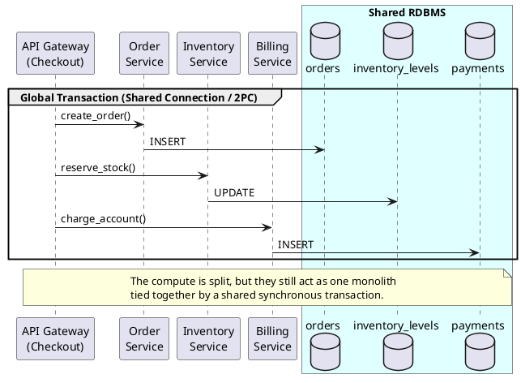
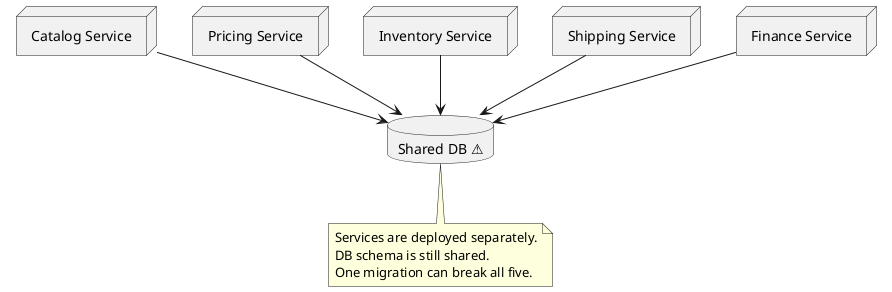
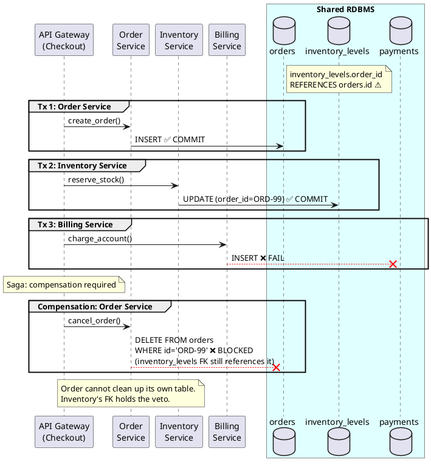
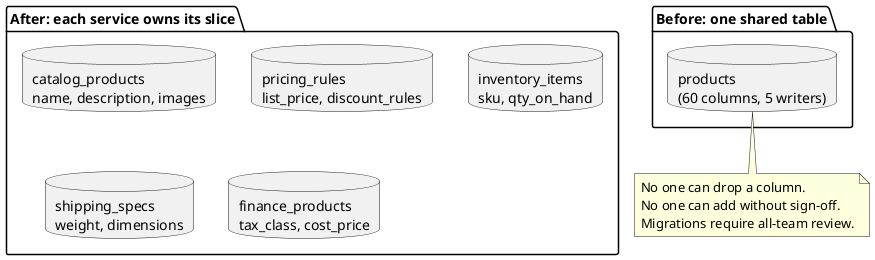
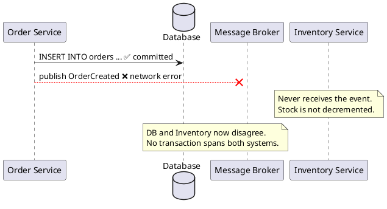
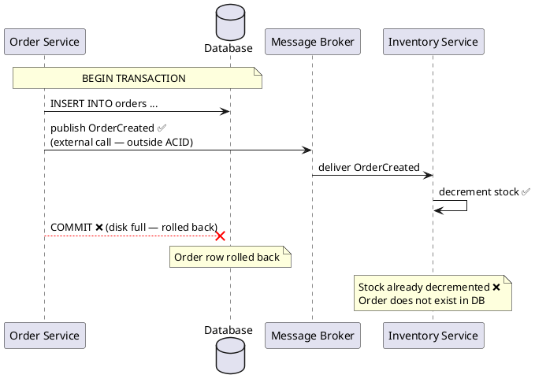
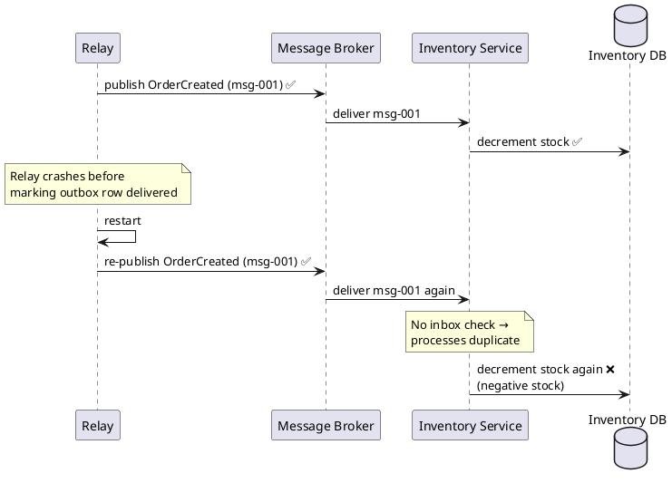
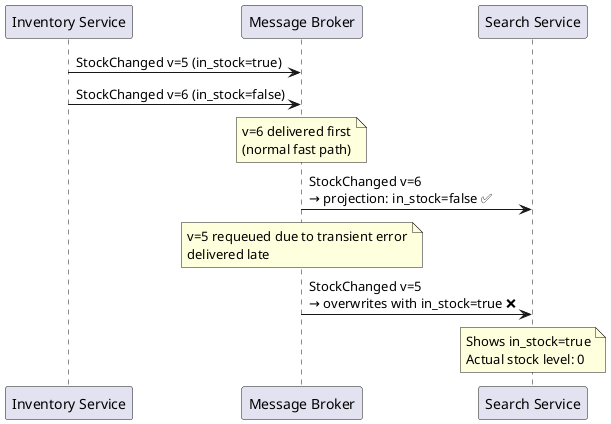
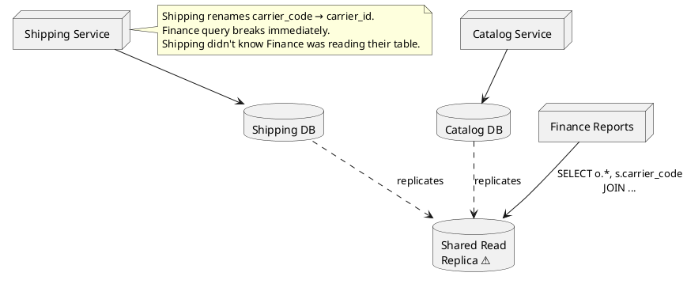
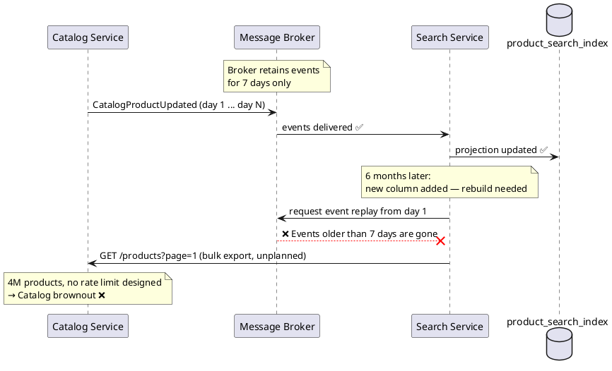

# Session 03 — Pitfall Cards (Modular)

> Each card is self-contained. Pick any card and insert it into the relevant slide section.
> The running scenario is **Tradr**, a B2C marketplace with Catalog / Pricing / Inventory / Shipping / Finance services.

---

## Index

| Card | Pitfall | Insert near |
|---|---|---|
| P-00 | "Independent tables" illusion | Slide 6 |
| P-01 | "We'll split the DB later" | Slide 8 |
| P-02 | Cross-service foreign keys | Slide 5 |
| P-03 | "Who owns `status`?" | Slide 7 |
| P-04 | Master table no one can own | Slide 7 / Exercise 1 |
| P-05 | Dual-write | Slide 10 |
| P-06 | Publishing before commit | Slide 10–11 |
| P-07 | Outbox without idempotent consumer | Slide 12 |
| P-08 | Out-of-order delivery | Slide 16 |
| P-09 | Shared read replica "just for reads" | Slide 17 |
| P-10 | No projection rebuild strategy | Slide 16 |

---

## ACT 1 — Ownership

---

### P-00 — The "Independent Tables" Illusion

**Tradr did:**
Split their monolith into `Order`, `Inventory`, and `Billing` services. They kept them all pointing to the same database but created strict rules: "Each service only writes to its own table." 

**Why it felt right:**
Table separation feels like decoupling. They didn't use `JOIN`s or foreign keys, so they assumed they had successfully built microservices.

**What broke:**
The checkout API wrapped the entire sequence (`create_order`, `reserve_stock`, `charge_account`) in a single `BEGIN TRANSACTION`. When the Billing table locked up during a batch job, the Inventory updates also blocked, and the `reserve_stock` calls timed out. The system was still completely coupled at the data layer and failed as a distributed monolith.

**The pattern:**
True independence requires independent transaction boundaries, not just separate table names. If three services rely on one database connection to succeed together, they are a monolith.

**Fix:** Remove the global transaction. Use the Outbox Pattern or Sagas to coordinate multi-step workflows asynchronously, accepting eventual consistency.



---

### P-01 — "We'll Split the DB Later"

**Tradr did:**
Split service deployments first. Left the DB shared "temporarily" — the API endpoints were the urgent deliverable.

**Why it felt right:**
The DB split is risky, slow, and invisible to users. Product pressure made the service split the priority.

**What broke:**
The Inventory team added `reserved_quantity`. Finance's reporting query broke that same night — it used `SELECT *` from the products table. The next migration script required sign-off from three other teams before it could merge.

**The pattern:**
"Just for now" became "we've been meaning to do this for 18 months." The shared DB became the permanent integration layer.

**Fix:** The service extraction is not done until the schema is also extracted. DB-per-service is part of the boundary definition, not a follow-up task.



---

### P-02 — Cross-Service Foreign Keys

**Tradr did:**
Left a foreign key in place: `inventory_levels.order_id REFERENCES orders.id` "for safety" while splitting the databases.

**Why it felt right:**
Referential integrity is a core RDB feature. They wanted to ensure an inventory reservation could never exist without a corresponding order row.

**What broke:**
During a Checkout flow, the Order was created (Tx 1) and Inventory was reserved (Tx 2). However, Billing failed (Tx 3). The Saga attempted to compensate by deleting the Order row, but the DB blocked the `DELETE` because the Inventory table still held a reference to that `order_id`. The compensation was blocked, leaving the system in a broken, inconsistent state.

**The pattern:**
A FK across service boundaries is a runtime dependency disguised as a safety feature. It gives the referencing service hidden veto power over the owning service's data lifecycle and recovery paths.

**Fix:** Reference by stored ID only. Referential safety becomes the owning service's responsibility via its API and business logic, not the DB engine's constraint.



---

### P-03 — "Who Owns `status`?"

**Tradr did:**
Kept `products.status` (active / inactive / discontinued) in the shared table. All five services read and sometimes wrote it.

**Why it felt right:**
"Status" seemed like a universal field — a single source of truth that everyone could trust.

**What broke:**
Three teams were updating the same column with three incompatible meanings:

| Service | What they meant by `status` |
|---|---|
| Catalog | Publication state: draft / published / archived |
| Inventory | Stock state: available / out-of-stock / backordered |
| Finance | Tax registration: taxable / exempt / pending-review |

The column became meaningless. A product "inactive" for Finance (pending tax review) was "active" for Catalog. Bugs became impossible to diagnose without knowing which team last wrote the field.

**The pattern:**
A field that means something different to each writer is not a shared field — it is multiple distinct concepts merged into one column with no owner.

**Fix:** Each service defines its own lifecycle state with a clear owner: `catalog_status`, `availability`, `tax_registration_status`. The vague shared `status` is retired.

---

### P-04 — Master Table No One Can Own

**Tradr did:**
Kept the `products` table as-is across all five services. Teams owned different column groups within the same table.

**Why it felt right:**
Splitting the table felt like a large, risky migration with no user-visible payoff. "We'll just be careful about which columns each team touches."

**What broke:**
With 60+ columns and no single owner, the table became a coordination tax:
- No team could add a column without reviewing with four others
- No team could drop a column — it might be in another team's `SELECT *`
- Inventory's batch-job load spikes caused latency for Catalog reads
- One bad migration script caused a 2-hour outage

**The pattern:**
A large shared master table with no business team owner is the wrong abstraction, not just the wrong location.

**Fix:** Apply the bounded-context split. Each service owns only the columns its business function writes. (→ See Exercise 1)



---

## ACT 2 — Messaging

---

### P-05 — The Dual-Write

**Tradr did:**
```python
def create_order(payload):
    order = db.insert("orders", payload)       # Step 1
    queue.publish("OrderCreated", order)        # Step 2
    return order
```

**Why it felt right:**
The natural sequence: persist, then notify. The obvious order of operations.

**What broke:**
The message broker had a 90-second network partition at 2 AM. Step 1 (DB write) succeeded. Step 2 (queue publish) failed silently. Inventory never received `OrderCreated`. 140 orders had no stock reservation the next morning.

A developer then reversed the order to "be safe." The event reached Inventory before the order row was committed. Inventory could not find the order row when it tried to validate.

**The pattern:**
Two independent systems share no transaction boundary. Any failure between the two steps leaves producer and consumers in disagreement.

**Fix:** Outbox pattern — write to `orders` and `outbox` in one ACID transaction. The relay delivers from a committed, consistent state.



---

### P-06 — Publishing Before Commit

**Tradr did:**
```python
with db.transaction():
    order = db.insert("orders", payload)
    queue.publish("OrderCreated", order)   # ← inside the tx block
    db.commit()
```

**Why it felt right:**
"If I publish inside the transaction block, it's effectively atomic, right?"

**What broke:**
The queue publish succeeded. `db.commit()` then failed (disk full on the DB host). Inventory received and processed `OrderCreated` — and decremented stock. The order row was rolled back. Inventory's stock was decremented for an order that never existed.

**The pattern:**
Publishing inside a transaction block does not include the publish in the transaction. Queue publish is a side effect against an external system — it operates entirely outside the DB's ACID scope. The commit is the only guarantee boundary.

**Fix:** The outbox row IS the publication intent. The commit atomically persists both the business row and the outbox row. The relay runs outside the transaction and delivers from a safely committed state.



---

### P-07 — Outbox Without Idempotent Consumer

**Tradr did:**
Implemented the outbox pattern correctly on the publisher side. Did not implement inbox deduplication on the Inventory consumer.

**Why it felt right:**
"We have at-least-once delivery. Duplicates will be rare in practice."

**What broke:**
The relay published `OrderCreated (msg-001)` to the broker. Inventory began processing — stock decremented. The relay crashed before marking the outbox row as delivered. On restart, it re-published the same message. Inventory received it a second time. No deduplication check → two stock decrements → negative stock on a high-demand item.

**The pattern:**
Outbox guarantees at-least-once delivery. At-least-once means duplicates are expected, not occasionally possible. The consumer must be idempotent by design, not by assumption.

**Fix:** Inbox pattern — before processing, check the `inbox` table for `message_id`. If already present, skip. Insert `message_id` and process in one local transaction.



---

### P-08 — Out-of-Order Delivery Wrecks the Projection

**Tradr did:**
The Search service subscribed to `StockChanged` events and applied each event to its `product_search_index` in the order received.

**Why it felt right:**
"Events arrive in order — it's a queue."

**What broke:**
Two `StockChanged` events produced seconds apart. A transient processing error caused the broker to requeue the older one. The newer event (v=6, `in_stock=false`) arrived first and was applied correctly. The older event (v=5, `in_stock=true`) arrived late and silently overwrote the newer state. The product displayed as in-stock even though stock was actually zero.

**The pattern:**
Message brokers guarantee ordering only under specific conditions (single partition, no retries). Requeues and retry policies break delivery order in practice.

**Fix:** Include a `version` or `event_sequence` in every event. Before writing to the projection, guard with: apply only if `incoming_version > current_version`. Silently discard stale events.



---

## ACT 3 — Reads

---

### P-09 — Shared Read Replica "Just for Reads"

**Tradr did:**
Set up a read replica aggregating all services' tables. Finance ran cross-service JOINs against it for monthly reporting.

**Why it felt right:**
"It's read-only — no write conflicts, no production traffic risk. It's just reports."

**What broke:**
The Shipping team renamed `carrier_code` → `carrier_id`. Finance's JOIN on the replica broke immediately. Finance filed a support ticket against Shipping. Shipping had no idea Finance was reading their table.

Then Inventory migrated from Postgres to DynamoDB. The replica could no longer include Inventory data. Finance rewrote months of reports.

**The pattern:**
A shared read replica is a shared database with delayed writes. Schema coupling is identical — just less visible until something changes.

**Fix:** Finance builds a Finance-specific projection from events. The dependency shifts from Shipping's table structure to Shipping's event contract. A column rename in Shipping emits a new event version; Finance updates its consumer independently.



---

### P-10 — No Projection Rebuild Strategy

**Tradr did:**
The Search service built a CQRS-lite projection from `CatalogProductUpdated` events. It worked well in production for months.

**Why it felt right:**
Events keep the projection fresh. There is no need to think about the past — the projection always converges from current events.

**What broke:**
Six months in, the Search team added a `rating_score` column. Backfilling historical products required replaying all past `CatalogProductUpdated` events. The broker retained only 7 days. The history was gone.

Rebuilding from scratch meant calling the Catalog API for 4 million products — an unplanned bulk export that neither team had designed. Catalog went into brownout. The Search index was stale for 6 hours.

**The pattern:**
A projection that cannot be rebuilt is an operational liability. Event log retention is finite. Schema changes, disaster recovery, and new consumers all require replay capability.

**Fix:** Design for rebuild from day one: retain events beyond broker defaults (cold storage), the owning service exposes a paginated bootstrap API, and the consumer has a controlled, rate-limited replay mode.


